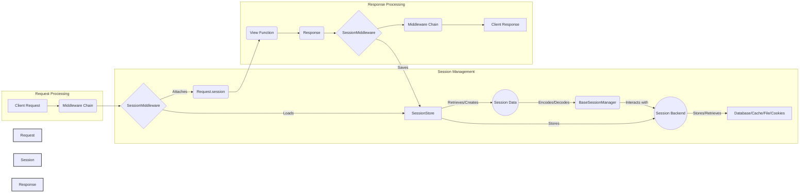

### Component Descriptions:

*   **Client Request:** Represents the initial request from a user's browser or application.
    *   Purpose: Initiates the entire process by sending a request to the Django application.
    *   Interaction: Starts the flow by triggering the middleware chain.
    *   Relevant source files: N/A

*   **Middleware Chain:** A sequence of middleware components that process the request and response.
    *   Purpose: Provides a hook to intercept and process requests and responses globally, enabling functionalities like authentication, session management, and CSRF protection.
    *   Interaction: Receives the request from the client and passes it to the SessionMiddleware.
    *   Relevant source files: `django.middleware`

*   **SessionMiddleware:** Middleware that manages user sessions across requests.
    *   Purpose: Attaches a session object to the request, loading the session at the beginning and saving it at the end.
    *   Interaction: Loads session data from the SessionStore, attaches it to the request, and saves it back to the SessionStore after the view function is executed.
    *   Relevant source files: `django.contrib.sessions.middleware.SessionMiddleware`

*   **SessionStore:** An abstract component that provides an interface for storing session data.
    *   Purpose: Handles the storage and retrieval of session data using various backends.
    *   Interaction: Interacts with the BaseSessionManager to encode and decode session data and with the Session Backend to store and retrieve the data.
    *   Relevant source files: `django.contrib.sessions.backends.base.SessionBase`, `django.contrib.sessions.backends.db.SessionStore`, `django.contrib.sessions.backends.file.SessionStore`, `django.contrib.sessions.backends.cache.SessionStore`, `django.contrib.sessions.backends.signed_cookies.SessionStore`, `django.contrib.sessions.backends.cached_db.SessionStore`

*   **Session Data:** Represents the actual session data stored for a user.
    *   Purpose: Holds the user-specific data that needs to be persisted across multiple requests.
    *   Interaction: Loaded from and saved to the SessionStore.
    *   Relevant source files: N/A

*   **BaseSessionManager:** Provides base functionalities for session management.
    *   Purpose: Manages encoding and decoding session data.
    *   Interaction: Interacts with the SessionStore to handle session data and with the Session Backend for storage.
    *   Relevant source files: `django.contrib.sessions.base_session.BaseSessionManager`

*   **Session Backend:** Represents the actual storage mechanism for session data.
    *   Purpose: Stores and retrieves session data from various backends like database, cache, files, or cookies.
    *   Interaction: Interacts with the SessionStore to persist session data.
    *   Relevant source files: `django.contrib.sessions.backends`

*   **Database/Cache/File/Cookies:** Represents the different storage options for session data.
    *   Purpose: Provides persistent storage for session data.
    *   Interaction: Used by the Session Backend to store and retrieve session data.
    *   Relevant source files: N/A

*   **Request.session:** The session object attached to the request.
    *   Purpose: Provides access to session data within the view function.
    *   Interaction: Used by the view function to access and modify session data.
    *   Relevant source files: N/A

*   **View Function:** The function that processes the request and generates a response.
    *   Purpose: Handles the business logic of the application.
    *   Interaction: Receives the request with the attached session object and returns a response.
    *   Relevant source files: N/A

*   **Response:** The response generated by the view function.
    *   Purpose: Contains the data to be sent back to the client.
    *   Interaction: Passed back through the middleware chain.
    *   Relevant source files: N/A

*   **Client Response:** The final response sent back to the user's browser or application.
    *   Purpose: Delivers the result of the request processing to the user.
    *   Interaction: Ends the flow by sending the response back to the client.
    *   Relevant source files: N/A