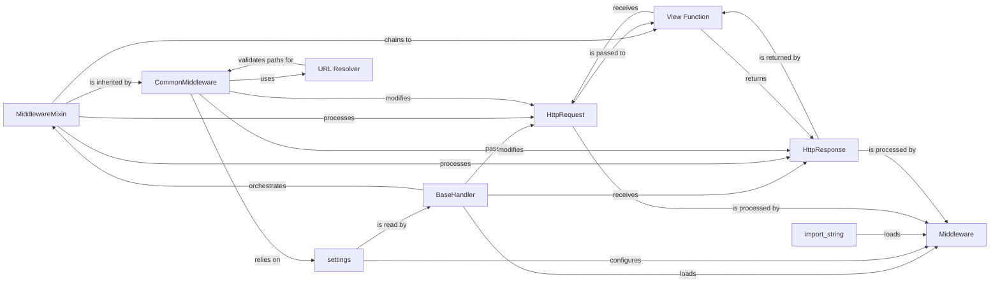

## Component Details

The `Middleware` subsystem in Django is a powerful and flexible mechanism for processing HTTP requests and responses globally across the application. It acts as a series of "hooks" that allow developers to inject custom logic at various stages of the request-response cycle. This enables the implementation of cross-cutting concerns such as authentication, session management, CSRF protection, URL rewriting, and content modification without cluttering individual view functions. The core idea is a chain of responsibility: each middleware component can decide to process the request, pass it to the next component (or the view), and then process the response on its way back.

### Middleware
Pluggable components that intercept and process HTTP requests before they reach the view and HTTP responses before they are sent back to the client. They enable cross-cutting concerns such as authentication, session management, CSRF protection, URL rewriting, and content modification. Middleware operates in a defined order, forming a chain that the request and response traverse.

**Related Classes/Methods**:

- <a href="https://github.com/django/django/blob/master/django/template/backends/django.py#L1-L1" target="_blank" rel="noopener noreferrer">`django.middleware` (1:1)</a>
- <a href="https://github.com/django/django/blob/master/django/middleware/common.py#L12-L114" target="_blank" rel="noopener noreferrer">`django.middleware.common.CommonMiddleware` (12:114)</a>

### MiddlewareMixin
The foundational abstract base class for all new-style Django middleware. It provides the core `__call__` method, which is the entry point for the middleware, orchestrating the execution of various hooks (`process_request`, `process_view`, `process_exception`, `process_template_response`, `process_response`). It also handles the crucial aspect of chaining middleware by invoking the `get_response` callable (which points to the next middleware in the stack or the final view).

**Related Classes/Methods**:

- <a href="https://github.com/django/django/blob/master/django/utils/deprecation.py#L85-L141" target="_blank" rel="noopener noreferrer">`django.utils.deprecation.MiddlewareMixin` (85:141)</a>
- <a href="https://github.com/django/django/blob/master/django/utils/deprecation.py#L112-L122" target="_blank" rel="noopener noreferrer">`django.utils.deprecation.MiddlewareMixin:__call__` (112:122)</a>
- <a href="https://github.com/django/django/blob/master/django/utils/deprecation.py#L1-L1" target="_blank" rel="noopener noreferrer">`django.utils.deprecation.MiddlewareMixin:process_request` (1:1)</a>
- <a href="https://github.com/django/django/blob/master/django/utils/deprecation.py#L1-L1" target="_blank" rel="noopener noreferrer">`django.utils.deprecation.MiddlewareMixin:process_view` (1:1)</a>
- <a href="https://github.com/django/django/blob/master/django/utils/deprecation.py#L1-L1" target="_blank" rel="noopener noreferrer">`django.utils.deprecation.MiddlewareMixin:process_exception` (1:1)</a>
- <a href="https://github.com/django/django/blob/master/django/utils/deprecation.py#L1-L1" target="_blank" rel="noopener noreferrer">`django.utils.deprecation.MiddlewareMixin:process_template_response` (1:1)</a>
- <a href="https://github.com/django/django/blob/master/django/utils/deprecation.py#L1-L1" target="_blank" rel="noopener noreferrer">`django.utils.deprecation.MiddlewareMixin:process_response` (1:1)</a>

### CommonMiddleware
A concrete, built-in implementation of Django middleware that extends `MiddlewareMixin`. It handles common web tasks such as enforcing `DISALLOWED_USER_AGENTS`, performing `PREPEND_WWW` redirects, and appending slashes to URLs for 404 responses. It demonstrates how `MiddlewareMixin`'s hooks (`process_request`, `process_response`) are utilized to modify requests and responses.

**Related Classes/Methods**:

- <a href="https://github.com/django/django/blob/master/django/middleware/common.py#L12-L114" target="_blank" rel="noopener noreferrer">`django.middleware.common.CommonMiddleware` (12:114)</a>
- <a href="https://github.com/django/django/blob/master/django/middleware/common.py#L33-L59" target="_blank" rel="noopener noreferrer">`django.middleware.common.CommonMiddleware:process_request` (33:59)</a>
- <a href="https://github.com/django/django/blob/master/django/middleware/common.py#L99-L114" target="_blank" rel="noopener noreferrer">`django.middleware.common.CommonMiddleware:process_response` (99:114)</a>

### BaseHandler
The central request/response handler in Django. It is responsible for loading middleware classes from `settings.MIDDLEWARE`, constructing the ordered middleware chain, and orchestrating the flow of `HttpRequest` and `HttpResponse` objects through this chain and ultimately to the `View Function`. It initiates the middleware processing.

**Related Classes/Methods**:

- <a href="https://github.com/django/django/blob/master/django/core/handlers/base.py#L19-L364" target="_blank" rel="noopener noreferrer">`django.core.handlers.base.BaseHandler` (19:364)</a>

### settings
Django's global configuration object. It is crucial for the Middleware subsystem as it contains the `MIDDLEWARE` list, which explicitly defines which middleware classes are active in the application and their precise order of execution. Middleware components often access `settings` to retrieve configuration values.

**Related Classes/Methods**:

- <a href="https://github.com/django/django/blob/master/django/template/backends/django.py#L1-L1" target="_blank" rel="noopener noreferrer">`django.conf.settings` (1:1)</a>
- `django.conf.settings.MIDDLEWARE` (1:1)

### HttpRequest
An object that encapsulates all information about an incoming HTTP request (headers, body, GET/POST parameters, user, etc.). It is created by the `WSGI/ASGI Handler` and passed through the entire middleware chain (from `BaseHandler` to `View Function`). Middleware can inspect and modify this object.

**Related Classes/Methods**:

- <a href="https://github.com/django/django/blob/master/django/http/request.py#L52-L469" target="_blank" rel="noopener noreferrer">`django.http.request.HttpRequest` (52:469)</a>

### HttpResponse
An object representing an outgoing HTTP response. It is typically constructed by a `View Function` (or sometimes by a middleware that short-circuits the request) and is then passed back through the middleware chain (in reverse order) before being sent to the client. Middleware can inspect and modify this object before it's finalized.

**Related Classes/Methods**:

- <a href="https://github.com/django/django/blob/master/django/http/response.py#L364-L434" target="_blank" rel="noopener noreferrer">`django.http.response.HttpResponse` (364:434)</a>

### import_string
A utility function used by `BaseHandler` to dynamically import Python objects (modules, classes, functions) given their fully qualified string path. In the context of middleware, `BaseHandler` uses this function to load the middleware classes specified in `settings.MIDDLEWARE` at runtime, enabling a flexible and configurable middleware stack.

**Related Classes/Methods**:

- <a href="https://github.com/django/django/blob/master/django/utils/module_loading.py#L18-L34" target="_blank" rel="noopener noreferrer">`django.utils.module_loading.import_string` (18:34)</a>

### URL Resolver
The component responsible for mapping an incoming URL path to the appropriate `View Function`. While `BaseHandler` directly uses it, `CommonMiddleware` also interacts with URL resolution indirectly via `is_valid_path` to determine if a URL with an appended slash would be valid, facilitating redirects.

**Related Classes/Methods**:

- <a href="https://github.com/django/django/blob/master/django/urls/resolvers.py#L1-L1" target="_blank" rel="noopener noreferrer">`django.urls.resolvers` (1:1)</a>
- <a href="https://github.com/django/django/blob/master/django/urls/resolvers.py#L1-L1" target="_blank" rel="noopener noreferrer">`django.urls.resolvers.is_valid_path` (1:1)</a>

### View Function
A Python function or method that serves as the core business logic handler for a specific URL endpoint. It receives an `HttpRequest` object and is expected to return an `HttpResponse` object. It is the ultimate target of the request after it has passed through the inbound middleware chain, and the source of the response that travels back through the outbound middleware chain.

**Related Classes/Methods**:

- <a href="https://github.com/django/django/blob/master/django/template/backends/django.py#L1-L1" target="_blank" rel="noopener noreferrer">`django.views` (1:1)</a>

### [FAQ](https://github.com/CodeBoarding/GeneratedOnBoardings/tree/main?tab=readme-ov-file#faq)