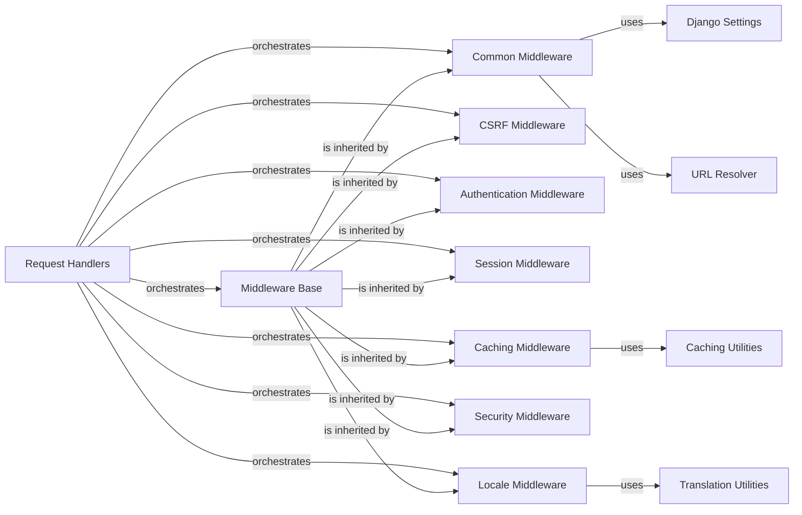

## Component Details

One paragraph explaining the functionality which is represented by this graph. What the main flow is and what is its purpose.

### Request Handlers
These classes (BaseHandler, WSGIHandler, ASGIHandler) serve as the primary entry points for Django's request/response processing. They are responsible for setting up the environment, initializing the middleware chain, creating the HttpRequest object, invoking the middleware methods in the correct order, calling the appropriate view, and finally generating and returning the HttpResponse. They are fundamental as they orchestrate the entire request lifecycle, including middleware execution.

**Related Classes/Methods**:

- <a href="https://github.com/django/django/blob/master/django/core/handlers/base.py#L19-L364" target="_blank" rel="noopener noreferrer">`django.core.handlers.base.BaseHandler` (19:364)</a>
- <a href="https://github.com/django/django/blob/master/django/core/handlers/wsgi.py#L112-L143" target="_blank" rel="noopener noreferrer">`django.core.handlers.wsgi.WSGIHandler` (112:143)</a>
- <a href="https://github.com/django/django/blob/master/django/core/handlers/asgi.py#L138-L380" target="_blank" rel="noopener noreferrer">`django.core.handlers.asgi.ASGIHandler` (138:380)</a>

### Middleware Base
MiddlewareMixin provides a common __init__ method and a __call__ method that wraps the get_response callable. This design pattern simplifies the creation of new middleware classes by handling the chaining mechanism, ensuring that middleware can be correctly integrated into the request/response flow. It is fundamental as it defines the standard interface and behavior for all Django middleware.

**Related Classes/Methods**:

- <a href="https://github.com/django/django/blob/master/django/utils/deprecation.py#L85-L141" target="_blank" rel="noopener noreferrer">`django.utils.deprecation.MiddlewareMixin` (85:141)</a>

### Common Middleware
CommonMiddleware handles a variety of common HTTP-related tasks. These include forbidding access to disallowed user agents (via settings.DISALLOWED_USER_AGENTS), URL rewriting (appending or prepending slashes based on settings.APPEND_SLASH and settings.PREPEND_WWW), and ensuring the Content-Length header is set for non-streaming responses. It also manages redirects for these URL manipulations. It is fundamental for standardizing URL behavior and basic request/response hygiene.

**Related Classes/Methods**:

- <a href="https://github.com/django/django/blob/master/django/middleware/common.py#L12-L114" target="_blank" rel="noopener noreferrer">`django.middleware.common.CommonMiddleware` (12:114)</a>

### CSRF Middleware
CsrfViewMiddleware is a security component that protects against Cross-Site Request Forgery (CSRF) attacks. It verifies a secret token in incoming requests (typically POST requests) to ensure they originate from the same site, preventing malicious requests from unauthorized sources. It is fundamental for securing web forms and state-changing operations.

**Related Classes/Methods**:

- <a href="https://github.com/django/django/blob/master/django/middleware/csrf.py#L1-L1" target="_blank" rel="noopener noreferrer">`django.middleware.csrf.CsrfViewMiddleware` (1:1)</a>

### Authentication Middleware
AuthenticationMiddleware is responsible for associating a user with the current request. It populates the request.user attribute based on the session or other configured authentication mechanisms, making user information readily available to views. It is fundamental for implementing user authentication and authorization in Django applications.

**Related Classes/Methods**:

- <a href="https://github.com/django/django/blob/master/django/contrib/auth/middleware.py#L29-L40" target="_blank" rel="noopener noreferrer">`django.contrib.auth.middleware.AuthenticationMiddleware` (29:40)</a>

### Session Middleware
SessionMiddleware enables session management in Django applications. It allows data to be stored and retrieved across multiple requests for a single user, providing the request.session attribute for persistent user-specific data. It is fundamental for maintaining user state across multiple interactions.

**Related Classes/Methods**:

- <a href="https://github.com/django/django/blob/master/django/contrib/sessions/middleware.py#L11-L76" target="_blank" rel="noopener noreferrer">`django.contrib.sessions.middleware.SessionMiddleware` (11:76)</a>

### Caching Middleware
CacheMiddleware (and its sub-components UpdateCacheMiddleware, FetchFromCacheMiddleware) handles caching of entire page responses. FetchFromCacheMiddleware attempts to serve a response directly from the cache, while UpdateCacheMiddleware saves responses to the cache for future requests, improving performance. It is fundamental for optimizing application performance and reducing server load.

**Related Classes/Methods**:

- <a href="https://github.com/django/django/blob/master/django/middleware/cache.py#L1-L1" target="_blank" rel="noopener noreferrer">`django.middleware.cache.CacheMiddleware` (1:1)</a>
- <a href="https://github.com/django/django/blob/master/django/middleware/cache.py#L1-L1" target="_blank" rel="noopener noreferrer">`django.middleware.cache.UpdateCacheMiddleware` (1:1)</a>
- <a href="https://github.com/django/django/blob/master/django/middleware/cache.py#L1-L1" target="_blank" rel="noopener noreferrer">`django.middleware.cache.FetchFromCacheMiddleware` (1:1)</a>

### Security Middleware
SecurityMiddleware provides several security enhancements, such as enforcing HTTPS redirects, setting the Strict-Transport-Security header, and configuring X-Content-Type-Options and X-XSS-Protection headers to mitigate common web vulnerabilities. It is fundamental for implementing modern web security best practices.

**Related Classes/Methods**:

- <a href="https://github.com/django/django/blob/master/django/middleware/security.py#L7-L65" target="_blank" rel="noopener noreferrer">`django.middleware.security.SecurityMiddleware` (7:65)</a>

### Caching Utilities
This module provides a set of utility functions that support Django's caching mechanisms. These utilities are used by various middleware components (like Caching Middleware) to generate cache keys, patch response headers, and handle conditional GET requests, ensuring efficient caching operations. It is fundamental as a supporting library for caching functionalities.

**Related Classes/Methods**:

- <a href="https://github.com/django/django/blob/master/django/utils/cache.py#L1-L1" target="_blank" rel="noopener noreferrer">`django.utils.cache` (1:1)</a>

### Translation Utilities
This module provides core functions for Django's internationalization (i18n) and localization (l10n) features. It enables applications to support multiple languages by providing mechanisms to activate and retrieve language settings. It is fundamental as a supporting library for internationalization features, used by middleware like LocaleMiddleware.

**Related Classes/Methods**:

- <a href="https://github.com/django/django/blob/master/django/template/backends/django.py#L1-L1" target="_blank" rel="noopener noreferrer">`django.utils.translation` (1:1)</a>

### Django Settings
Manages application-wide configurations and settings.

**Related Classes/Methods**: _None_

### URL Resolver
Handles the resolution of URLs to views in Django.

**Related Classes/Methods**: _None_

### Locale Middleware
Middleware responsible for handling language and locale settings.

**Related Classes/Methods**:

- <a href="https://github.com/django/django/blob/master/django/middleware/locale.py#L9-L79" target="_blank" rel="noopener noreferrer">`django.middleware.locale.LocaleMiddleware` (9:79)</a>

### [FAQ](https://github.com/CodeBoarding/GeneratedOnBoardings/tree/main?tab=readme-ov-file#faq)