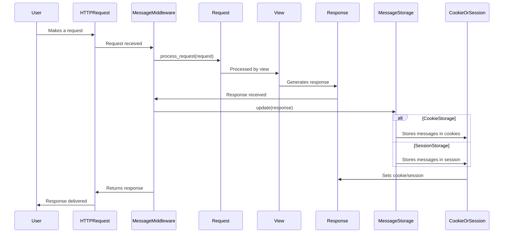

### Component Descriptions:

*   **User**: Initiates the HTTP request and receives the response.

*   **HTTPRequest**: Represents the incoming HTTP request and outgoing HTTP response.

*   **MessageMiddleware**: Processes the request and response to manage messages. It initializes the message storage and updates it after the view is processed. Relevant source files: `django.contrib.messages.middleware.py`

*   **Request**: Django's request object, passed to the view.

*   **View**: Processes the request and generates a response. It interacts with the MessageMiddleware through the standard request-response cycle.

*   **Response**: Django's response object, returned by the view.

*   **MessageStorage**: Abstract component representing the storage backend for messages (either cookies or session). It's used by the MessageMiddleware to store and retrieve messages. Relevant source files: `django.contrib.messages.storage.base.py`, `django.contrib.messages.storage.cookie.py`, `django.contrib.messages.storage.session.py`

*   **CookieOrSession**: Represents either cookie storage or session storage, depending on the configuration. It's used by the MessageStorage to persist messages.
