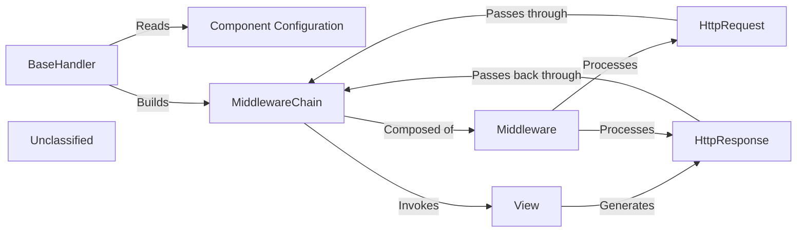

## Details

The central flow begins when an incoming `HttpRequest` is received by the `BaseHandler`. The `BaseHandler` dynamically constructs a `MiddlewareChain` based on the `MIDDLEWARE` setting in the project's configuration. This chain is a nested structure of all defined middleware. The request is passed through each middleware in the defined order, allowing each to process or modify it. After passing through the entire chain, the request reaches the target `View`, which contains the primary application logic. The `View` processes the request and generates an `HttpResponse`. This response then travels back through the `MiddlewareChain` in reverse order, allowing each middleware to process or modify it before it is sent to the client. This two-phase processing—first the request, then the response—is the fundamental pattern of Django's middleware architecture.

### Component Configuration
A project-level setting that defines the ordered list of middleware classes to be applied to every request. This configuration is the blueprint used by the BaseHandler to construct the middleware chain.

**Related Classes/Methods**:

- <a href="https://github.com/django/django/blob/main/django/conf/global_settings.py#L402-L410" target="_blank" rel="noopener noreferrer">`django.conf.global_settings`:402-410</a>

### BaseHandler
The core request orchestrator. It loads the middleware classes specified in the configuration and builds the middleware chain. It then initiates the request-response cycle by passing the request to the chain.

**Related Classes/Methods**:

- <a href="https://github.com/django/django/blob/main/django/core/handlers/base.py#L19-L365" target="_blank" rel="noopener noreferrer">`django.core.handlers.base`:19-365</a>

### MiddlewareChain
A composite callable representing the full stack of middleware. It is constructed by the BaseHandler, wrapping each middleware in sequence to process the request on its way to the view and the response on its way back.

**Related Classes/Methods**:

- <a href="https://github.com/django/django/blob/main/django/core/handlers/base.py" target="_blank" rel="noopener noreferrer">`django.core.handlers.base`</a>

### Middleware [[Expand]](./Middleware.md)
A single, pluggable class that hooks into the request/response cycle. Each middleware can modify the HttpRequest before it reaches the view or the HttpResponse before it's sent to the client.

**Related Classes/Methods**:

- <a href="https://github.com/django/django/blob/main/django/utils/deprecation.py#L273-L329" target="_blank" rel="noopener noreferrer">`django.utils.deprecation`:273-329</a>

### HttpRequest
An object encapsulating the incoming HTTP request. It is created by the server handler and passed through the MiddlewareChain to the view, carrying all request data.

**Related Classes/Methods**:

- <a href="https://github.com/django/django/blob/main/django/http/request.py#L52-L487" target="_blank" rel="noopener noreferrer">`django.http.request`:52-487</a>

### View
The endpoint for a request after it has passed through the middleware chain. The view executes the primary application logic and is responsible for generating the HttpResponse.

**Related Classes/Methods**:

- <a href="https://github.com/django/django/blob/main/django/views/generic/base.py#L97-L105" target="_blank" rel="noopener noreferrer">`django.views.generic.base`:97-105</a>

### HttpResponse
An object encapsulating the outgoing HTTP response. It is created by the View and then travels back through the MiddlewareChain in reverse order, allowing each middleware to process it.

**Related Classes/Methods**:

- <a href="https://github.com/django/django/blob/main/django/http/response.py#L365-L435" target="_blank" rel="noopener noreferrer">`django.http.response`:365-435</a>

### Unclassified
Component for all unclassified files and utility functions (Utility functions/External Libraries/Dependencies)

**Related Classes/Methods**: _None_

### [FAQ](https://github.com/CodeBoarding/GeneratedOnBoardings/tree/main?tab=readme-ov-file#faq)