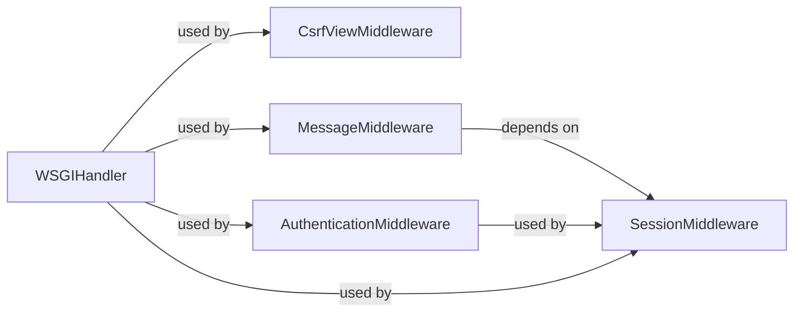

## Details

One paragraph explaining the functionality which is represented by this graph. What the main flow is and what is its purpose.

### WSGIHandler
Core request handler that initializes and orchestrates the middleware chain.

**Related Classes/Methods**:

- <a href="https://github.com/django/django/blob/main/django/core/handlers/wsgi.py#L112-L143" target="_blank" rel="noopener noreferrer">`django.core.handlers.wsgi.WSGIHandler` (112:143)</a>

### CsrfViewMiddleware
Enforces CSRF token validation for state-changing requests.

**Related Classes/Methods**:

- <a href="https://github.com/django/django/blob/main/django/middleware/csrf.py#L50-L120" target="_blank" rel="noopener noreferrer">`django.middleware.csrf.CsrfViewMiddleware` (50:120)</a>

### AuthenticationMiddleware
Attaches authenticated user to the request object.

**Related Classes/Methods**:

- <a href="https://github.com/django/django/blob/main/django/contrib/auth/middleware.py#L29-L40" target="_blank" rel="noopener noreferrer">`django.contrib.auth.middleware.AuthenticationMiddleware` (29:40)</a>

### SessionMiddleware
Persists session data across requests.

**Related Classes/Methods**:

- `django.middleware.session.SessionMiddleware` (40:90)

### MessageMiddleware
Stores transient messages between requests.

**Related Classes/Methods**:

- <a href="https://github.com/django/django/blob/main/django/contrib/messages/middleware.py#L5-L25" target="_blank" rel="noopener noreferrer">`django.contrib.messages.middleware.MessageMiddleware` (5:25)</a>

### [FAQ](https://github.com/CodeBoarding/GeneratedOnBoardings/tree/main?tab=readme-ov-file#faq)