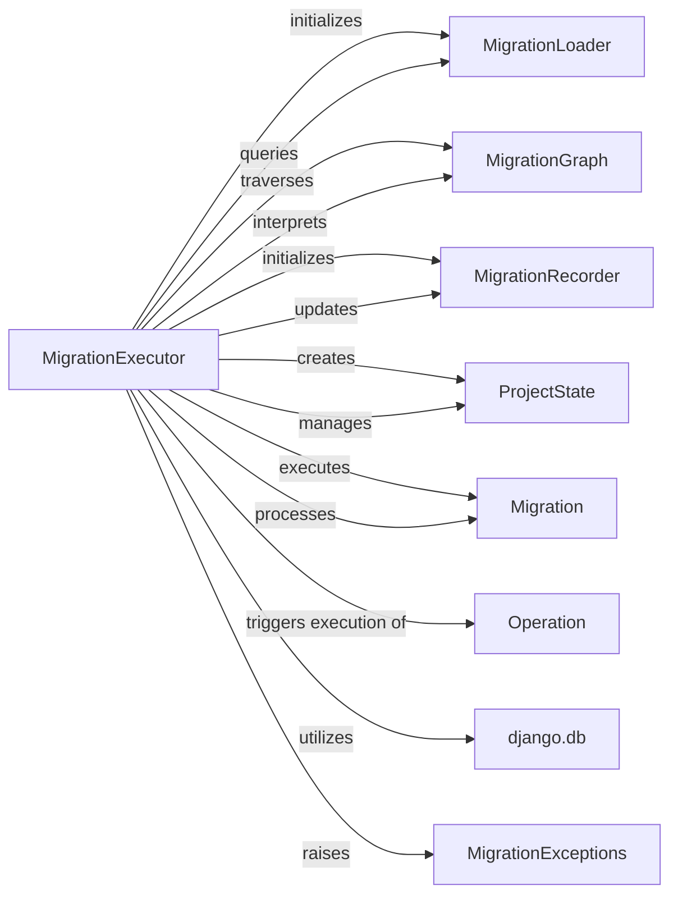

## Component Details

This document provides an overview of the fundamental components of Django's migration system, with MigrationExecutor as the central orchestrator. It details the responsibilities of each component and their relationships, highlighting how they collectively form a robust and extensible architecture for managing database schema evolution.

### MigrationExecutor
The MigrationExecutor is the core component responsible for orchestrating the entire migration process. It calculates the migration plan (the sequence of migrations to apply or unapply), manages the in-memory project state, and directs the actual database schema modifications. It ensures that migrations are applied in the correct order, respecting dependencies, and updates the migration history.

**Related Classes/Methods**:

- `MigrationExecutor` (0:0)

### MigrationLoader
The MigrationLoader is responsible for discovering all available migration files across installed applications and constructing the complete MigrationGraph. The MigrationExecutor initializes and queries the MigrationLoader to get the initial migration graph and to resolve dependencies and target migrations.

**Related Classes/Methods**:

- `MigrationLoader` (0:0)

### MigrationGraph
This component represents the directed acyclic graph of all migrations, defining their interdependencies. The MigrationExecutor uses this graph to determine the correct order of execution for migrations, ensuring that dependencies are met before a migration is applied or unapplied.

**Related Classes/Methods**:

- `MigrationGraph` (0:0)

### MigrationRecorder
The MigrationRecorder is responsible for persisting the history of applied migrations in the database (typically in the django_migrations table). After successfully applying or unapplying a migration, the MigrationExecutor instructs the MigrationRecorder to update the database history. It also checks the existing history.

**Related Classes/Methods**:

- `MigrationRecorder` (0:0)

### ProjectState
ProjectState is an in-memory representation of the Django project's models at a specific point in time. As the MigrationExecutor applies or unapplies migrations, it updates this ProjectState to reflect the changes to the model definitions, which is crucial for operations that depend on the current schema (e.g., RunPython operations or schema introspection).

**Related Classes/Methods**:

- `ProjectState` (0:0)

### Migration
A Migration object represents a single migration file, containing a list of Operation objects. The MigrationExecutor iterates through the Migration objects in the determined order and calls their apply() or unapply() methods, which in turn execute the contained operations.

**Related Classes/Methods**:

- <a href="https://github.com/django/django/blob/master/django/db/migrations/migration.py#L8-L221" target="_blank" rel="noopener noreferrer">`Migration` (8:221)</a>

### Operation
These are the atomic units of schema changes (e.g., CreateModel, AddField, AlterField). Each Migration object contains one or more Operation objects. The MigrationExecutor indirectly triggers the execution of these operations when it calls migration.apply() or migration.unapply(), which then interact with the database schema editor.

**Related Classes/Methods**:

- `Operation` (0:0)

### django.db
This represents Django's core database layer, providing the connection and schema editor. The MigrationExecutor ultimately relies on this layer to perform the actual SQL commands that modify the database schema. The Operation objects, when applied, use the database connection's schema editor to execute these changes.

**Related Classes/Methods**:

- <a href="https://github.com/django/django/blob/master/django/template/backends/django.py#L0-L0" target="_blank" rel="noopener noreferrer">`django.db` (0:0)</a>

### MigrationExceptions
This component defines custom exceptions specific to migration-related errors, such as InvalidMigrationPlan or InconsistentMigrationHistory. The MigrationExecutor raises these exceptions to signal issues encountered during the migration process, providing structured error handling.

**Related Classes/Methods**:

- `MigrationExceptions` (0:0)

### [FAQ](https://github.com/CodeBoarding/GeneratedOnBoardings/tree/main?tab=readme-ov-file#faq)