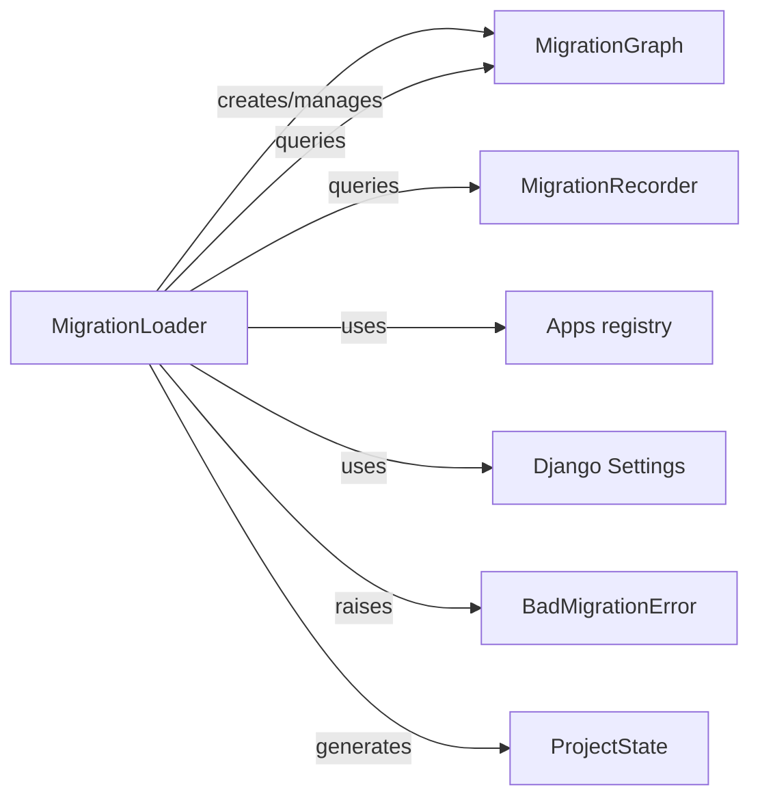

## Component Details

Analysis of Django's MigrationLoader and its fundamental relationships with other components in the migration system. The MigrationLoader is responsible for discovering, loading, and organizing migration files into a dependency graph, interacting with various components to achieve this purpose, including MigrationGraph, MigrationRecorder, Apps registry, Django Settings, BadMigrationError, and ProjectState. These interactions enable the migration system to discover migrations, understand dependencies, track applied migrations, handle errors, and represent schema state effectively.

### MigrationLoader
The MigrationLoader is the central orchestrator for Django migrations. Its primary responsibility is to scan the file system for migration files within installed applications, parse them, and construct a MigrationGraph that represents the dependencies between these migrations. It also interacts with the database to determine which migrations have already been applied. This component is crucial for determining the correct order of migration application and unapplication, and for detecting inconsistencies or conflicts in the migration history.

**Related Classes/Methods**:

- <a href="https://github.com/django/django/blob/master/django/db/migrations/loader.py#L20-L417" target="_blank" rel="noopener noreferrer">`django.db.migrations.loader.MigrationLoader` (20:417)</a>

### MigrationGraph
This component represents the directed acyclic graph (DAG) of migration dependencies. The MigrationLoader populates this graph by adding nodes (migrations) and edges (dependencies). It's fundamental because it provides the structure for understanding the order in which migrations must be applied or unapplied, and it's used for detecting cycles and inconsistencies.

**Related Classes/Methods**:

- <a href="https://github.com/django/django/blob/master/django/db/migrations/graph.py#L62-L332" target="_blank" rel="noopener noreferrer">`django.db.migrations.graph.MigrationGraph` (62:332)</a>

### MigrationRecorder
This component is responsible for interacting with the django_migrations table in the database. It records which migrations have been applied and retrieves the list of applied migrations. It's essential for the MigrationLoader to understand the current state of the database's migration history.

**Related Classes/Methods**:

- <a href="https://github.com/django/django/blob/master/django/db/migrations/recorder.py#L8-L110" target="_blank" rel="noopener noreferrer">`django.db.migrations.recorder.MigrationRecorder` (8:110)</a>

### Apps registry
This is Django's central registry of installed applications. The MigrationLoader uses this registry to discover all installed applications and then locate their respective migrations directories. It's fundamental because it provides the entry point for the MigrationLoader to find where migration files are located on disk.

**Related Classes/Methods**:

- <a href="https://github.com/django/django/blob/master/django/template/backends/django.py#L1-L1" target="_blank" rel="noopener noreferrer">`django.apps.apps` (1:1)</a>

### Django Settings
This component provides access to Django's project settings, such as INSTALLED_APPS and MIGRATION_MODULES. The MigrationLoader uses these settings to identify which applications to scan for migrations and to determine if any custom migration module paths have been defined. It's fundamental for configuring the migration discovery process.

**Related Classes/Methods**:

- <a href="https://github.com/django/django/blob/master/django/template/backends/django.py#L1-L1" target="_blank" rel="noopener noreferrer">`django.conf.settings` (1:1)</a>

### BadMigrationError
This is a custom exception class used to signal errors encountered during the migration loading process, such as a migration file missing the required Migration class. It's fundamental for robust error handling within the migration system.

**Related Classes/Methods**:

- <a href="https://github.com/django/django/blob/master/django/db/migrations/exceptions.py#L9-L12" target="_blank" rel="noopener noreferrer">`django.db.migrations.exceptions.BadMigrationError` (9:12)</a>

### ProjectState
This component represents the state of the project's models (and their fields) at a specific point in the migration history. The MigrationLoader can generate a ProjectState object based on the loaded migrations, which is crucial for applying or unapplying migrations and for schema operations.

**Related Classes/Methods**:

- <a href="https://github.com/django/django/blob/master/django/db/migrations/state.py#L93-L601" target="_blank" rel="noopener noreferrer">`django.db.migrations.state.ProjectState` (93:601)</a>

### [FAQ](https://github.com/CodeBoarding/GeneratedOnBoardings/tree/main?tab=readme-ov-file#faq)