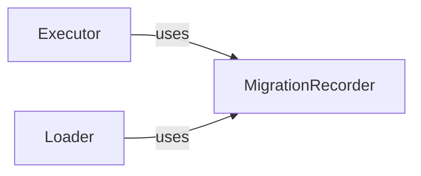

## Component Details

The MigrationRecorder is fundamental to Django's migration system for several critical reasons: 1. State Persistence: It provides the persistent storage mechanism for the database's migration state. Without the django_migrations table and the MigrationRecorder to manage it, Django would have no way of knowing which migrations have been run, leading to inconsistencies and potential data corruption. 2. Reliable Schema Evolution: By accurately tracking applied migrations, it ensures that migrations are applied only once and in the correct order, preventing redundant operations and maintaining the integrity of the database schema. 3. Decoupling Migration Files from Database State: It acts as the crucial link between the migration files (Python code defining schema changes) and the actual state of the database. This decoupling allows Django to manage schema changes incrementally and reliably across different environments. 4. Foundation for Migration Operations: Both the process of applying migrations (Executor) and discovering which migrations need to be applied (Loader) directly depend on the information managed by the MigrationRecorder. It is the single source of truth for the database's migration history.

### MigrationRecorder
The MigrationRecorder is a core component responsible for managing the django_migrations table within the database. This table serves as the authoritative record of which migrations have been successfully applied to the database. Its primary purpose is to enable Django to accurately track the current state of the database schema, determine which migrations are pending, and facilitate the application or unapplication of migrations. It directly interacts with the database to persist and retrieve migration metadata.

**Related Classes/Methods**:

- `MigrationRecorder.Migration` (0:0)
- `MigrationRecorder.__init__` (0:0)
- `MigrationRecorder.has_table` (0:0)
- `MigrationRecorder.ensure_schema` (0:0)
- `MigrationRecorder.applied_migrations` (0:0)
- `MigrationRecorder.record_applied` (0:0)
- `MigrationRecorder.record_unapplied` (0:0)
- `MigrationRecorder.flush` (0:0)

### Executor
Component responsible for executing migrations.

**Related Classes/Methods**: _None_

### Loader
Component responsible for loading and determining applied migrations.

**Related Classes/Methods**: _None_

### [FAQ](https://github.com/CodeBoarding/GeneratedOnBoardings/tree/main?tab=readme-ov-file#faq)