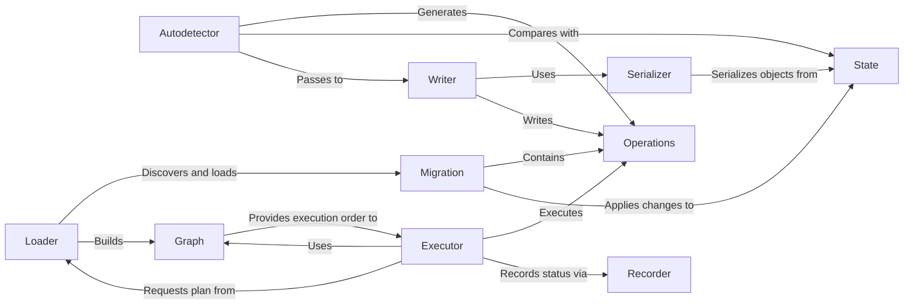

## Component Details

The Migrations subsystem in Django is a robust framework for managing database schema changes. It ensures that the database structure evolves in sync with the application's models in a controlled and versioned manner. The core process involves detecting changes, generating migration files, applying these changes to the database, and tracking the state of applied migrations.

### Migration
The fundamental unit of change in the migration system. Each Migration object encapsulates a set of operations and their dependencies, representing a single step in the database schema evolution.

**Related Classes/Methods**:

- <a href="https://github.com/django/django/blob/master/django/db/migrations/migration.py#L1-L1" target="_blank" rel="noopener noreferrer">`django.db.migrations.migration` (1:1)</a>

### Operations
A collection of atomic database schema modification actions (e.g., CreateModel, AddField, AlterField). These are the building blocks that define what a migration actually does.

**Related Classes/Methods**:

- `django.db.migrations.operations` (1:1)

### State
Represents an in-memory snapshot of a Django project's models at a specific point in time. It's crucial for detecting schema differences, applying migrations, and resolving dependencies without hitting the actual database.

**Related Classes/Methods**:

- <a href="https://github.com/django/django/blob/master/django/db/migrations/state.py#L1-L1" target="_blank" rel="noopener noreferrer">`django.db.migrations.state` (1:1)</a>

### Autodetector
The "brain" of the makemigrations command. It compares the current project's model state with the historical state (derived from existing migrations) to identify differences and generate the necessary Operations.

**Related Classes/Methods**:

- <a href="https://github.com/django/django/blob/master/django/db/migrations/autodetector.py#L1-L1" target="_blank" rel="noopener noreferrer">`django.db.migrations.autodetector` (1:1)</a>

### Writer
Responsible for generating the actual Python code for migration files. It takes the Operations detected by the Autodetector and translates them into a human-readable and executable .py file.

**Related Classes/Methods**:

- <a href="https://github.com/django/django/blob/master/django/db/migrations/writer.py#L1-L1" target="_blank" rel="noopener noreferrer">`django.db.migrations.writer` (1:1)</a>

### Serializer
A helper component used by the Writer to convert Python objects (like model fields, functions, or custom classes) into a string representation that can be directly embedded within migration files.

**Related Classes/Methods**:

- <a href="https://github.com/django/django/blob/master/django/db/migrations/serializer.py#L1-L1" target="_blank" rel="noopener noreferrer">`django.db.migrations.serializer` (1:1)</a>

### Loader
Discovers and loads all migration files from installed applications. It parses these files and constructs the complete migration dependency graph, making them available for execution or analysis.

**Related Classes/Methods**:

- <a href="https://github.com/django/django/blob/master/django/db/migrations/loader.py#L1-L1" target="_blank" rel="noopener noreferrer">`django.db.migrations.loader` (1:1)</a>

### Graph
Represents the dependencies between migrations as a directed acyclic graph (DAG). It ensures that migrations are applied in the correct order, preventing inconsistencies and handling complex inter-app dependencies.

**Related Classes/Methods**:

- <a href="https://github.com/django/django/blob/master/django/db/migrations/graph.py#L1-L1" target="_blank" rel="noopener noreferrer">`django.db.migrations.graph` (1:1)</a>

### Executor
The "worker" that applies or unapplies migrations to the database. It takes a migration plan (ordered by the Graph) and executes the Operations contained within each Migration object.

**Related Classes/Methods**:

- <a href="https://github.com/django/django/blob/master/django/db/migrations/executor.py#L1-L1" target="_blank" rel="noopener noreferrer">`django.db.migrations.executor` (1:1)</a>

### Recorder
Manages the django_migrations table in the database, which tracks which migrations have been applied. It ensures that migrations are not applied multiple times and helps maintain the database's schema history.

**Related Classes/Methods**:

- <a href="https://github.com/django/django/blob/master/django/db/migrations/recorder.py#L1-L1" target="_blank" rel="noopener noreferrer">`django.db.migrations.recorder` (1:1)</a>

### [FAQ](https://github.com/CodeBoarding/GeneratedOnBoardings/tree/main?tab=readme-ov-file#faq)