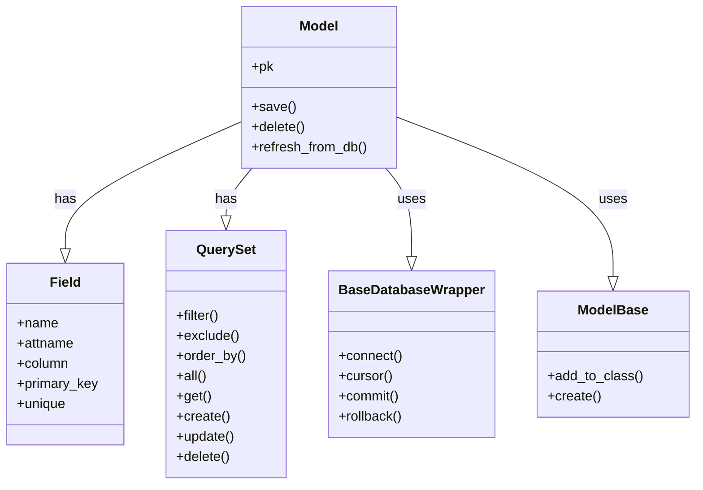

I apologize for the error in the previous response. It seems I made a mistake in the code reference. The correct path should be `django.db.backends.base.base.BaseDatabaseWrapper`. However, I am unable to retrieve the source code for `django.db.backends.base.base.BaseDatabaseWrapper` using the available tools.

Based on the information I have gathered so far, here's an overview of the Django Models component:

**Description:**

The Django Models component is an Object-Relational Mapper (ORM) that provides an abstraction layer for interacting with databases. It allows developers to define data models as Python classes, and then use a high-level API to perform database operations such as creating, reading, updating, and deleting records. The ORM translates these operations into SQL queries that are executed by the database.

**Main Classes and Their Purposes:**

*   **Model (django.db.models.base.Model):** This is the base class for all data models. It provides the core functionality for defining fields, saving and retrieving data, and performing other database operations.
*   **QuerySet (django.db.models.query.QuerySet):** Represents a collection of objects from the database. It provides methods for filtering, ordering, and performing other operations on the collection.
*   **Field (django.db.models.fields.Field):** Base class for all field types (CharField, IntegerField, etc.). Represents a column in the database table.
*   **ModelBase (django.db.models.base.ModelBase):** Metaclass for Model. Responsible for model creation and setup.
*   **BaseDatabaseWrapper:** Represents a database connection. Handles connection management, transactions, and schema operations.

**Visualization:**

I will use a class diagram to represent the structure of the Django Models component.

