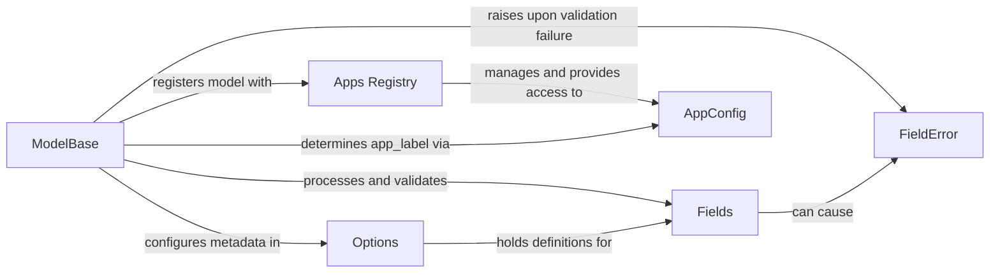

## Component Details

This subsystem is centered around `django.db.models.base.ModelBase`, the metaclass responsible for the dynamic creation and registration of all Django model classes. Its primary purpose is to transform a Python class definition into a fully functional Django model, integrating it into the Django application ecosystem.

### ModelBase
The metaclass for all Django models. Its `__new__` method is the orchestrator, invoked when a `Model` subclass is defined. It handles the parsing of `Meta` options, processing of fields, establishment of inheritance, and registration with the `Apps Registry`.

**Related Classes/Methods**:

- <a href="https://github.com/django/django/blob/master/django/db/models/base.py#L93-L457" target="_blank" rel="noopener noreferrer">`django.db.models.base.ModelBase` (93:457)</a>
- <a href="https://github.com/django/django/blob/master/django/db/models/base.py#L96-L388" target="_blank" rel="noopener noreferrer">`django.db.models.base.ModelBase:__new__` (96:388)</a>

### Apps Registry
A central repository for all installed Django applications and their models. `ModelBase` interacts with this registry to register newly created models, making them discoverable and usable by Django's ORM and other components.

**Related Classes/Methods**:

- <a href="https://github.com/django/django/blob/master/django/apps/registry.py#L12-L433" target="_blank" rel="noopener noreferrer">`django.apps.registry.Apps` (12:433)</a>
- <a href="https://github.com/django/django/blob/master/django/apps/registry.py#L250-L267" target="_blank" rel="noopener noreferrer">`django.apps.registry.Apps:get_containing_app_config` (250:267)</a>
- <a href="https://github.com/django/django/blob/master/django/apps/registry.py#L214-L239" target="_blank" rel="noopener noreferrer">`django.apps.registry.Apps:register_model` (214:239)</a>

### Options
An internal class (accessed via `_meta` on a model instance) that encapsulates all metadata and configuration options for a Django model, such as table name, ordering, abstract status, and relationships. `ModelBase` populates and attaches an `Options` instance to each model.

**Related Classes/Methods**:

- <a href="https://github.com/django/django/blob/master/django/db/models/options.py#L89-L1042" target="_blank" rel="noopener noreferrer">`django.db.models.options.Options` (89:1042)</a>

### Fields
Represents the various data types and relationships (e.g., `CharField`, `IntegerField`, `ForeignKey`) that define a model's attributes. `ModelBase` processes these field definitions, validates them, and integrates them into the model's structure and its `Options` metadata.

**Related Classes/Methods**:

- `django.db.models.fields` (1:1)
- <a href="https://github.com/django/django/blob/master/django/db/models/fields/related.py#L1-L1" target="_blank" rel="noopener noreferrer">`django.db.models.fields.related` (1:1)</a>
- `django.db.models.fields.CharField` (1:1)
- `django.db.models.fields.IntegerField` (1:1)
- `django.db.models.fields.ForeignKey` (1:1)

### FieldError
A specific exception raised when inconsistencies or errors are detected during the processing and validation of model fields, such as naming conflicts or invalid configurations. `ModelBase` raises this exception to enforce model definition rules.

**Related Classes/Methods**:

- <a href="https://github.com/django/django/blob/master/django/core/exceptions.py#L1-L1" target="_blank" rel="noopener noreferrer">`django.core.exceptions.FieldError` (1:1)</a>

### AppConfig
Stores configuration and metadata for an individual Django application. While the `Apps Registry` manages collections of `AppConfig` instances, `ModelBase` queries the `Apps Registry` to determine the appropriate `AppConfig` for a model, which helps in assigning the correct `app_label`.

**Related Classes/Methods**:

- <a href="https://github.com/django/django/blob/master/django/apps/config.py#L12-L273" target="_blank" rel="noopener noreferrer">`django.apps.config.AppConfig` (12:273)</a>

### [FAQ](https://github.com/CodeBoarding/GeneratedOnBoardings/tree/main?tab=readme-ov-file#faq)