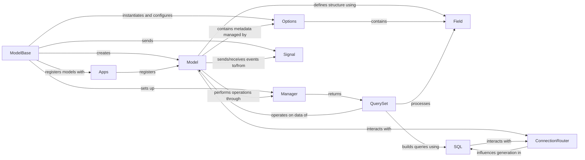

## Component Details

Updated analysis of Django ORM components and their relationships.

### Model
The `Model` class (`django.db.models.base.Model`) is the foundational class from which all Django database tables are defined. It provides the core ORM functionalities, enabling developers to define fields, metadata, and methods for interacting with individual database records. Instances of `Model` represent rows in a database table.

**Related Classes/Methods**:

- <a href="https://github.com/django/django/blob/master/django/db/models/base.py#L480-L2407" target="_blank" rel="noopener noreferrer">`django.db.models.base.Model` (480:2407)</a>

### ModelBase
`ModelBase` (`django.db.models.base.ModelBase`) is the metaclass for `Model`. It's responsible for the creation and initial setup of model classes when they are defined. This includes processing the inner `Meta` class, adding fields, and setting up default managers. It's the engine that transforms a Python class definition into a functional Django model.

**Related Classes/Methods**:

- <a href="https://github.com/django/django/blob/master/django/db/models/base.py#L93-L457" target="_blank" rel="noopener noreferrer">`django.db.models.base.ModelBase` (93:457)</a>

### Options
The `Options` class (`django.db.models.options.Options`), typically accessed via `_meta` on a model instance or class, stores all the model's metadata. This includes field definitions, relationships, database table name, ordering, and various other model-specific configurations. It acts as a central repository for a model's declarative information.

**Related Classes/Methods**:

- <a href="https://github.com/django/django/blob/master/django/db/models/options.py#L89-L1042" target="_blank" rel="noopener noreferrer">`django.db.models.options.Options` (89:1042)</a>

### Field
`Field` (`django.db.models.fields.Field`) represents the individual attributes of a model, mapping Python data types to database column types. Django provides various concrete field types (e.g., `CharField`, `IntegerField`, `ForeignKey`) that inherit from `Field`. It handles data validation, database representation, and serialization.

**Related Classes/Methods**:

- `django.db.models.fields.Field` (119:1000)

### Manager
`Manager` (`django.db.models.manager.Manager`) provides the interface through which database query operations are performed on a model. Every `Model` has at least one `Manager` instance (the default `objects` manager), which is used to retrieve, create, update, and delete model instances. Managers are the entry point for all ORM queries.

**Related Classes/Methods**:

- <a href="https://github.com/django/django/blob/master/django/db/models/manager.py#L175-L176" target="_blank" rel="noopener noreferrer">`django.db.models.manager.Manager` (175:176)</a>

### QuerySet
`QuerySet` (`django.db.models.query.QuerySet`) represents a collection of database queries that can be chained together to filter, order, and manipulate data. It is "lazy" in that it doesn't hit the database until evaluated (e.g., when iterating over it or calling `list()`). QuerySets are returned by `Manager` methods.

**Related Classes/Methods**:

- <a href="https://github.com/django/django/blob/master/django/db/models/query.py#L100-L1000" target="_blank" rel="noopener noreferrer">`django.db.models.query.QuerySet` (100:1000)</a>

### SQL
This conceptual sub-component, primarily represented by modules within `django.db.models.sql`, is responsible for constructing and compiling SQL queries from Django's ORM expressions. It translates the Python-based `QuerySet` operations into the appropriate SQL syntax for the underlying database.

**Related Classes/Methods**:

- <a href="https://github.com/django/django/blob/master/django/db/models/sql/query.py#L100-L1000" target="_blank" rel="noopener noreferrer">`django.db.models.sql.query.Query` (100:1000)</a>
- <a href="https://github.com/django/django/blob/master/django/db/models/sql/compiler.py#L39-L1674" target="_blank" rel="noopener noreferrer">`django.db.models.sql.compiler.SQLCompiler` (39:1674)</a>

### Signal
Django's signaling mechanism (`django.dispatch.dispatcher.Signal` and `django.db.models.signals`) allows decoupled applications to get notified when certain actions occur elsewhere in the framework. In the context of models, signals like `pre_save`, `post_save`, `pre_delete`, and `post_delete` are sent, allowing other parts of the application to react to model changes without tight coupling.

**Related Classes/Methods**:

- <a href="https://github.com/django/django/blob/master/django/dispatch/dispatcher.py#L24-L487" target="_blank" rel="noopener noreferrer">`django.dispatch.dispatcher.Signal` (24:487)</a>
- <a href="https://github.com/django/django/blob/master/django/db/models/signals.py#L1-L100" target="_blank" rel="noopener noreferrer">`django.db.models.signals.pre_save` (1:100)</a>
- <a href="https://github.com/django/django/blob/master/django/db/models/signals.py#L1-L100" target="_blank" rel="noopener noreferrer">`django.db.models.signals.post_save` (1:100)</a>
- <a href="https://github.com/django/django/blob/master/django/db/models/signals.py#L1-L100" target="_blank" rel="noopener noreferrer">`django.db.models.signals.pre_delete` (1:100)</a>
- <a href="https://github.com/django/django/blob/master/django/db/models/signals.py#L1-L100" target="_blank" rel="noopener noreferrer">`django.db.models.signals.post_delete` (1:100)</a>

### ConnectionRouter
The `ConnectionRouter` (`django.db.utils.ConnectionRouter`) component is responsible for determining which database to use for read and write operations when multiple databases are configured in a Django project. It allows for flexible database routing based on application logic, enabling features like database sharding or read/write splitting.

**Related Classes/Methods**:

- <a href="https://github.com/django/django/blob/master/django/db/utils.py#L199-L280" target="_blank" rel="noopener noreferrer">`django.db.utils.ConnectionRouter` (199:280)</a>

### Apps
The `Apps` registry (`django.apps.registry.Apps`) stores the configuration of all installed applications and keeps track of all loaded models. It provides methods to retrieve app configurations and model classes, acting as a central registry for all Django applications and their models.

**Related Classes/Methods**:

- <a href="https://github.com/django/django/blob/master/django/apps/registry.py#L12-L433" target="_blank" rel="noopener noreferrer">`django.apps.registry.Apps` (12:433)</a>

### [FAQ](https://github.com/CodeBoarding/GeneratedOnBoardings/tree/main?tab=readme-ov-file#faq)