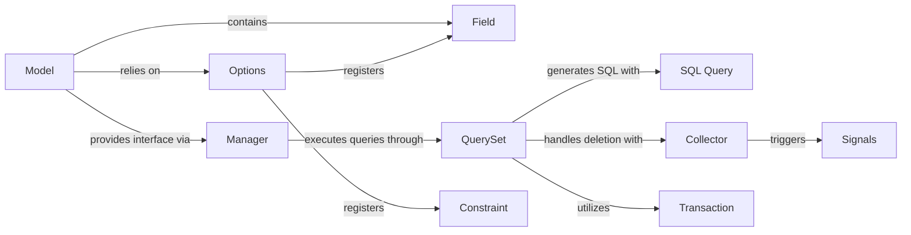

## Component Details

One paragraph explaining the functionality which is represented by this graph. What the main flow is and what is its purpose.

### Model
The foundational class (`django.db.models.base.Model`) from which all Django database models inherit. It defines the structure of database tables, including fields, relationships, and behaviors. Instances of `Model` represent individual rows in a database table and provide core methods for saving, updating, and deleting objects.

**Related Classes/Methods**:

- <a href="https://github.com/django/django/blob/master/django/db/models/base.py#L480-L2407" target="_blank" rel="noopener noreferrer">`django.db.models.base.Model` (480:2407)</a>

### Options
This class (`django.db.models.options.Options`), typically accessed via `Model._meta`, serves as the metadata container for a Django model. It stores and manages all configuration details, including the model's fields, relationships, managers, database table name, ordering, indexes, and constraints. It plays a crucial role during model initialization by processing the `Meta` inner class and dynamically adding components like fields and managers to the model.

**Related Classes/Methods**:

- <a href="https://github.com/django/django/blob/master/django/db/models/options.py#L89-L1042" target="_blank" rel="noopener noreferrer">`django.db.models.options.Options` (89:1042)</a>

### Field
The base class (`django.db.models.fields.__init__.Field`) for all model field types (e.g., `CharField`, `IntegerField`, `ForeignKey`). A `Field` instance defines a single column in a database table, specifying its data type, constraints (e.g., primary key, unique, nullability), default values, and validation rules. Fields are "contributed" to the `Model` class via `Options` during setup.

**Related Classes/Methods**:

- <a href="https://github.com/django/django/blob/master/django/db/models/fields/__init__.py#L118-L1155" target="_blank" rel="noopener noreferrer">`django.db.models.fields.__init__.Field` (118:1155)</a>

### Manager
The primary interface (`django.db.models.manager.Manager`) through which database query operations are performed on a Django model. The `Manager` class itself inherits from `BaseManager` and dynamically proxies methods from `QuerySet`, providing a rich API for database interaction. Every `Model` class automatically gets a default manager (usually `objects`), and custom managers can be defined. It provides methods for retrieving, creating, updating, and deleting model instances.

**Related Classes/Methods**:

- <a href="https://github.com/django/django/blob/master/django/db/models/manager.py#L175-L176" target="_blank" rel="noopener noreferrer">`django.db.models.manager.Manager` (175:176)</a>
- <a href="https://github.com/django/django/blob/master/django/db/models/manager.py#L9-L172" target="_blank" rel="noopener noreferrer">`django.db.models.manager.BaseManager` (9:172)</a>

### QuerySet
Represents a collection of database query operations (`django.db.models.query.QuerySet`) that are lazily evaluated. It encapsulates the logic for building complex SQL queries through methods like `filter()`, `exclude()`, `annotate()`, and `order_by()`. When a `QuerySet` is iterated or a terminal operation (e.g., `get()`, `count()`, `delete()`) is called, it triggers the actual database interaction.

**Related Classes/Methods**:

- <a href="https://github.com/django/django/blob/master/django/db/models/query.py#L279-L2677" target="_blank" rel="noopener noreferrer">`django.db.models.query.QuerySet` (279:2677)</a>

### SQL Query
This internal component (`django.db.models.sql.query.Query`) is the core engine for constructing the actual SQL statements. It translates the high-level ORM operations defined on a `QuerySet` into specific SQL clauses (SELECT, FROM, WHERE, GROUP BY, ORDER BY, LIMIT/OFFSET), managing joins, annotations, and filtering conditions before execution by the database backend.

**Related Classes/Methods**:

- <a href="https://github.com/django/django/blob/master/django/db/models/sql/query.py#L220-L2694" target="_blank" rel="noopener noreferrer">`django.db.models.sql.query.Query` (220:2694)</a>

### Collector
Responsible for orchestrating the deletion of model instances and their related objects (`django.db.models.deletion.Collector`). It recursively gathers all objects affected by a deletion based on `on_delete` rules (e.g., `CASCADE`, `SET_NULL`, `PROTECT`), builds a dependency graph, and executes the deletion in the correct order, ensuring referential integrity.

**Related Classes/Methods**:

- <a href="https://github.com/django/django/blob/master/django/db/models/deletion.py#L93-L516" target="_blank" rel="noopener noreferrer">`django.db.models.deletion.Collector` (93:516)</a>

### Signals
Provides a decoupled communication mechanism (`django.db.models.signals`) within Django, allowing various parts of the framework or custom applications to register listeners for specific events in a model's lifecycle. Key signals include `pre_save`, `post_save`, `pre_delete`, and `post_delete`, enabling custom logic to be executed before or after an object is saved or deleted.

**Related Classes/Methods**:

- <a href="https://github.com/django/django/blob/master/django/db/models/signals.py#L1-L54" target="_blank" rel="noopener noreferrer">`django.db.models.signals` (1:54)</a>

### Transaction
Manages database transactions (`django.db.transaction`), ensuring that a series of database operations are treated as a single, atomic unit. This is critical for maintaining data consistency and integrity, especially during complex operations like `bulk_create` or cascading deletions, where all changes must succeed or fail together.

**Related Classes/Methods**:

- <a href="https://github.com/django/django/blob/master/django/db/transaction.py#L1-L200" target="_blank" rel="noopener noreferrer">`django.db.transaction` (1:200)</a>

### Constraint
Represents database-level constraints (`django.db.models.constraints.BaseConstraint` and its subclasses like `CheckConstraint`, `UniqueConstraint`) defined within a model's `Meta` class. These enforce data integrity rules directly at the database level, such as ensuring uniqueness across multiple fields or validating data against a specific condition. They provide methods to generate the necessary SQL for schema creation and integrate with Django's system checks.

**Related Classes/Methods**:

- <a href="https://github.com/django/django/blob/master/django/db/models/constraints.py#L18-L126" target="_blank" rel="noopener noreferrer">`django.db.models.constraints.BaseConstraint` (18:126)</a>

### [FAQ](https://github.com/CodeBoarding/GeneratedOnBoardings/tree/main?tab=readme-ov-file#faq)