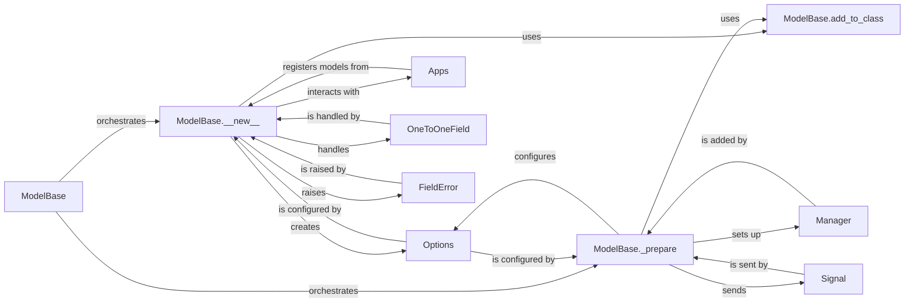

## Component Details

Abstract Components Overview for ModelBase

### ModelBase
The metaclass for all Django models. It acts as the central orchestrator, intercepting the creation of `Model` subclasses to inject Django's ORM capabilities. It defines the overall flow, delegating initial setup to its `__new__` method and finalization to its `_prepare` method.

**Related Classes/Methods**:

- `ModelBase` (1:1)

### ModelBase.__new__
This static method within `ModelBase` is the primary entry point for creating new model classes. It processes attributes, parses the inner `Meta` class, initializes the `Options` object (`_meta`), creates default exceptions (`DoesNotExist`, `MultipleObjectsReturned`), handles proxy models, and establishes multi-table inheritance relationships (often involving `OneToOneField`). It extensively uses `add_to_class` to attach various components and interacts with the `Apps` registry to determine the model's application label and initiate model registration.

**Related Classes/Methods**:

- `ModelBase.__new__` (1:1)

### ModelBase.add_to_class
A utility method within `ModelBase` used by both `ModelBase.__new__` and `ModelBase._prepare` to dynamically add attributes (such as fields, managers, and methods) to the newly created model class. It checks for a `contribute_to_class` method on the attribute and calls it if present, allowing for custom logic during attribute addition; otherwise, it uses `setattr`.

**Related Classes/Methods**:

- `ModelBase.add_to_class` (1:1)

### ModelBase._prepare
This method, part of `ModelBase`, performs final preparations on the model class after its initial creation by `__new__`. Its responsibilities include further configuring the `_meta` options, setting up ordering methods, generating a default docstring, ensuring a default `Manager` (`objects`) is present, and sending the `class_prepared` signal. It also utilizes `add_to_class` to add the default manager.

**Related Classes/Methods**:

- `ModelBase._prepare` (1:1)

### Options
This class (from `django.db.models.options`) encapsulates all model-specific metadata and configuration, such as field definitions, primary key information, database table name, ordering, and various other settings defined in the model's inner `Meta` class. An instance is created by `ModelBase.__new__` and further configured by `ModelBase._prepare`.

**Related Classes/Methods**:

- <a href="https://github.com/django/django/blob/master/django/contrib/admin/options.py#L1-L1" target="_blank" rel="noopener noreferrer">`Options` (1:1)</a>

### Apps
The application registry (`django.apps.registry.Apps`) is a central component that stores configurations and provides introspection capabilities for all installed applications and their models. `ModelBase.__new__` interacts with `Apps` to determine the model's `app_label` and registers the newly created model with this registry, making it discoverable and manageable within the Django project.

**Related Classes/Methods**:

- <a href="https://github.com/django/django/blob/master/django/contrib/postgres/apps.py#L1-L1" target="_blank" rel="noopener noreferrer">`Apps` (1:1)</a>

### Manager
Managers (from `django.db.models.manager`) are the primary interface through which database query operations are provided to Django models. `ModelBase._prepare` ensures that every `Model` has at least one `Manager` instance (by default, `objects`) by creating and adding it to the model class using `add_to_class`.

**Related Classes/Methods**:

- <a href="https://github.com/django/django/blob/master/django/db/models/manager.py#L175-L176" target="_blank" rel="noopener noreferrer">`Manager` (175:176)</a>

### Signal
Django's signaling framework (`django.dispatch.dispatcher`) allows decoupled applications to get notified when certain actions occur. The `class_prepared` signal is specifically sent by `ModelBase._prepare` after a model class has been fully prepared, allowing other parts of Django or third-party apps to react to the model's readiness.

**Related Classes/Methods**:

- `Signal` (1:1)

### OneToOneField
A specific type of field (`django.db.models.fields.related`) that represents a one-to-one relationship in the database. It is particularly relevant in the context of multi-table inheritance, where `ModelBase.__new__` explicitly handles its creation (e.g., for `_ptr` fields) to link a child model to its parent model's primary key.

**Related Classes/Methods**:

- `OneToOneField` (1:1)

### FieldError
A specific exception class (`django.core.exceptions`) raised by Django when there is an issue related to a model field, such as a name clash during model inheritance, invalid field options, or other field validation problems during model definition. `ModelBase.__new__` raises this exception to enforce valid model structures.

**Related Classes/Methods**:

- `FieldError` (1:1)

### [FAQ](https://github.com/CodeBoarding/GeneratedOnBoardings/tree/main?tab=readme-ov-file#faq)