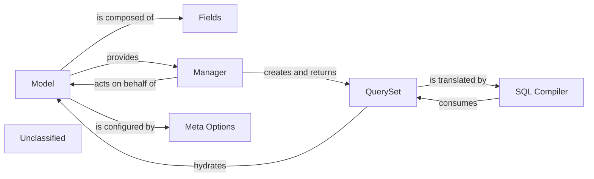

## Details

An analysis of the Django ORM subsystem reveals a layered architecture designed to abstract database interactions into Pythonic operations. The core of this subsystem is the `Model`, which serves as the single source of truth for data structure and behavior. Developers define models by inheriting from `django.db.models.base.Model`, and each model class maps to a database table. Attached to each model is a `Manager`, which acts as the primary interface for database queries. The `Manager` produces `QuerySet` objects, which represent a collection of database records and allow for filtering, slicing, and ordering. These `QuerySet`s are lazily evaluated, meaning the database is only hit when the `QuerySet` is iterated over. When a `QuerySet` is evaluated, a `SQLCompiler` translates the Python code into a database-specific SQL query. Finally, the `Meta Options` class provides a way to configure model-level settings, such as the database table name, default ordering, and permissions.

### Model
The core of the ORM. This is the base class from which all application data models inherit. It links field definitions to database columns and encapsulates the object's behavior and relationships.

**Related Classes/Methods**:

- <a href="https://github.com/django/django/blob/main/django/db/models/base.py" target="_blank" rel="noopener noreferrer">`django.db.models.base.Model`</a>

### Fields
A collection of classes (CharField, IntegerField, ForeignKey, etc.) that define the schema. Each field class maps a Python data type to a database column type, handling validation, default values, and relationship logic. This component represents the collection of modules in the `django.db.models.fields` package.

**Related Classes/Methods**:

- <a href="https://github.com/django/django/blob/main/django/db/models/fields/__init__.py" target="_blank" rel="noopener noreferrer">`django.db.models.fields`</a>

### Manager
The primary gateway for database query operations. Attached to a Model, it provides methods (.all(), .filter(), .create()) that initiate database interactions and return QuerySet objects.

**Related Classes/Methods**:

- <a href="https://github.com/django/django/blob/main/django/db/models/manager.py" target="_blank" rel="noopener noreferrer">`django.db.models.manager.Manager`</a>

### QuerySet
Represents a lazily-executed database query. It holds a collection of model instances and provides a powerful API for filtering, ordering, and slicing data before it is fetched from the database.

**Related Classes/Methods**:

- <a href="https://github.com/django/django/blob/main/django/db/models/query.py" target="_blank" rel="noopener noreferrer">`django.db.models.query.QuerySet`</a>

### SQL Compiler
The translation engine of the ORM. It takes a QuerySet object, with its filters and annotations, and compiles it into a database-specific SQL query string for execution.

**Related Classes/Methods**:

- <a href="https://github.com/django/django/blob/main/django/db/models/sql/compiler.py#L40-L1675" target="_blank" rel="noopener noreferrer">`django.db.models.sql.compiler.SQLCompiler`:40-1675</a>

### Meta Options
Handles the declarative configuration for a model, defined in its inner Meta class. It processes options like table names (db_table), default ordering, and model permissions.

**Related Classes/Methods**:

- <a href="https://github.com/django/django/blob/main/django/db/models/options.py#L90-L1052" target="_blank" rel="noopener noreferrer">`django.db.models.options.Options`:90-1052</a>

### Unclassified
Component for all unclassified files and utility functions (Utility functions/External Libraries/Dependencies)

**Related Classes/Methods**: _None_

### [FAQ](https://github.com/CodeBoarding/GeneratedOnBoardings/tree/main?tab=readme-ov-file#faq)