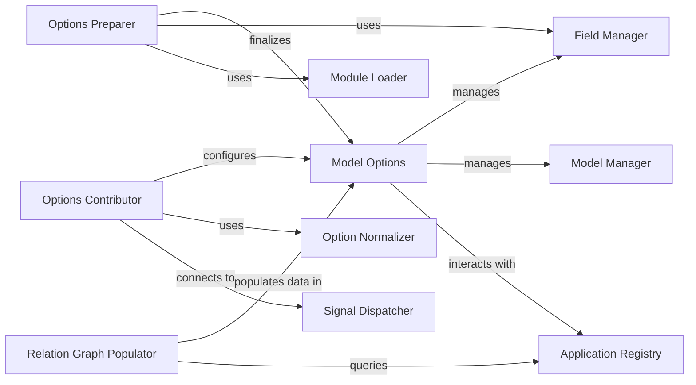

## Component Details

The `Model Options` subsystem in Django is centered around the `django.db.models.options.Options` class, which serves as the central repository for all metadata and configuration related to a Django model. This metadata is crucial for the Django ORM and other framework components to understand, interact with, and manage a model's structure and behavior.

### Model Options
This is the foundational class (`django.db.models.options.Options`) that encapsulates all metadata and configuration for a Django model. Every Django model instance has an `_meta` attribute, which is an instance of `Options`. It stores crucial information such as field definitions (`local_fields`, `many_to_many`), database table names (`db_table`), ordering (`ordering`), unique constraints (`unique_together`), and various other model-specific settings. It acts as the central blueprint that Django's ORM and other components use to understand, interact with, and manage a model's structure and behavior.

**Related Classes/Methods**:

- <a href="https://github.com/django/django/blob/master/django/db/models/options.py#L89-L1042" target="_blank" rel="noopener noreferrer">`django.db.models.options.Options` (89:1042)</a>

### Options Contributor
Represented by the `contribute_to_class` method within `django.db.models.options.Options`. This method is a critical entry point for integrating an `Options` instance with its corresponding model class. It's responsible for processing the `Meta` inner class defined within a Django model, extracting configuration attributes (e.g., `db_table`, `ordering`, `unique_together`), applying default values where necessary, and performing initial setup like connecting to Django's signal system for model-related events. It ensures that the `Options` instance is correctly populated with the model's declared metadata.

**Related Classes/Methods**:

- <a href="https://github.com/django/django/blob/master/django/db/models/options.py#L177-L241" target="_blank" rel="noopener noreferrer">`django.db.models.options.Options:contribute_to_class` (177:241)</a>

### Options Preparer
Embodied by the `_prepare` internal method of `django.db.models.options.Options`. This component handles post-initialization setup for the model's options. Its primary responsibilities include resolving the `order_with_respect_to` field (if specified) and, crucially, ensuring that a primary key is correctly defined for the model. If no primary key is explicitly declared, this component automatically creates a default `AutoField` to serve as the primary key, ensuring every model has a unique identifier.

**Related Classes/Methods**:

- <a href="https://github.com/django/django/blob/master/django/db/models/options.py#L284-L326" target="_blank" rel="noopener noreferrer">`django.db.models.options.Options:_prepare` (284:326)</a>

### Field Manager
This conceptual component encompasses methods within `django.db.models.options.Options` such as `add_field`, `get_field`, and `_get_fields`. It is responsible for the dynamic management of field instances associated with a model. This includes adding new fields, retrieving existing field definitions, and managing internal caches of different field types (e.g., `local_fields`, `many_to_many`, `private_fields`). It ensures that field information is consistently accessible and that the `Options` instance accurately reflects the model's field structure.

**Related Classes/Methods**:

- <a href="https://github.com/django/django/blob/master/django/db/models/options.py#L332-L364" target="_blank" rel="noopener noreferrer">`django.db.models.options.Options:add_field` (332:364)</a>
- <a href="https://github.com/django/django/blob/master/django/db/models/options.py#L661-L686" target="_blank" rel="noopener noreferrer">`django.db.models.options.Options:get_field` (661:686)</a>
- <a href="https://github.com/django/django/blob/master/django/db/models/options.py#L871-L964" target="_blank" rel="noopener noreferrer">`django.db.models.options.Options:_get_fields` (871:964)</a>

### Relation Graph Populator
Represented by the `_populate_directed_relation_graph` method within `django.db.models.options.Options`. This component is responsible for constructing and caching an internal graph that maps all relationships (both forward and reverse) between the current model and other models across all installed Django applications. This graph is vital for the Django ORM to efficiently navigate complex relationships between models, enabling operations like `select_related` and `prefetch_related`.

**Related Classes/Methods**:

- <a href="https://github.com/django/django/blob/master/django/db/models/options.py#L798-L836" target="_blank" rel="noopener noreferrer">`django.db.models.options.Options:_populate_directed_relation_graph` (798:836)</a>

### Option Normalizer
This is a utility function (`django.db.models.options.normalize_together`) that standardizes the format of specific model options, particularly `unique_together` and `index_together`. It ensures that these options, which can be provided in various formats, are consistently converted into a tuple of tuples. This normalization simplifies their subsequent processing and validation by other parts of the `Model Options` component.

**Related Classes/Methods**:

- <a href="https://github.com/django/django/blob/master/django/db/models/options.py#L63-L82" target="_blank" rel="noopener noreferrer">`django.db.models.options.normalize_together` (63:82)</a>

### Application Registry
This is Django's central registry (`django.apps.registry.Apps`) that maintains a comprehensive list of all installed applications and their registered models. The `Model Options` component, particularly the `Relation Graph Populator`, interacts with this registry (e.g., via `get_models`) to discover and resolve relationships with other models throughout the Django project. It provides a global view of the project's model landscape.

**Related Classes/Methods**:

- <a href="https://github.com/django/django/blob/master/django/apps/registry.py#L12-L433" target="_blank" rel="noopener noreferrer">`django.apps.registry.Apps` (12:433)</a>

### Module Loader
A utility function (`django.utils.module_loading.import_string`) used for dynamically importing Python modules, classes, or functions given their fully qualified dotted path. Within the `Model Options` subsystem, it's specifically used by the `Options Preparer` to load the default primary key class based on Django's settings, allowing for flexible primary key configurations.

**Related Classes/Methods**:

- <a href="https://github.com/django/django/blob/master/django/utils/module_loading.py#L18-L34" target="_blank" rel="noopener noreferrer">`django.utils.module_loading.import_string` (18:34)</a>

### Signal Dispatcher
Django's built-in mechanism (`django.dispatch.dispatcher.Signal`) for decoupled communication between different parts of the framework. The `Options Contributor` component utilizes `Signal.connect` to register callbacks that respond to specific events, such as changes in Django settings that might influence model behavior or options. This allows for a flexible and extensible way to react to system-wide changes.

**Related Classes/Methods**:

- <a href="https://github.com/django/django/blob/master/django/dispatch/dispatcher.py#L24-L487" target="_blank" rel="noopener noreferrer">`django.dispatch.dispatcher.Signal` (24:487)</a>

### Model Manager
The primary interface (`django.db.models.manager.Manager`) through which database queries are performed for a model. The `Model Options` component is responsible for configuring and making available the default manager (and any custom managers defined on the model) for a model. This ensures that all ORM operations, such as `MyModel.objects.all()`, are correctly routed and executed.

**Related Classes/Methods**:

- <a href="https://github.com/django/django/blob/master/django/db/models/manager.py#L175-L176" target="_blank" rel="noopener noreferrer">`django.db.models.manager.Manager` (175:176)</a>

### [FAQ](https://github.com/CodeBoarding/GeneratedOnBoardings/tree/main?tab=readme-ov-file#faq)