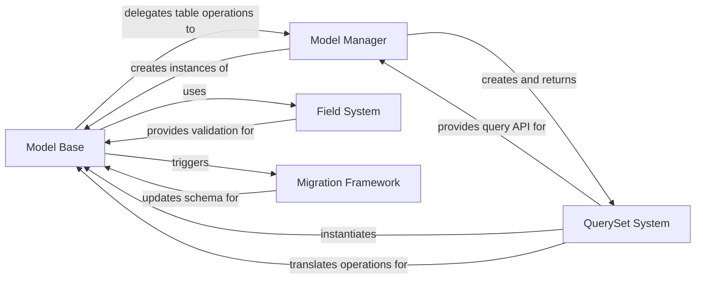

## Details

Django's Model System (ORM) is a core component of Django's MVT architecture that implements the Object-Relational Mapping pattern. It provides a high-level abstraction for database operations, allowing developers to work with Python objects rather than raw SQL. The system consists of several interconnected components: Model Base (the foundation for defining database models as Python classes), QuerySet System (for constructing database queries using Python methods), Model Manager (interface for table-level operations), Field System (defining field types and handling validation), and Migration Framework (managing schema evolution). Together, these components enable database abstraction, data validation, schema evolution, and a Pythonic query construction API, exemplifying Django's "batteries-included" philosophy.

### Model Base
The foundation of Django's ORM system, providing the core functionality for defining database models as Python classes.

**Related Classes/Methods**:

- <a href="https://github.com/django/django/blob/main/django/db/models/base.py#L480-L2407" target="_blank" rel="noopener noreferrer">`django.db.models.base.Model` (480:2407)</a>

### QuerySet System
Provides a chainable API for constructing database queries using Python methods rather than SQL.

**Related Classes/Methods**:

- `django.db.models.query.QuerySet`

### Model Manager
Acts as an interface for database operations at the table level rather than instance level.

**Related Classes/Methods**:

- <a href="https://github.com/django/django/blob/main/django/db/models/manager.py#L175-L176" target="_blank" rel="noopener noreferrer">`django.db.models.manager.Manager` (175:176)</a>

### Field System
Defines the various field types that can be used in models, mapping Python types to database column types.

**Related Classes/Methods**:

- `django.db.models.fields.Field`

### Migration Framework
Handles schema evolution by tracking changes to models and generating/executing database migrations.

**Related Classes/Methods**:

- <a href="https://github.com/django/django/blob/main/django/db/migrations/migration.py#L8-L221" target="_blank" rel="noopener noreferrer">`django.db.migrations.migration.Migration` (8:221)</a>
- <a href="https://github.com/django/django/blob/main/django/db/migrations/executor.py#L9-L411" target="_blank" rel="noopener noreferrer">`django.db.migrations.executor.MigrationExecutor` (9:411)</a>

### [FAQ](https://github.com/CodeBoarding/GeneratedOnBoardings/tree/main?tab=readme-ov-file#faq)