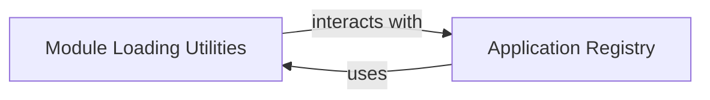

## Component Details

Overview of Django's Module Loading Utilities and Application Registry components and their relationships.

### Module Loading Utilities
This component is a foundational utility responsible for dynamically loading Python modules, classes, and functions from string paths. This dynamic loading capability is crucial for Django's pluggable and extensible architecture, allowing various parts of the framework to be configured and extended at runtime. It also includes mechanisms for auto-discovery of specific submodules within Django applications, which is vital for features like the Django Admin and ORM.

**Related Classes/Methods**:

- <a href="https://github.com/django/django/blob/master/django/utils/module_loading.py#L18-L34" target="_blank" rel="noopener noreferrer">`django.utils.module_loading.import_string` (18:34)</a>
- <a href="https://github.com/django/django/blob/master/django/utils/module_loading.py#L7-L15" target="_blank" rel="noopener noreferrer">`django.utils.module_loading.cached_import` (7:15)</a>
- <a href="https://github.com/django/django/blob/master/django/utils/module_loading.py#L37-L70" target="_blank" rel="noopener noreferrer">`django.utils.module_loading.autodiscover_modules` (37:70)</a>
- <a href="https://github.com/django/django/blob/master/django/utils/module_loading.py#L73-L88" target="_blank" rel="noopener noreferrer">`django.utils.module_loading.module_has_submodule` (73:88)</a>

### Application Registry
The Application Registry (`django.apps.registry.Apps`) acts as the central repository for all installed Django applications. It manages `AppConfig` objects, which encapsulate metadata and configuration for each application. This registry is vital for Django to understand the project's structure, enabling features like model discovery, signal dispatching, URL routing, and various management commands by providing a unified interface to access application-specific information and components.

**Related Classes/Methods**:

- <a href="https://github.com/django/django/blob/master/django/apps/registry.py#L12-L433" target="_blank" rel="noopener noreferrer">`django.apps.registry.Apps` (12:433)</a>
- <a href="https://github.com/django/django/blob/master/django/apps/registry.py#L0-L0" target="_blank" rel="noopener noreferrer">`django.apps.registry.Apps:ready` (0:0)</a>
- <a href="https://github.com/django/django/blob/master/django/apps/registry.py#L144-L147" target="_blank" rel="noopener noreferrer">`django.apps.registry.Apps:get_app_configs` (144:147)</a>
- <a href="https://github.com/django/django/blob/master/django/apps/registry.py#L149-L164" target="_blank" rel="noopener noreferrer">`django.apps.registry.Apps:get_app_config` (149:164)</a>
- <a href="https://github.com/django/django/blob/master/django/apps/registry.py#L187-L212" target="_blank" rel="noopener noreferrer">`django.apps.registry.Apps:get_model` (187:212)</a>
- <a href="https://github.com/django/django/blob/master/django/apps/registry.py#L60-L126" target="_blank" rel="noopener noreferrer">`django.apps.registry.Apps:populate` (60:126)</a>

### [FAQ](https://github.com/CodeBoarding/GeneratedOnBoardings/tree/main?tab=readme-ov-file#faq)