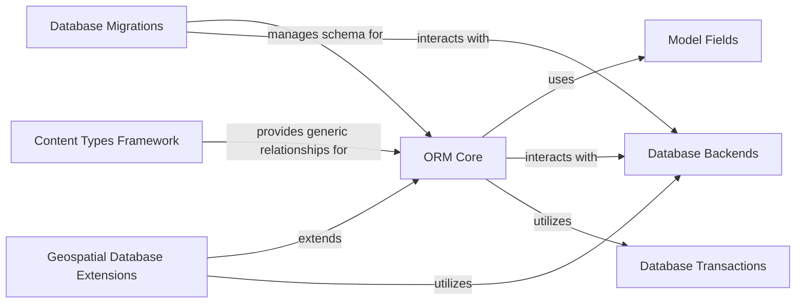

## Component Details

This section details the core components of Django's ORM and Database Layer. It covers how models are defined, how queries are constructed and executed, the various field types available, the underlying database interaction mechanisms, transaction management, schema evolution through migrations, and specialized extensions for geospatial data and generic content types. The components work together to provide a robust and abstract interface for interacting with different database systems, allowing developers to focus on Python objects rather than raw SQL.

### ORM Core
The heart of Django's ORM, providing the fundamental classes for defining database models as Python objects and enabling object-oriented interaction with the database. It includes the base Model class and the QuerySet API for building and executing database queries.

**Related Classes/Methods**:

- <a href="https://github.com/django/django/blob/master/django/db/models/base.py#L480-L2406" target="_blank" rel="noopener noreferrer">`django.db.models.base.Model` (480:2406)</a>
- <a href="https://github.com/django/django/blob/master/django/db/models/query.py#L279-L2069" target="_blank" rel="noopener noreferrer">`django.db.models.query.QuerySet` (279:2069)</a>

### Model Fields
Defines the various field types (e.g., CharField, IntegerField, ForeignKey) that can be used in Django models to represent different kinds of data and their corresponding database column types. It also handles field-level validation and database-specific adaptations.

**Related Classes/Methods**:

- `django.db.models.fields` (1:200)

### Database Backends
This component provides the specific implementations for connecting to and interacting with different database systems (e.g., PostgreSQL, MySQL, SQLite). It handles the low-level details of database communication and query execution.

**Related Classes/Methods**:

- <a href="https://github.com/django/django/blob/master/django/db/backends/base/base.py#L29-L791" target="_blank" rel="noopener noreferrer">`django.db.backends.base.base.BaseDatabaseWrapper` (29:791)</a>
- <a href="https://github.com/django/django/blob/master/django/template/backends/django.py#L1-L200" target="_blank" rel="noopener noreferrer">`django.db.backends` (1:200)</a>

### Database Transactions
Manages database transactions, ensuring data integrity by grouping multiple database operations into a single atomic unit. It provides functionalities like `atomic` blocks and savepoints.

**Related Classes/Methods**:

- <a href="https://github.com/django/django/blob/master/django/db/transaction.py#L1-L200" target="_blank" rel="noopener noreferrer">`django.db.transaction` (1:200)</a>

### Database Migrations
Handles the evolution of the database schema over time. It allows developers to define changes to their models and automatically generates and applies database migrations.

**Related Classes/Methods**:

- <a href="https://github.com/django/django/blob/master/django/db/migrations/migration.py#L1-L200" target="_blank" rel="noopener noreferrer">`django.db.migrations.migration` (1:200)</a>
- <a href="https://github.com/django/django/blob/master/django/db/migrations/autodetector.py#L1-L200" target="_blank" rel="noopener noreferrer">`django.db.migrations.autodetector` (1:200)</a>

### Geospatial Database Extensions
Extends Django's ORM to support geospatial data types and operations, enabling interaction with spatial databases like PostGIS, SpatiaLite, Oracle Spatial, and MySQL's spatial extensions.

**Related Classes/Methods**:

- `django.contrib.gis.db.models` (1:200)

### Content Types Framework
Provides a high-level, generic interface for working with different models in your installed applications. It allows for generic relationships and dynamic content management.

**Related Classes/Methods**:

- <a href="https://github.com/django/django/blob/master/django/contrib/contenttypes/models.py#L1-L200" target="_blank" rel="noopener noreferrer">`django.contrib.contenttypes.models` (1:200)</a>

### [FAQ](https://github.com/CodeBoarding/GeneratedOnBoardings/tree/main?tab=readme-ov-file#faq)