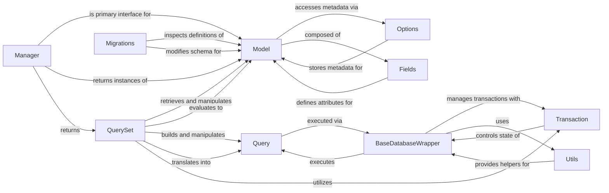

## Component Details

The ORM and Database Layer in Django provides a powerful and abstract way to interact with databases using Python objects. This layer is fundamental to Django's "Don't Repeat Yourself" (DRY) philosophy, allowing developers to define database schemas and perform queries without writing raw SQL.

### Model
The foundational class for defining database tables and their structure. All Django models inherit from this class. It provides core functionalities for object-relational mapping, including defining fields, metadata, and methods for interacting with individual database records (e.g., `save()`, `delete()`).

**Related Classes/Methods**:

- <a href="https://github.com/django/django/blob/master/django/db/models/base.py#L480-L2407" target="_blank" rel="noopener noreferrer">`django.db.models.base.Model` (480:2407)</a>

### QuerySet
Represents a collection of database queries. It offers a rich, lazy API for filtering, ordering, slicing, and retrieving data from the database in a Pythonic manner. `QuerySet` objects are not evaluated until explicitly needed, promoting efficiency.

**Related Classes/Methods**:

- <a href="https://github.com/django/django/blob/master/django/db/models/query.py#L1-L1" target="_blank" rel="noopener noreferrer">`django.db.models.query.QuerySet` (1:1)</a>

### Manager
Provides the interface through which database query operations are accessed on a model. Every Django `Model` has at least one `Manager` instance (usually `objects`), which serves as the entry point for performing database queries and creating new model instances.

**Related Classes/Methods**:

- <a href="https://github.com/django/django/blob/master/django/db/models/manager.py#L175-L176" target="_blank" rel="noopener noreferrer">`django.db.models.manager.Manager` (175:176)</a>

### Fields
This conceptual module defines the various field types (e.g., `CharField`, `IntegerField`, `ForeignKey`, `DateTimeField`) that can be used as attributes within Django models. These fields handle the mapping between Python data types and their corresponding database column types, including validation and serialization logic.

**Related Classes/Methods**:

- `django.db.models.fields` (1:1)

### Query
An internal class that represents the abstract SQL query being constructed. It manages the various clauses of an SQL statement (SELECT, FROM, WHERE, GROUP BY, ORDER BY, LIMIT), handles table aliasing, and manages join operations. `QuerySet` objects build and manipulate `Query` objects.

**Related Classes/Methods**:

- <a href="https://github.com/django/django/blob/master/django/db/models/sql/query.py#L1-L1" target="_blank" rel="noopener noreferrer">`django.db.models.sql.query.Query` (1:1)</a>

### BaseDatabaseWrapper
The abstract base class for all Django database backends (e.g., PostgreSQL, MySQL, SQLite). It defines the common interface for establishing and closing database connections, creating cursors, executing SQL, and managing transaction states.

**Related Classes/Methods**:

- <a href="https://github.com/django/django/blob/master/django/db/backends/base/base.py#L29-L791" target="_blank" rel="noopener noreferrer">`django.db.backends.base.base.BaseDatabaseWrapper` (29:791)</a>

### Transaction
This module provides functions and decorators for managing database transactions. It ensures that a series of database operations are executed atomically (all or nothing), which is crucial for maintaining data integrity.

**Related Classes/Methods**:

- <a href="https://github.com/django/django/blob/master/django/db/transaction.py#L1-L1" target="_blank" rel="noopener noreferrer">`django.db.transaction` (1:1)</a>

### Migrations
The framework responsible for managing database schema changes over time. It allows developers to define and apply incremental modifications to the database structure in a version-controlled manner, keeping the database schema synchronized with the Django models.

**Related Classes/Methods**:

- <a href="https://github.com/django/django/blob/master/django/template/backends/django.py#L1-L1" target="_blank" rel="noopener noreferrer">`django.db.migrations` (1:1)</a>

### Options
This internal class (typically accessed via `_meta` on a model instance) stores all the metadata about a Django model. This includes its database table name, field definitions, relationships, ordering, unique constraints, and other model-specific configurations.

**Related Classes/Methods**:

- <a href="https://github.com/django/django/blob/master/django/db/models/options.py#L89-L1042" target="_blank" rel="noopener noreferrer">`django.db.models.options.Options` (89:1042)</a>

### Utils
Contains various utility functions and exception classes related to general database operations. This includes helpers for handling database-specific errors, managing connection details, and other low-level database interactions.

**Related Classes/Methods**:

- <a href="https://github.com/django/django/blob/master/django/db/utils.py#L1-L1" target="_blank" rel="noopener noreferrer">`django.db.utils` (1:1)</a>

### [FAQ](https://github.com/CodeBoarding/GeneratedOnBoardings/tree/main?tab=readme-ov-file#faq)