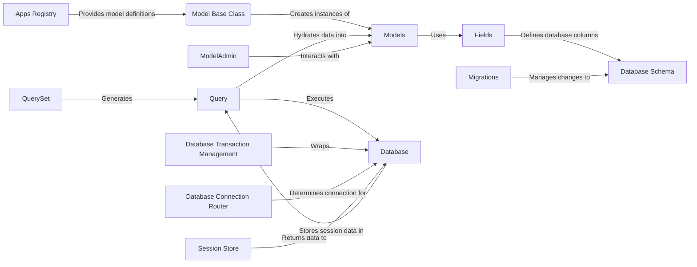

## ORM Component Overview

This diagram illustrates the flow of data and interactions within the Django ORM.

## Component Descriptions

**Apps Registry**

*   **Description:** Manages the configuration and loading of Django applications, providing access to model definitions.
*   **Functionality:** Loads application configurations and makes models available to the ORM.
*   **Relationships:** Provides model definitions to the `Model Base Class`.
*   **Relevant Source Files:** `django.apps.registry.Apps`, `django.apps.config.AppConfig`

**Model Base Class**

*   **Description:** Base class for Django models, providing save and other ORM functionalities.
*   **Functionality:** Defines the basic structure and behavior of all models.
*   **Relationships:** Creates instances of `Models` and uses `Fields` to define model attributes.
*   **Relevant Source Files:** `django.db.models.base.Model`

**Models**

*   **Description:** Represents instances of Django models, holding data retrieved from or to be saved to the database.
*   **Functionality:** Holds data and interacts with `Fields` for data validation and database interaction.
*   **Relationships:** Uses `Fields` to define data types and constraints.
*   **Relevant Source Files:** (Model definitions in `models.py` files)

**Fields**

*   **Description:** Represent the columns in the database tables, defining data types and constraints.
*   **Functionality:** Defines the structure of the database columns and handles data validation.
*   **Relationships:** Defines database columns in the `DatabaseSchema`.
*   **Relevant Source Files:** `django.db.models.fields`

**Database Schema**

*   **Description:** Represents the structure of the database, including tables, columns, and relationships.
*   **Functionality:** Stores the database structure and is managed by `Migrations`.
*   **Relationships:** Defined by `Fields` and managed by `Migrations`.
*   **Relevant Source Files:** (Database schema definition files)

**QuerySet**

*   **Description:** Represents a collection of objects from the database, allowing filtering, ordering, and other operations.
*   **Functionality:** Provides an interface for querying the database and returns a list of model instances.
*   **Relationships:** Generates `Query` objects to interact with the database.
*   **Relevant Source Files:** `django.db.models.query.QuerySet`

**Query**

*   **Description:** Represents a database query, encapsulating the SQL generation and execution logic.
*   **Functionality:** Generates SQL queries and executes them against the database.
*   **Relationships:** Executes queries against the `Database` and hydrates data into `Models`.
*   **Relevant Source Files:** `django.db.models.sql.query.Query`

**Database**

*   **Description:** Represents the database connection and provides an interface for executing SQL queries.
*   **Functionality:** Executes SQL queries and returns data to the `Query` component.
*   **Relationships:** Receives queries from `Query` and is managed by `DatabaseTransactionManagement` and `DatabaseConnectionRouter`.
*   **Relevant Source Files:** `django.db.backends`

**Migrations**

*   **Description:** Handles the evolution of the database schema over time, allowing to create, modify, and delete tables and columns.
*   **Functionality:** Manages changes to the `DatabaseSchema`.
*   **Relationships:** Manages changes to the `DatabaseSchema`.
*   **Relevant Source Files:** `django.db.migrations`

**Database Transaction Management**

*   **Description:** Provides atomic transaction support for database operations, ensuring data consistency and integrity.
*   **Functionality:** Wraps database operations in transactions.
*   **Relationships:** Wraps the `Database` component.
*   **Relevant Source Files:** `django.db.transaction.atomic`

**Database Connection Router**

*   **Description:** Determines which database connection to use for a given model or operation.
*   **Functionality:** Routes database connections based on model type or other criteria.
*   **Relationships:** Determines the connection for the `Database` component.
*   **Relevant Source Files:** `django.db.utils.ConnectionRouter`, `django.db.utils.ConnectionRouter._router_func._route_db`

**ModelAdmin**

*   **Description:** Provides the base functionality for the Django admin interface for a specific model.
*   **Functionality:** Enables easy data management through a web interface.
*   **Relationships:** Interacts with `Models` to display and modify data.
*   **Relevant Source Files:** `django.contrib.admin.options.ModelAdmin`, `django.contrib.admin.options.InlineModelAdmin`

**SessionStore**

*   **Description:** Handles the storage and retrieval of session data, typically using a database backend.
*   **Functionality:** Stores session data in the `Database`.
*   **Relationships:** Stores session data in the `Database`.
*   **Relevant Source Files:** `django.contrib.sessions.backends.db.SessionStore`