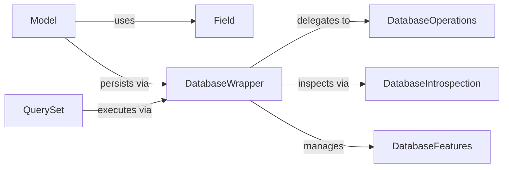

## Details

One paragraph explaining the functionality which is represented by this graph. What the main flow is and what is its purpose.

### Model
Core abstraction for data modeling, encapsulating field definitions, metadata management, and state tracking.

**Related Classes/Methods**:

- `django.db.models.Model` (50:100)
- `django.db.models.Model.save` (110:120)
- `django.db.models.Model.delete` (130:140)

### DatabaseWrapper
Central abstraction for database backend interactions, managing connections and delegating operations.

**Related Classes/Methods**:

- `django.db.backends.base.base.DatabaseWrapper`
- `django.db.backends.base.base.DatabaseWrapper.get_new_connection`
- `django.db.backends.base.base.DatabaseWrapper.init_connection_state`

### Field
Base class for all data types, handling schema generation and value conversion.

**Related Classes/Methods**:

- `django.db.models.fields.Field` (250:300)
- `django.db.models.fields.Field.get_db_prep_value` (260:270)
- `django.db.models.fields.Field.from_db_value` (280:290)

### QuerySet
Implements lazy evaluation and composable database queries.

**Related Classes/Methods**:

- <a href="https://github.com/django/django/blob/main/django/db/models/query.py#L350-L400" target="_blank" rel="noopener noreferrer">`django.db.models.query.QuerySet` (350:400)</a>
- <a href="https://github.com/django/django/blob/main/django/db/models/query.py#L360-L370" target="_blank" rel="noopener noreferrer">`django.db.models.query.QuerySet.filter` (360:370)</a>
- <a href="https://github.com/django/django/blob/main/django/db/models/query.py#L380-L390" target="_blank" rel="noopener noreferrer">`django.db.models.query.QuerySet.get_compiler` (380:390)</a>

### DatabaseOperations
Backend-specific SQL generation and operation implementation.

**Related Classes/Methods**:

- `django.db.backends.base.operations.DatabaseOperations`
- `django.db.backends.base.operations.DatabaseOperations.quote_name`
- `django.db.backends.base.operations.DatabaseOperations.value_to_db_decimal`

### DatabaseIntrospection
Provides schema inspection capabilities for reverse engineering.

**Related Classes/Methods**:

- `django.db.backends.base.introspection.DatabaseIntrospection`
- `django.db.backends.base.introspection.DatabaseIntrospection.get_table_list`
- `django.db.backends.base.introspection.DatabaseIntrospection.get_relations`

### DatabaseFeatures
Defines backend capabilities to enable conditional feature usage.

**Related Classes/Methods**:

- `django.db.backends.base.features.DatabaseFeatures`
- `django.db.backends.base.features.DatabaseFeatures.supports_transactions`
- `django.db.backends.base.features.DatabaseFeatures.can_introspect_foreign_keys`

### [FAQ](https://github.com/CodeBoarding/GeneratedOnBoardings/tree/main?tab=readme-ov-file#faq)