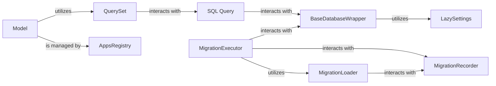

## Component Details

This component provides Django's powerful Object-Relational Mapper (ORM), allowing developers to interact with database data using Python objects (models) instead of raw SQL. It includes the underlying database backends that handle database-specific communication and SQL generation, as well as the migration system for managing and applying schema changes in a version-controlled manner.

### Model
The fundamental building block of the Django ORM. `Model` classes define the structure of database tables, including fields, relationships, and behaviors. Instances of `Model` represent individual rows in a database table. It provides methods for saving, updating, and deleting objects.

**Related Classes/Methods**:

- <a href="https://github.com/django/django/blob/master/django/db/models/base.py#L480-L2407" target="_blank" rel="noopener noreferrer">`django.db.models.base.Model` (480:2407)</a>

### QuerySet
Represents a collection of database objects. `QuerySet` objects are lazy, meaning they don't hit the database until they are evaluated. They provide a rich API for filtering, ordering, slicing, and performing aggregations on database records, translating these operations into SQL queries.

**Related Classes/Methods**:

- <a href="https://github.com/django/django/blob/master/django/db/models/query.py#L1-L1" target="_blank" rel="noopener noreferrer">`django.db.models.query.QuerySet` (1:1)</a>

### BaseDatabaseWrapper
An abstract base class that defines the interface for Django's database backends. It manages the actual database connection, handles transaction management (autocommit, savepoints), and provides methods for creating cursors and executing SQL. Specific database implementations (e.g., PostgreSQL, MySQL, SQLite) inherit from this class.

**Related Classes/Methods**:

- <a href="https://github.com/django/django/blob/master/django/db/backends/base/base.py#L29-L791" target="_blank" rel="noopener noreferrer">`django.db.backends.base.base.BaseDatabaseWrapper` (29:791)</a>

### MigrationLoader
Responsible for discovering and loading migration files from all installed applications on disk. It builds a `MigrationGraph` representing the dependencies between migrations, which is essential for determining the order in which migrations should be applied or unapplied.

**Related Classes/Methods**:

- <a href="https://github.com/django/django/blob/master/django/db/migrations/loader.py#L20-L417" target="_blank" rel="noopener noreferrer">`django.db.migrations.loader.MigrationLoader` (20:417)</a>

### MigrationExecutor
Orchestrates the execution of migration plans. It takes a set of target migrations and, using the `MigrationLoader`, determines the sequence of migrations to apply or unapply. It then interacts with the database backend to perform the actual schema changes.

**Related Classes/Methods**:

- <a href="https://github.com/django/django/blob/master/django/db/migrations/executor.py#L9-L411" target="_blank" rel="noopener noreferrer">`django.db.migrations.executor.MigrationExecutor` (9:411)</a>

### MigrationRecorder
Manages the `django_migrations` table in the database. This table records which migrations have been successfully applied to the database, allowing Django to track the current state of the database schema and determine which migrations still need to be run.

**Related Classes/Methods**:

- <a href="https://github.com/django/django/blob/master/django/db/migrations/recorder.py#L8-L110" target="_blank" rel="noopener noreferrer">`django.db.migrations.recorder.MigrationRecorder` (8:110)</a>

### SQL Query
An internal representation of a database query. It's responsible for constructing the SQL statements based on the operations requested by a `QuerySet`. It handles clauses like `SELECT`, `WHERE`, `ORDER BY`, `GROUP BY`, and `JOIN`.

**Related Classes/Methods**:

- <a href="https://github.com/django/django/blob/master/django/db/models/sql/query.py#L1-L1" target="_blank" rel="noopener noreferrer">`django.db.models.sql.query.Query` (1:1)</a>

### AppsRegistry
Keeps track of all loaded models and their metadata, which the ORM uses for various operations.

**Related Classes/Methods**:

- <a href="https://github.com/django/django/blob/master/django/apps/registry.py#L1-L1" target="_blank" rel="noopener noreferrer">`django.apps.registry.AppsRegistry` (1:1)</a>

### LazySettings
Provides lazy loading of Django's settings, used for accessing database configuration.

**Related Classes/Methods**:

- <a href="https://github.com/django/django/blob/master/django/template/backends/django.py#L1-L1" target="_blank" rel="noopener noreferrer">`django.conf.LazySettings` (1:1)</a>

### [FAQ](https://github.com/CodeBoarding/GeneratedOnBoardings/tree/main?tab=readme-ov-file#faq)