```mermaid
graph LR
    django_db["django.db"]
    django_db_models["django.db.models"]
    django_db_models_base_Model["django.db.models.base.Model"]
    django_db_models_query_QuerySet["django.db.models.query.QuerySet"]
    django_db_models_fields["django.db.models.fields"]
    django_db_backends_base_base_BaseDatabaseWrapper["django.db.backends.base.base.BaseDatabaseWrapper"]
    django_db_migrations["django.db.migrations"]
    django_db_transaction["django.db.transaction"]
    django_db_utils["django.db.utils"]
    django_db_models_manager_Manager["django.db.models.manager.Manager"]
    django_db -- "uses" --> django_db_utils
    django_db -- "uses" --> django_db_backends_base_base_BaseDatabaseWrapper
    django_db_models -- "uses" --> django_db_models_base_Model
    django_db_models -- "uses" --> django_db_models_query_QuerySet
    django_db_models -- "uses" --> django_db_models_fields
    django_db_models_base_Model -- "uses" --> django_db_models_query_QuerySet
    django_db_models_base_Model -- "uses" --> django_db_transaction
    django_db_models_query_QuerySet -- "uses" --> django_db_backends_base_base_BaseDatabaseWrapper
    django_db_models_manager_Manager -- "uses" --> django_db_models_query_QuerySet
    django_db_backends_base_base_BaseDatabaseWrapper -- "uses" --> django_db_utils
    django_db_backends_base_base_BaseDatabaseWrapper -- "uses" --> django_db_transaction
    django_db_migrations -- "uses" --> django_db_models
    django_db_migrations -- "uses" --> django_db_backends_base_base_BaseDatabaseWrapper
    django_db_transaction -- "uses" --> django_db_backends_base_base_BaseDatabaseWrapper
    click django_db href "https://github.com/CodeBoarding/GeneratedOnBoardings/blob/main//django/django_db.md" "Details"
    click django_db_models href "https://github.com/CodeBoarding/GeneratedOnBoardings/blob/main//django/django_db_models.md" "Details"
    click django_db_models_base_Model href "https://github.com/CodeBoarding/GeneratedOnBoardings/blob/main//django/django_db_models_base_Model.md" "Details"
    click django_db_migrations href "https://github.com/CodeBoarding/GeneratedOnBoardings/blob/main//django/django_db_migrations.md" "Details"
    click django_db_utils href "https://github.com/CodeBoarding/GeneratedOnBoardings/blob/main//django/django_db_utils.md" "Details"
    click django_db_models_manager_Manager href "https://github.com/CodeBoarding/GeneratedOnBoardings/blob/main//django/django_db_models_manager_Manager.md" "Details"
```

## Component Details

The `ORM and Database Layer` in Django provides a robust and abstract way to interact with relational databases using Python objects. This layer simplifies database operations, schema definition, and migration management, allowing developers to focus on application logic rather than raw SQL.

### django.db
The foundational package for Django's database integration. It serves as the primary entry point for database-related functionalities, handling core connection management and dispatching operations to specific backends.

**Related Classes/Methods**:

- <a href="https://github.com/django/django/blob/master/django/template/backends/django.py#L-1-L-1" target="_blank" rel="noopener noreferrer">`django.db` (-1:-1)</a>

### django.db.models
The core of Django's Object-Relational Mapper (ORM). This package defines the mechanisms for mapping Python objects to database tables, including the base `Model` class, field types, and query building components.

**Related Classes/Methods**:

- <a href="https://github.com/django/django/blob/master/django/template/backends/django.py#L-1-L-1" target="_blank" rel="noopener noreferrer">`django.db.models` (-1:-1)</a>

### django.db.models.base.Model
The fundamental base class for all Django models. It provides the essential functionalities for defining database tables, including fields, metadata (`_meta`), and methods for saving, updating, and deleting instances.

**Related Classes/Methods**:

- <a href="https://github.com/django/django/blob/master/django/db/models/base.py#L480-L2407" target="_blank" rel="noopener noreferrer">`django.db.models.base.Model` (480:2407)</a>

### django.db.models.query.QuerySet
Represents a lazily evaluated collection of database queries. It offers a rich API for filtering, ordering, slicing, and retrieving data from the database in a Pythonic and efficient manner.

**Related Classes/Methods**:

- <a href="https://github.com/django/django/blob/master/django/db/models/query.py#L-1-L-1" target="_blank" rel="noopener noreferrer">`django.db.models.query.QuerySet` (-1:-1)</a>

### django.db.models.fields
This module defines the various data types (e.g., `CharField`, `IntegerField`, `ForeignKey`) that can be used as attributes in Django models. These fields define the column types in the database and handle data validation and serialization.

**Related Classes/Methods**:

- `django.db.models.fields` (-1:-1)

### django.db.backends.base.base.BaseDatabaseWrapper
The abstract base class for managing a database connection. It defines the common interface that all specific database backends (e.g., PostgreSQL, MySQL) must implement, handling connection establishment, cursor creation, and transaction management.

**Related Classes/Methods**:

- <a href="https://github.com/django/django/blob/master/django/db/backends/base/base.py#L29-L791" target="_blank" rel="noopener noreferrer">`django.db.backends.base.base.BaseDatabaseWrapper` (29:791)</a>

### django.db.migrations
Django's migration framework. It enables developers to define and apply incremental changes to the database schema in a version-controlled way, ensuring that the database structure remains synchronized with the models.

**Related Classes/Methods**:

- <a href="https://github.com/django/django/blob/master/django/template/backends/django.py#L-1-L-1" target="_blank" rel="noopener noreferrer">`django.db.migrations` (-1:-1)</a>

### django.db.transaction
Provides functions and decorators for managing database transactions. It ensures that a series of database operations are executed atomically, either all succeeding or all failing, which is crucial for maintaining data integrity.

**Related Classes/Methods**:

- <a href="https://github.com/django/django/blob/master/django/db/transaction.py#L-1-L-1" target="_blank" rel="noopener noreferrer">`django.db.transaction` (-1:-1)</a>

### django.db.utils
Contains various utility functions and exception classes related to database operations. This includes helpers for database error handling, connection details, and other low-level database interactions.

**Related Classes/Methods**:

- <a href="https://github.com/django/django/blob/master/django/db/utils.py#L-1-L-1" target="_blank" rel="noopener noreferrer">`django.db.utils` (-1:-1)</a>

### django.db.models.manager.Manager
Provides the interface through which database query operations are accessed on a Django model (e.g., `MyModel.objects`). It acts as a bridge between the model and the `QuerySet`, allowing for convenient access to query methods.

**Related Classes/Methods**:

- <a href="https://github.com/django/django/blob/master/django/db/models/manager.py#L175-L176" target="_blank" rel="noopener noreferrer">`django.db.models.manager.Manager` (175:176)</a>

### [FAQ](https://github.com/CodeBoarding/GeneratedOnBoardings/tree/main?tab=readme-ov-file#faq)