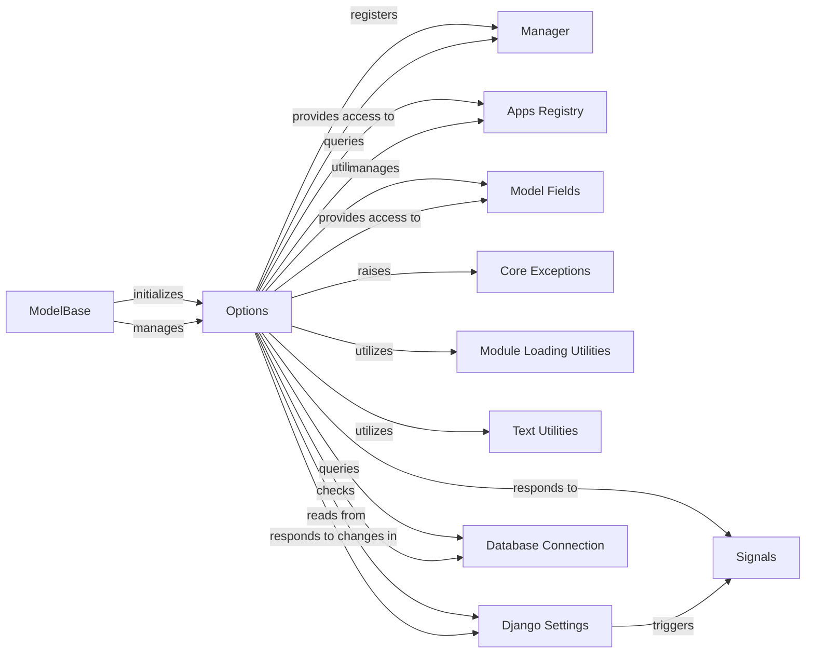

## Component Details

The Options component in Django serves as the central metadata repository for every Django model. It encapsulates all configuration details, field definitions, and relationships, making it fundamental to how Django's Object-Relational Mapper (ORM) understands and interacts with models. Its purpose is to provide a single, consistent interface for accessing a model's structural and behavioral attributes, which are crucial for tasks ranging from database table creation to query generation and form rendering.

### Options
The core component under analysis. It stores and manages all model-specific metadata and configurations, providing methods for accessing and manipulating these attributes. This includes details like table name, ordering, abstract status, and definitions of fields and relationships.

**Related Classes/Methods**:

- <a href="https://github.com/django/django/blob/master/django/db/models/options.py#L89-L1042" target="_blank" rel="noopener noreferrer">`django.db.models.options.Options` (89:1042)</a>
- <a href="https://github.com/django/django/blob/master/django/db/models/options.py#L328-L330" target="_blank" rel="noopener noreferrer">`django.db.models.options.Options:add_manager` (328:330)</a>
- <a href="https://github.com/django/django/blob/master/django/db/models/options.py#L445-L462" target="_blank" rel="noopener noreferrer">`django.db.models.options.Options:managers` (445:462)</a>
- <a href="https://github.com/django/django/blob/master/django/db/models/options.py#L498-L520" target="_blank" rel="noopener noreferrer">`django.db.models.options.Options:default_manager` (498:520)</a>
- <a href="https://github.com/django/django/blob/master/django/db/models/options.py#L808-L808" target="_blank" rel="noopener noreferrer">`django.db.models.options.Options:self.apps.get_models` (808:808)</a>
- <a href="https://github.com/django/django/blob/master/django/db/models/options.py#L174-L174" target="_blank" rel="noopener noreferrer">`django.db.models.options.Options:self.app_config` (174:174)</a>
- <a href="https://github.com/django/django/blob/master/django/db/models/options.py#L332-L364" target="_blank" rel="noopener noreferrer">`django.db.models.options.Options:add_field` (332:364)</a>
- <a href="https://github.com/django/django/blob/master/django/db/models/options.py#L110-L110" target="_blank" rel="noopener noreferrer">`django.db.models.options.Options:local_fields` (110:110)</a>
- <a href="https://github.com/django/django/blob/master/django/db/models/options.py#L855-L869" target="_blank" rel="noopener noreferrer">`django.db.models.options.Options:get_fields` (855:869)</a>
- <a href="https://github.com/django/django/blob/master/django/db/models/options.py#L523-L562" target="_blank" rel="noopener noreferrer">`django.db.models.options.Options:fields` (523:562)</a>
- <a href="https://github.com/django/django/blob/master/django/db/models/options.py#L227-L227" target="_blank" rel="noopener noreferrer">`django.db.models.options.Options:TypeError` (227:227)</a>
- <a href="https://github.com/django/django/blob/master/django/db/models/options.py#L268-L268" target="_blank" rel="noopener noreferrer">`django.db.models.options.Options:ImproperlyConfigured` (268:268)</a>
- <a href="https://github.com/django/django/blob/master/django/db/models/options.py#L297-L297" target="_blank" rel="noopener noreferrer">`django.db.models.options.Options:FieldDoesNotExist` (297:297)</a>
- <a href="https://github.com/django/django/blob/master/django/db/models/options.py#L271-L271" target="_blank" rel="noopener noreferrer">`django.db.models.options.Options:import_string` (271:271)</a>
- <a href="https://github.com/django/django/blob/master/django/db/models/options.py#L187-L187" target="_blank" rel="noopener noreferrer">`django.db.models.options.Options:camel_case_to_spaces` (187:187)</a>
- <a href="https://github.com/django/django/blob/master/django/db/models/options.py#L133-L133" target="_blank" rel="noopener noreferrer">`django.db.models.options.Options:settings.DEFAULT_TABLESPACE` (133:133)</a>
- <a href="https://github.com/django/django/blob/master/django/db/models/options.py#L258-L258" target="_blank" rel="noopener noreferrer">`django.db.models.options.Options:settings.DEFAULT_AUTO_FIELD` (258:258)</a>
- <a href="https://github.com/django/django/blob/master/django/db/models/options.py#L440-L442" target="_blank" rel="noopener noreferrer">`django.db.models.options.Options:setting_changed` (440:442)</a>
- <a href="https://github.com/django/django/blob/master/django/db/models/options.py#L238-L238" target="_blank" rel="noopener noreferrer">`django.db.models.options.Options:connection.ops.max_name_length` (238:238)</a>
- <a href="https://github.com/django/django/blob/master/django/db/models/options.py#L397-L397" target="_blank" rel="noopener noreferrer">`django.db.models.options.Options:connection.vendor` (397:397)</a>
- <a href="https://github.com/django/django/blob/master/django/db/models/options.py#L386-L402" target="_blank" rel="noopener noreferrer">`django.db.models.options.Options:can_migrate` (386:402)</a>

### ModelBase
The metaclass for all Django models. ModelBase is responsible for the actual creation of model classes. During this process, it instantiates and populates the _meta attribute of the model with an Options object, thereby linking the model's definition to its comprehensive metadata.

**Related Classes/Methods**:

- <a href="https://github.com/django/django/blob/master/django/db/models/base.py#L93-L457" target="_blank" rel="noopener noreferrer">`django.db.models.base.ModelBase` (93:457)</a>

### Manager
The base class for all model managers, which provide the primary interface for database query operations on a model. Options is responsible for registering and providing access to these managers.

**Related Classes/Methods**:

- <a href="https://github.com/django/django/blob/master/django/db/models/manager.py#L175-L176" target="_blank" rel="noopener noreferrer">`django.db.models.manager.Manager` (175:176)</a>

### Apps Registry
Django's central registry for all installed applications and their models. Options interacts with this registry to resolve model references, especially when dealing with relationships between models across different applications, and to manage the application cache.

**Related Classes/Methods**:

- <a href="https://github.com/django/django/blob/master/django/apps/registry.py#L12-L433" target="_blank" rel="noopener noreferrer">`django.apps.registry.Apps` (12:433)</a>

### Model Fields
This category encompasses various field types (e.g., AutoField, ForeignKey, CharField) that define the data structure and relationships of a model's attributes. Options is the primary component responsible for storing, organizing, and providing comprehensive access to these fields.

**Related Classes/Methods**:

- `django.db.models.fields.Field` (0:0)

### Core Exceptions
This module defines standard Django exceptions used for signaling various errors, such as configuration issues (ImproperlyConfigured) or attempts to access non-existent fields (FieldDoesNotExist). Options raises these exceptions to enforce correct model definition and usage.

**Related Classes/Methods**:

- <a href="https://github.com/django/django/blob/master/django/core/exceptions.py#L0-L0" target="_blank" rel="noopener noreferrer">`django.core.exceptions.ImproperlyConfigured` (0:0)</a>
- <a href="https://github.com/django/django/blob/master/django/core/exceptions.py#L0-L0" target="_blank" rel="noopener noreferrer">`django.core.exceptions.FieldDoesNotExist` (0:0)</a>

### Module Loading Utilities
Provides utilities for dynamic loading of Python modules and objects, notably import_string. Options uses this utility to dynamically load classes, such as the default primary key field, based on configuration.

**Related Classes/Methods**:

- <a href="https://github.com/django/django/blob/master/django/utils/module_loading.py#L18-L34" target="_blank" rel="noopener noreferrer">`django.utils.module_loading.import_string` (18:34)</a>

### Text Utilities
A utility module for text manipulation, including functions like camel_case_to_spaces. Options uses these utilities for formatting default verbose names and other string manipulations related to model metadata.

**Related Classes/Methods**:

- <a href="https://github.com/django/django/blob/master/django/utils/text.py#L472-L476" target="_blank" rel="noopener noreferrer">`django.utils.text.camel_case_to_spaces` (472:476)</a>

### Django Settings
Django's global configuration system, accessible via django.conf.settings. Options reads various settings (e.g., DEFAULT_TABLESPACE, DEFAULT_AUTO_FIELD, swappable models) to determine default behaviors and configurations for models.

**Related Classes/Methods**:

- <a href="https://github.com/django/django/blob/master/django/template/backends/django.py#L0-L0" target="_blank" rel="noopener noreferrer">`django.conf.settings` (0:0)</a>

### Database Connection
Represents the active database connection and provides database-specific operations and features. Options interacts with it to determine database table naming conventions (e.g., truncation) and to check if a model can be migrated to the current database.

**Related Classes/Methods**:

- <a href="https://github.com/django/django/blob/master/django/template/backends/django.py#L0-L0" target="_blank" rel="noopener noreferrer">`django.db.connection` (0:0)</a>

### Signals
Django's signaling framework, used for decoupling applications by allowing certain senders to notify a set of receivers when certain actions occur.

**Related Classes/Methods**:

- <a href="https://github.com/django/django/blob/master/django/dispatch/dispatcher.py#L24-L487" target="_blank" rel="noopener noreferrer">`django.dispatch.dispatcher.Signal` (24:487)</a>

### [FAQ](https://github.com/CodeBoarding/GeneratedOnBoardings/tree/main?tab=readme-ov-file#faq)