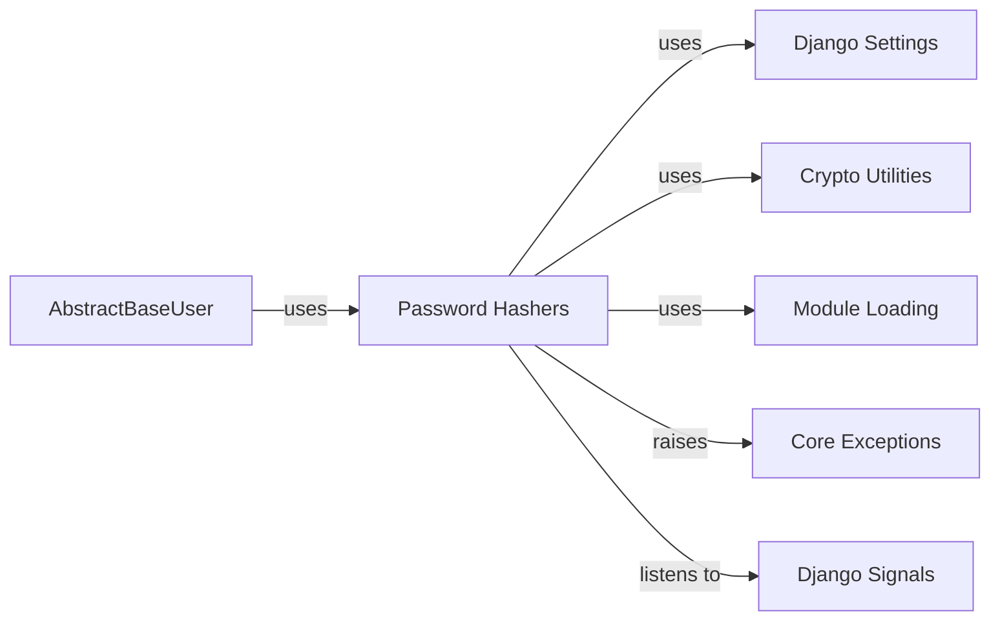

## Component Details

Analysis of Django's password hashing system, detailing its core components and their interdependencies.

### Password Hashers
This component, primarily implemented in `django/contrib/auth/hashers.py`, provides a robust framework for securely handling user passwords. It includes functions for hashing plaintext passwords (`make_password`), verifying a plaintext password against an encoded hash (`verify_password`, `check_password`), and identifying the hashing algorithm used for an existing hash (`identify_hasher`). It also manages the loading and caching of various hashing algorithms defined in Django's settings. This component is fundamental because it ensures that passwords are never stored in plaintext, significantly enhancing application security by protecting against data breaches.

**Related Classes/Methods**:

- <a href="https://github.com/django/django/blob/master/django/contrib/auth/hashers.py#L93-L112" target="_blank" rel="noopener noreferrer">`django.contrib.auth.hashers.make_password` (93:112)</a>
- <a href="https://github.com/django/django/blob/master/django/contrib/auth/hashers.py#L35-L68" target="_blank" rel="noopener noreferrer">`django.contrib.auth.hashers.verify_password` (35:68)</a>
- <a href="https://github.com/django/django/blob/master/django/contrib/auth/hashers.py#L71-L82" target="_blank" rel="noopener noreferrer">`django.contrib.auth.hashers.check_password` (71:82)</a>
- <a href="https://github.com/django/django/blob/master/django/contrib/auth/hashers.py#L166-L185" target="_blank" rel="noopener noreferrer">`django.contrib.auth.hashers.identify_hasher` (166:185)</a>

### AbstractBaseUser
As the foundational class for Django's user authentication system, `AbstractBaseUser` (and its concrete implementations like `User`) directly interacts with the `Password Hashers` component. It relies on the hashing functions provided by `Password Hashers` to set and verify user passwords, ensuring that user credentials are handled securely within the application. This component is fundamental as it represents the primary consumer of the password hashing functionality, integrating it into the user management flow.

**Related Classes/Methods**:

- <a href="https://github.com/django/django/blob/master/django/contrib/auth/base_user.py#L0-L0" target="_blank" rel="noopener noreferrer">`django.contrib.auth.base_user.AbstractBaseUser` (0:0)</a>

### Django Settings
This component provides the configuration mechanism for the entire Django project. Specifically, the `PASSWORD_HASHERS` setting within `django.conf.settings` dictates which password hashing algorithms are available to the `Password Hashers` component and their preferred order. This component is fundamental because it allows developers to configure and customize the security algorithms used for password storage without modifying the core hashing logic.

**Related Classes/Methods**:

- <a href="https://github.com/django/django/blob/master/django/template/backends/django.py#L0-L0" target="_blank" rel="noopener noreferrer">`django.conf.settings:PASSWORD_HASHERS` (0:0)</a>

### Crypto Utilities
Located in `django/utils/crypto.py`, this component offers essential low-level cryptographic primitives. The `Password Hashers` component utilizes functions like `get_random_string` for generating secure salts and `pbkdf2` for key derivation, which are critical for the strength and randomness of the generated password hashes. This component is fundamental as it provides the underlying secure building blocks necessary for robust password hashing.

**Related Classes/Methods**:

- <a href="https://github.com/django/django/blob/master/django/utils/crypto.py#L0-L0" target="_blank" rel="noopener noreferrer">`django.utils.crypto.get_random_string` (0:0)</a>
- <a href="https://github.com/django/django/blob/master/django/utils/crypto.py#L0-L0" target="_blank" rel="noopener noreferrer">`django.utils.crypto.pbkdf2` (0:0)</a>

### Module Loading
The `django/utils/module_loading.py` component provides utilities for dynamically importing Python modules and classes. The `Password Hashers` component uses `import_string` to load the specific hasher classes defined in the `PASSWORD_HASHERS` setting. This dynamic loading capability is fundamental for allowing flexible and extensible password hashing configurations.

**Related Classes/Methods**:

- <a href="https://github.com/django/django/blob/master/django/utils/module_loading.py#L18-L34" target="_blank" rel="noopener noreferrer">`django.utils.module_loading.import_string` (18:34)</a>

### Core Exceptions
Defined in `django/core/exceptions.py`, this component provides standard exception classes used throughout Django. The `Password Hashers` component specifically raises `ImproperlyConfigured` exceptions when there are issues with the `PASSWORD_HASHERS` settings or if a hasher is not correctly defined. This component is fundamental for providing clear and consistent error reporting related to configuration problems.

**Related Classes/Methods**:

- <a href="https://github.com/django/django/blob/master/django/core/exceptions.py#L0-L0" target="_blank" rel="noopener noreferrer">`django.core.exceptions.ImproperlyConfigured` (0:0)</a>

### Django Signals
The `django/dispatch/__init__.py` component implements Django's signal dispatching system, allowing different parts of the application to communicate in a decoupled manner. The `Password Hashers` component listens to the `setting_changed` signal (specifically for `PASSWORD_HASHERS`) to clear its internal cache of hashers when the configuration changes. This component is fundamental for ensuring that the password hashing system remains up-to-date with any runtime changes to its configuration.

**Related Classes/Methods**:

- <a href="https://github.com/django/django/blob/master/django/template/backends/django.py#L0-L0" target="_blank" rel="noopener noreferrer">`django.dispatch.setting_changed` (0:0)</a>

### [FAQ](https://github.com/CodeBoarding/GeneratedOnBoardings/tree/main?tab=readme-ov-file#faq)