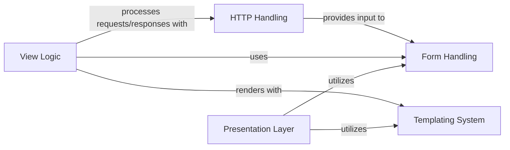

## Component Details

The Presentation Layer in Django provides the user-facing components, primarily focusing on rendering dynamic HTML content and handling user input through forms. It leverages the Templating System for separating presentation from logic and the Form Handling system for robust data validation and rendering. This layer interacts closely with the View Logic to process requests and generate responses, which are then managed by the HTTP Handling component.

### Presentation Layer
Provides systems for handling HTML forms, including data validation and rendering, and a powerful template engine for generating dynamic HTML content, separating presentation from logic.

**Related Classes/Methods**:

- <a href="https://github.com/django/django/blob/master/django/forms/forms.py#L432-L433" target="_blank" rel="noopener noreferrer">`django.forms.forms.Form` (432:433)</a>
- <a href="https://github.com/django/django/blob/master/django/template/backends/django.py#L92-L108" target="_blank" rel="noopener noreferrer">`django.template.backends.django.Template` (92:108)</a>

### Form Handling
Provides a comprehensive system for creating, processing, and validating HTML forms, including automatic rendering of form widgets and handling user input.

**Related Classes/Methods**:

- `django.forms` (full file reference)
- <a href="https://github.com/django/django/blob/master/django/forms/forms.py#L432-L433" target="_blank" rel="noopener noreferrer">`django.forms.forms.Form` (432:433)</a>
- `django.forms.fields` (full file reference)
- `django.forms.widgets` (full file reference)
- `django.forms.models` (full file reference)

### Templating System
Manages the rendering of dynamic content using Django's powerful template language. It separates presentation logic from business logic, allowing for clean and maintainable HTML generation.

**Related Classes/Methods**:

- `django.template` (full file reference)
- `django.template.base` (full file reference)
- `django.template.engine` (full file reference)
- `django.template.loader` (full file reference)
- <a href="https://github.com/django/django/blob/master/django/template/backends/django.py#L92-L108" target="_blank" rel="noopener noreferrer">`django.template.backends.django.Template` (92:108)</a>

### View Logic
Contains base classes and utilities for creating views, which are Python functions or classes that receive web requests, process them, and return web responses. It's the core of Django's request-response cycle.

**Related Classes/Methods**:

- `django.views` (full file reference)
- `django.views.generic.base` (full file reference)

### HTTP Handling
Defines fundamental classes for handling HTTP requests (HttpRequest) and responses (HttpResponse). It provides the basic building blocks for web communication within the Django framework.

**Related Classes/Methods**:

- `django.http` (full file reference)
- `django.http.request` (full file reference)
- `django.http.response` (full file reference)

### [FAQ](https://github.com/CodeBoarding/GeneratedOnBoardings/tree/main?tab=readme-ov-file#faq)