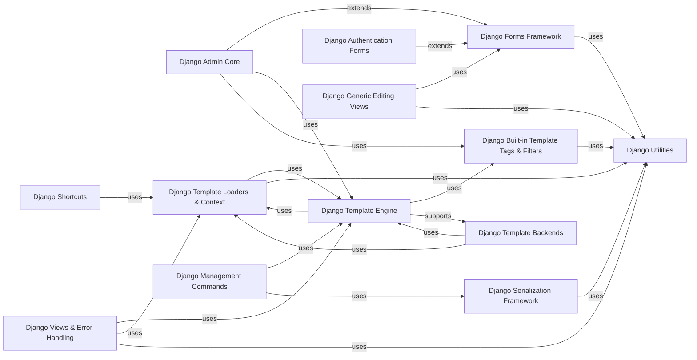

## Component Details

The Presentation Layer provides tools for rendering dynamic content and handling user input. This includes Django's templating system for generating HTML and a robust forms framework for creating, validating, and rendering HTML forms. It encompasses various sub-components such as Django Shortcuts for high-level rendering, Django Admin Core for administrative interface management, the core Django Forms Framework for form handling, the Django Template Engine for parsing and rendering templates, and Django Template Loaders & Context for managing template discovery and data. Additionally, it leverages Django Built-in Template Tags & Filters for extending template functionality, supports different Django Template Backends, and integrates with Django Serialization Framework for data conversion. Authentication forms, generic editing views, management commands, and various utilities and error handling views also contribute to its comprehensive functionality.

### Django Shortcuts
This component provides high-level helper functions that simplify common web development patterns in Django, primarily focusing on rendering templates with context data to produce HTTP responses.

**Related Classes/Methods**:

- <a href="https://github.com/django/django/blob/master/django/shortcuts.py#L18-L26" target="_blank" rel="noopener noreferrer">`django.shortcuts.render` (18:26)</a>

### Django Admin Core
The Django Admin Core component is responsible for managing the administrative interface. It defines how models are displayed, how forms are generated for model instances, and integrates specialized widgets for the admin site. It also includes helper classes for structuring admin forms and custom template tags for rendering admin-specific elements.

**Related Classes/Methods**:

- <a href="https://github.com/django/django/blob/master/django/contrib/admin/widgets.py#L22-L49" target="_blank" rel="noopener noreferrer">`django.contrib.admin.widgets.FilteredSelectMultiple` (22:49)</a>
- <a href="https://github.com/django/django/blob/master/django/contrib/admin/widgets.py#L52-L61" target="_blank" rel="noopener noreferrer">`django.contrib.admin.widgets.BaseAdminDateWidget` (52:61)</a>
- <a href="https://github.com/django/django/blob/master/django/contrib/admin/widgets.py#L68-L77" target="_blank" rel="noopener noreferrer">`django.contrib.admin.widgets.BaseAdminTimeWidget` (68:77)</a>
- <a href="https://github.com/django/django/blob/master/django/contrib/admin/widgets.py#L84-L101" target="_blank" rel="noopener noreferrer">`django.contrib.admin.widgets.AdminSplitDateTime` (84:101)</a>
- <a href="https://github.com/django/django/blob/master/django/contrib/admin/widgets.py#L132-L213" target="_blank" rel="noopener noreferrer">`django.contrib.admin.widgets.ForeignKeyRawIdWidget` (132:213)</a>
- <a href="https://github.com/django/django/blob/master/django/contrib/admin/widgets.py#L364-L366" target="_blank" rel="noopener noreferrer">`django.contrib.admin.widgets.AdminTextareaWidget` (364:366)</a>
- <a href="https://github.com/django/django/blob/master/django/contrib/admin/widgets.py#L369-L371" target="_blank" rel="noopener noreferrer">`django.contrib.admin.widgets.AdminTextInputWidget` (369:371)</a>
- <a href="https://github.com/django/django/blob/master/django/contrib/admin/widgets.py#L374-L376" target="_blank" rel="noopener noreferrer">`django.contrib.admin.widgets.AdminEmailInputWidget` (374:376)</a>
- <a href="https://github.com/django/django/blob/master/django/contrib/admin/widgets.py#L379-L399" target="_blank" rel="noopener noreferrer">`django.contrib.admin.widgets.AdminURLFieldWidget` (379:399)</a>
- <a href="https://github.com/django/django/blob/master/django/contrib/admin/widgets.py#L402-L406" target="_blank" rel="noopener noreferrer">`django.contrib.admin.widgets.AdminIntegerFieldWidget` (402:406)</a>
- <a href="https://github.com/django/django/blob/master/django/contrib/admin/widgets.py#L413-L415" target="_blank" rel="noopener noreferrer">`django.contrib.admin.widgets.AdminUUIDInputWidget` (413:415)</a>
- <a href="https://github.com/django/django/blob/master/django/contrib/admin/options.py#L127-L632" target="_blank" rel="noopener noreferrer">`django.contrib.admin.options.BaseModelAdmin` (127:632)</a>
- <a href="https://github.com/django/django/blob/master/django/contrib/admin/options.py#L635-L1000" target="_blank" rel="noopener noreferrer">`django.contrib.admin.options.ModelAdmin` (635:1000)</a>
- `django.contrib.admin.options.InlineModelAdmin` (full file reference)
- <a href="https://github.com/django/django/blob/master/django/contrib/admin/helpers.py#L40-L97" target="_blank" rel="noopener noreferrer">`django.contrib.admin.helpers.AdminForm` (40:97)</a>
- <a href="https://github.com/django/django/blob/master/django/contrib/admin/helpers.py#L100-L132" target="_blank" rel="noopener noreferrer">`django.contrib.admin.helpers.Fieldset` (100:132)</a>
- <a href="https://github.com/django/django/blob/master/django/contrib/admin/helpers.py#L170-L197" target="_blank" rel="noopener noreferrer">`django.contrib.admin.helpers.AdminField` (170:197)</a>
- <a href="https://github.com/django/django/blob/master/django/contrib/admin/helpers.py#L301-L462" target="_blank" rel="noopener noreferrer">`django.contrib.admin.helpers.InlineAdminFormSet` (301:462)</a>
- <a href="https://github.com/django/django/blob/master/django/contrib/admin/helpers.py#L465-L534" target="_blank" rel="noopener noreferrer">`django.contrib.admin.helpers.InlineAdminForm` (465:534)</a>
- <a href="https://github.com/django/django/blob/master/django/contrib/admin/helpers.py#L537-L548" target="_blank" rel="noopener noreferrer">`django.contrib.admin.helpers.InlineFieldset` (537:548)</a>
- <a href="https://github.com/django/django/blob/master/django/contrib/admin/helpers.py#L551-L562" target="_blank" rel="noopener noreferrer">`django.contrib.admin.helpers.AdminErrorList` (551:562)</a>
- <a href="https://github.com/django/django/blob/master/django/contrib/admin/templatetags/admin_list.py#L530-L533" target="_blank" rel="noopener noreferrer">`django.contrib.admin.templatetags.admin_list.admin_actions_tag` (530:533)</a>
- <a href="https://github.com/django/django/blob/master/django/contrib/admin/templatetags/admin_list.py#L537-L544" target="_blank" rel="noopener noreferrer">`django.contrib.admin.templatetags.admin_list.change_list_object_tools_tag` (537:544)</a>
- <a href="https://github.com/django/django/blob/master/django/contrib/admin/templatetags/base.py#L6-L45" target="_blank" rel="noopener noreferrer">`django.contrib.admin.templatetags.base.InclusionAdminNode` (6:45)</a>
- <a href="https://github.com/django/django/blob/master/django/contrib/admin/templatetags/admin_modify.py#L52-L58" target="_blank" rel="noopener noreferrer">`django.contrib.admin.templatetags.admin_modify.prepopulated_fields_js_tag` (52:58)</a>
- <a href="https://github.com/django/django/blob/master/django/contrib/admin/templatetags/admin_modify.py#L116-L119" target="_blank" rel="noopener noreferrer">`django.contrib.admin.templatetags.admin_modify.submit_row_tag` (116:119)</a>
- <a href="https://github.com/django/django/blob/master/django/contrib/admin/templatetags/admin_modify.py#L123-L130" target="_blank" rel="noopener noreferrer">`django.contrib.admin.templatetags.admin_modify.change_form_object_tools_tag` (123:130)</a>

### Django Forms Framework
This component provides a comprehensive system for handling HTML forms, encompassing the rendering of form widgets, validation of field data, and the mapping of model data to form fields. It includes base classes for widgets, fields, and forms, along with utilities for creating forms directly from Django models.

**Related Classes/Methods**:

- `django.forms.widgets.ChoiceWidget` (full file reference)
- `django.forms.widgets.DateTimeBaseInput` (full file reference)
- `django.forms.widgets.MultiWidget` (full file reference)
- `django.forms.widgets.Input` (full file reference)
- `django.forms.widgets.Textarea` (full file reference)
- `django.forms.widgets.Media` (full file reference)
- `django.forms.widgets.CheckboxInput` (full file reference)
- <a href="https://github.com/django/django/blob/master/django/forms/fields.py#L83-L270" target="_blank" rel="noopener noreferrer">`django.forms.fields.Field` (83:270)</a>
- <a href="https://github.com/django/django/blob/master/django/forms/fields.py#L273-L306" target="_blank" rel="noopener noreferrer">`django.forms.fields.CharField` (273:306)</a>
- <a href="https://github.com/django/django/blob/master/django/forms/fields.py#L866-L921" target="_blank" rel="noopener noreferrer">`django.forms.fields.ChoiceField` (866:921)</a>
- <a href="https://github.com/django/django/blob/master/django/forms/forms.py#L52-L429" target="_blank" rel="noopener noreferrer">`django.forms.forms.BaseForm` (52:429)</a>
- `django.forms.models.modelform_defines_fields` (full file reference)
- `django.forms.models.modelform_factory` (full file reference)
- `django.forms.models.modelformset_factory` (full file reference)
- `django.forms.models.inlineformset_factory` (full file reference)
- `django.forms.models.BaseModelForm` (full file reference)
- <a href="https://github.com/django/django/blob/master/django/forms/utils.py#L20-L42" target="_blank" rel="noopener noreferrer">`django.forms.utils.flatatt` (20:42)</a>
- <a href="https://github.com/django/django/blob/master/django/forms/utils.py#L141-L209" target="_blank" rel="noopener noreferrer">`django.forms.utils.ErrorList` (141:209)</a>
- <a href="https://github.com/django/django/blob/master/django/forms/renderers.py#L12-L14" target="_blank" rel="noopener noreferrer">`django.forms.renderers.get_default_renderer` (12:14)</a>
- `django.forms.widgets.Widget` (full file reference)

### Django Template Engine
The core of Django's templating system, this component is responsible for the entire lifecycle of a template, from parsing the raw template string into a structured representation (nodes) to compiling and rendering it with provided context data. It includes the lexer for tokenizing, the parser for building the node tree, and the execution logic for rendering.

**Related Classes/Methods**:

- <a href="https://github.com/django/django/blob/master/django/template/engine.py#L13-L214" target="_blank" rel="noopener noreferrer">`django.template.engine.Engine` (13:214)</a>
- <a href="https://github.com/django/django/blob/master/django/template/base.py#L138-L288" target="_blank" rel="noopener noreferrer">`django.template.base.Template` (138:288)</a>
- <a href="https://github.com/django/django/blob/master/django/template/base.py#L409-L440" target="_blank" rel="noopener noreferrer">`django.template.base.DebugLexer` (409:440)</a>
- <a href="https://github.com/django/django/blob/master/django/template/base.py#L348-L406" target="_blank" rel="noopener noreferrer">`django.template.base.Lexer` (348:406)</a>
- <a href="https://github.com/django/django/blob/master/django/template/base.py#L443-L623" target="_blank" rel="noopener noreferrer">`django.template.base.Parser` (443:623)</a>
- `django.template.base.NodeList` (full file reference)
- `django.template.base.TextNode` (full file reference)
- `django.template.base.VariableNode` (full file reference)
- <a href="https://github.com/django/django/blob/master/django/template/base.py#L663-L787" target="_blank" rel="noopener noreferrer">`django.template.base.FilterExpression` (663:787)</a>
- `django.template.base.render_value_in_context` (full file reference)
- <a href="https://github.com/django/django/blob/master/django/template/library.py#L16-L288" target="_blank" rel="noopener noreferrer">`django.template.library.Library` (16:288)</a>
- <a href="https://github.com/django/django/blob/master/django/template/library.py#L312-L327" target="_blank" rel="noopener noreferrer">`django.template.library.SimpleNode` (312:327)</a>
- <a href="https://github.com/django/django/blob/master/django/template/library.py#L330-L344" target="_blank" rel="noopener noreferrer">`django.template.library.SimpleBlockNode` (330:344)</a>
- <a href="https://github.com/django/django/blob/master/django/template/library.py#L347-L381" target="_blank" rel="noopener noreferrer">`django.template.library.InclusionNode` (347:381)</a>
- <a href="https://github.com/django/django/blob/master/django/template/library.py#L291-L309" target="_blank" rel="noopener noreferrer">`django.template.library.TagHelperNode` (291:309)</a>
- <a href="https://github.com/django/django/blob/master/django/template/library.py#L384-L469" target="_blank" rel="noopener noreferrer">`django.template.library.parse_bits` (384:469)</a>
- <a href="https://github.com/django/django/blob/master/django/template/library.py#L472-L488" target="_blank" rel="noopener noreferrer">`django.template.library.import_library` (472:488)</a>
- <a href="https://github.com/django/django/blob/master/django/template/library.py#L12-L13" target="_blank" rel="noopener noreferrer">`django.template.library.InvalidTemplateLibrary` (12:13)</a>

### Django Template Loaders & Context
This component manages the discovery and loading of template files from various configured sources, ensuring that the template engine can locate and access them. It also handles the creation and management of template context, which is the dictionary-like object containing data passed to templates during rendering.

**Related Classes/Methods**:

- <a href="https://github.com/django/django/blob/master/django/template/loader.py#L5-L19" target="_blank" rel="noopener noreferrer">`django.template.loader.get_template` (5:19)</a>
- <a href="https://github.com/django/django/blob/master/django/template/loader.py#L22-L49" target="_blank" rel="noopener noreferrer">`django.template.loader.select_template` (22:49)</a>
- <a href="https://github.com/django/django/blob/master/django/template/loader.py#L52-L62" target="_blank" rel="noopener noreferrer">`django.template.loader.render_to_string` (52:62)</a>
- <a href="https://github.com/django/django/blob/master/django/template/loader.py#L65-L66" target="_blank" rel="noopener noreferrer">`django.template.loader._engine_list` (65:66)</a>
- <a href="https://github.com/django/django/blob/master/django/template/context.py#L138-L173" target="_blank" rel="noopener noreferrer">`django.template.context.Context` (138:173)</a>
- <a href="https://github.com/django/django/blob/master/django/template/context.py#L176-L217" target="_blank" rel="noopener noreferrer">`django.template.context.RenderContext` (176:217)</a>
- <a href="https://github.com/django/django/blob/master/django/template/context.py#L28-L135" target="_blank" rel="noopener noreferrer">`django.template.context.BaseContext` (28:135)</a>
- <a href="https://github.com/django/django/blob/master/django/template/context.py#L14-L25" target="_blank" rel="noopener noreferrer">`django.template.context.ContextDict` (14:25)</a>
- <a href="https://github.com/django/django/blob/master/django/template/context.py#L220-L283" target="_blank" rel="noopener noreferrer">`django.template.context.RequestContext` (220:283)</a>
- <a href="https://github.com/django/django/blob/master/django/template/context.py#L286-L303" target="_blank" rel="noopener noreferrer">`django.template.context.make_context` (286:303)</a>
- <a href="https://github.com/django/django/blob/master/django/template/utils.py#L16-L94" target="_blank" rel="noopener noreferrer">`django.template.utils.EngineHandler` (16:94)</a>
- <a href="https://github.com/django/django/blob/master/django/template/loaders/cached.py#L14-L100" target="_blank" rel="noopener noreferrer">`django.template.loaders.cached.Loader` (14:100)</a>
- <a href="https://github.com/django/django/blob/master/django/template/loaders/locmem.py#L10-L26" target="_blank" rel="noopener noreferrer">`django.template.loaders.locmem.Loader` (10:26)</a>
- <a href="https://github.com/django/django/blob/master/django/template/loaders/filesystem.py#L12-L45" target="_blank" rel="noopener noreferrer">`django.template.loaders.filesystem.Loader` (12:45)</a>
- <a href="https://github.com/django/django/blob/master/django/template/loaders/base.py#L4-L51" target="_blank" rel="noopener noreferrer">`django.template.loaders.base.Loader` (4:51)</a>

### Django Built-in Template Tags & Filters
This component provides a collection of standard, pre-defined template tags and filters that extend the functionality of the Django template language. These include tags for control flow (e.g., 'for' loops), URL reversal, static file handling, internationalization, and filters for data formatting and manipulation.

**Related Classes/Methods**:

- `django.template.defaulttags.AutoEscapeControlNode` (full file reference)
- `django.template.defaulttags.CycleNode` (full file reference)
- `django.template.defaulttags.FirstOfNode` (full file reference)
- `django.template.defaulttags.ForNode` (full file reference)
- `django.template.defaulttags.NowNode` (full file reference)
- `django.template.defaulttags.URLNode` (full file reference)
- `django.template.defaulttags.autoescape` (full file reference)
- `django.template.defaulttags.cycle` (full file reference)
- `django.template.defaulttags.firstof` (full file reference)
- `django.template.defaulttags.do_for` (full file reference)
- `django.template.defaulttags.now` (full file reference)
- `django.template.defaulttags.url` (full file reference)
- <a href="https://github.com/django/django/blob/master/django/template/defaultfilters.py#L80-L82" target="_blank" rel="noopener noreferrer">`django.template.defaultfilters.escapejs_filter` (80:82)</a>
- <a href="https://github.com/django/django/blob/master/django/template/defaultfilters.py#L86-L91" target="_blank" rel="noopener noreferrer">`django.template.defaultfilters.json_script` (86:91)</a>
- <a href="https://github.com/django/django/blob/master/django/template/defaultfilters.py#L224-L226" target="_blank" rel="noopener noreferrer">`django.template.defaultfilters.iriencode` (224:226)</a>
- <a href="https://github.com/django/django/blob/master/django/template/defaultfilters.py#L382-L384" target="_blank" rel="noopener noreferrer">`django.template.defaultfilters.urlize` (382:384)</a>
- <a href="https://github.com/django/django/blob/master/django/template/defaultfilters.py#L389-L398" target="_blank" rel="noopener noreferrer">`django.template.defaultfilters.urlizetrunc` (389:398)</a>
- <a href="https://github.com/django/django/blob/master/django/template/defaultfilters.py#L482-L489" target="_blank" rel="noopener noreferrer">`django.template.defaultfilters.linebreaks_filter` (482:489)</a>
- <a href="https://github.com/django/django/blob/master/django/template/defaultfilters.py#L494-L503" target="_blank" rel="noopener noreferrer">`django.template.defaultfilters.linebreaksbr` (494:503)</a>
- <a href="https://github.com/django/django/blob/master/django/template/defaultfilters.py#L525-L527" target="_blank" rel="noopener noreferrer">`django.template.defaultfilters.striptags` (525:527)</a>
- <a href="https://github.com/django/django/blob/master/django/template/defaultfilters.py#L779-L789" target="_blank" rel="noopener noreferrer">`django.template.defaultfilters.date` (779:789)</a>
- <a href="https://github.com/django/django/blob/master/django/template/defaultfilters.py#L793-L803" target="_blank" rel="noopener noreferrer">`django.template.defaultfilters.time` (793:803)</a>
- <a href="https://github.com/django/django/blob/master/django/template/defaultfilters.py#L807-L816" target="_blank" rel="noopener noreferrer">`django.template.defaultfilters.timesince_filter` (807:816)</a>
- <a href="https://github.com/django/django/blob/master/django/template/defaultfilters.py#L820-L827" target="_blank" rel="noopener noreferrer">`django.template.defaultfilters.timeuntil_filter` (820:827)</a>
- <a href="https://github.com/django/django/blob/master/django/template/defaultfilters.py#L895-L934" target="_blank" rel="noopener noreferrer">`django.template.defaultfilters.filesizeformat` (895:934)</a>
- `django.template.templatetags.i18n.TranslateNode` (full file reference)
- `django.template.templatetags.i18n.BlockTranslateNode` (full file reference)
- `django.template.templatetags.i18n.do_translate` (full file reference)
- `django.template.templatetags.i18n.do_block_translate` (full file reference)
- `django.template.templatetags.static.PrefixNode` (full file reference)
- `django.template.templatetags.static.StaticNode` (full file reference)
- `django.template.templatetags.static.do_static` (full file reference)
- `django.template.templatetags.static.static` (full file reference)
- <a href="https://github.com/django/django/blob/master/django/template/loader_tags.py#L42-L82" target="_blank" rel="noopener noreferrer">`django.template.loader_tags.BlockNode` (42:82)</a>
- <a href="https://github.com/django/django/blob/master/django/template/loader_tags.py#L85-L159" target="_blank" rel="noopener noreferrer">`django.template.loader_tags.ExtendsNode` (85:159)</a>
- <a href="https://github.com/django/django/blob/master/django/template/loader_tags.py#L214-L242" target="_blank" rel="noopener noreferrer">`django.template.loader_tags.do_block` (214:242)</a>
- <a href="https://github.com/django/django/blob/master/django/template/loader_tags.py#L291-L311" target="_blank" rel="noopener noreferrer">`django.template.loader_tags.do_extends` (291:311)</a>
- <a href="https://github.com/django/django/blob/master/django/template/loader_tags.py#L315-L369" target="_blank" rel="noopener noreferrer">`django.template.loader_tags.do_include` (315:369)</a>

### Django Template Backends
This component provides the necessary interfaces and implementations for integrating different template rendering engines with Django. It allows developers to choose between Django's native template language, Jinja2, or even a dummy backend for specific use cases, ensuring flexibility in template rendering.

**Related Classes/Methods**:

- <a href="https://github.com/django/django/blob/master/django/template/backends/dummy.py#L11-L39" target="_blank" rel="noopener noreferrer">`django.template.backends.dummy.TemplateStrings` (11:39)</a>
- <a href="https://github.com/django/django/blob/master/django/template/backends/dummy.py#L42-L51" target="_blank" rel="noopener noreferrer">`django.template.backends.dummy.Template` (42:51)</a>
- <a href="https://github.com/django/django/blob/master/django/template/backends/base.py#L7-L83" target="_blank" rel="noopener noreferrer">`django.template.backends.base.BaseEngine` (7:83)</a>
- <a href="https://github.com/django/django/blob/master/django/template/backends/django.py#L16-L90" target="_blank" rel="noopener noreferrer">`django.template.backends.django.DjangoTemplates` (16:90)</a>
- <a href="https://github.com/django/django/blob/master/django/template/backends/django.py#L93-L109" target="_blank" rel="noopener noreferrer">`django.template.backends.django.Template` (93:109)</a>
- <a href="https://github.com/django/django/blob/master/django/template/backends/jinja2.py#L14-L52" target="_blank" rel="noopener noreferrer">`django.template.backends.jinja2.Jinja2` (14:52)</a>
- <a href="https://github.com/django/django/blob/master/django/template/backends/jinja2.py#L55-L78" target="_blank" rel="noopener noreferrer">`django.template.backends.jinja2.Template` (55:78)</a>
- <a href="https://github.com/django/django/blob/master/django/template/backends/utils.py#L7-L11" target="_blank" rel="noopener noreferrer">`django.template.backends.utils.csrf_input` (7:11)</a>

### Django Serialization Framework
The Serialization Framework handles the conversion of Django model instances into various data formats (e.g., XML, JSON, Python objects) for storage or transmission, and also provides the functionality to deserialize data back into model instances. It supports different serialization formats through specialized serializers and deserializers.

**Related Classes/Methods**:

- <a href="https://github.com/django/django/blob/master/django/core/serializers/xml_serializer.py#L18-L186" target="_blank" rel="noopener noreferrer">`django.core.serializers.xml_serializer.Serializer` (18:186)</a>
- <a href="https://github.com/django/django/blob/master/django/core/serializers/xml_serializer.py#L189-L392" target="_blank" rel="noopener noreferrer">`django.core.serializers.xml_serializer.Deserializer` (189:392)</a>
- <a href="https://github.com/django/django/blob/master/django/core/serializers/xml_serializer.py#L395-L409" target="_blank" rel="noopener noreferrer">`django.core.serializers.xml_serializer.getInnerText` (395:409)</a>
- <a href="https://github.com/django/django/blob/master/django/core/serializers/jsonl.py#L13-L39" target="_blank" rel="noopener noreferrer">`django.core.serializers.jsonl.Serializer` (13:39)</a>
- <a href="https://github.com/django/django/blob/master/django/core/serializers/jsonl.py#L42-L68" target="_blank" rel="noopener noreferrer">`django.core.serializers.jsonl.Deserializer` (42:68)</a>
- <a href="https://github.com/django/django/blob/master/django/core/serializers/json.py#L18-L58" target="_blank" rel="noopener noreferrer">`django.core.serializers.json.Serializer` (18:58)</a>
- <a href="https://github.com/django/django/blob/master/django/core/serializers/json.py#L61-L81" target="_blank" rel="noopener noreferrer">`django.core.serializers.json.Deserializer` (61:81)</a>
- <a href="https://github.com/django/django/blob/master/django/core/serializers/python.py#L14-L100" target="_blank" rel="noopener noreferrer">`django.core.serializers.python.Serializer` (14:100)</a>
- <a href="https://github.com/django/django/blob/master/django/core/serializers/python.py#L103-L222" target="_blank" rel="noopener noreferrer">`django.core.serializers.python.Deserializer` (103:222)</a>
- <a href="https://github.com/django/django/blob/master/django/core/serializers/pyyaml.py#L42-L65" target="_blank" rel="noopener noreferrer">`django.core.serializers.pyyaml.Serializer` (42:65)</a>
- <a href="https://github.com/django/django/blob/master/django/core/serializers/pyyaml.py#L68-L87" target="_blank" rel="noopener noreferrer">`django.core.serializers.pyyaml.Deserializer` (68:87)</a>
- `django.core.serializers.serialize` (full file reference)
- `django.core.serializers.deserialize` (full file reference)
- `django.core.serializers.get_serializer` (full file reference)
- `django.core.serializers.get_deserializer` (full file reference)

### Django Authentication Forms
This component provides a set of forms specifically designed for user authentication and password management within Django applications. It includes forms for setting and changing passwords, user creation, and user login, often integrating with Django's authentication backend.

**Related Classes/Methods**:

- <a href="https://github.com/django/django/blob/master/django/contrib/auth/forms.py#L35-L47" target="_blank" rel="noopener noreferrer">`django.contrib.auth.forms.ReadOnlyPasswordHashWidget` (35:47)</a>
- <a href="https://github.com/django/django/blob/master/django/contrib/auth/forms.py#L50-L56" target="_blank" rel="noopener noreferrer">`django.contrib.auth.forms.ReadOnlyPasswordHashField` (50:56)</a>
- <a href="https://github.com/django/django/blob/master/django/contrib/auth/forms.py#L59-L76" target="_blank" rel="noopener noreferrer">`django.contrib.auth.forms.UsernameField` (59:76)</a>
- <a href="https://github.com/django/django/blob/master/django/contrib/auth/forms.py#L79-L135" target="_blank" rel="noopener noreferrer">`django.contrib.auth.forms.SetPasswordMixin` (79:135)</a>
- <a href="https://github.com/django/django/blob/master/django/contrib/auth/forms.py#L488-L508" target="_blank" rel="noopener noreferrer">`django.contrib.auth.forms.SetPasswordForm` (488:508)</a>
- <a href="https://github.com/django/django/blob/master/django/contrib/auth/forms.py#L138-L207" target="_blank" rel="noopener noreferrer">`django.contrib.auth.forms.SetUnusablePasswordMixin` (138:207)</a>
- <a href="https://github.com/django/django/blob/master/django/contrib/auth/forms.py#L210-L248" target="_blank" rel="noopener noreferrer">`django.contrib.auth.forms.BaseUserCreationForm` (210:248)</a>
- <a href="https://github.com/django/django/blob/master/django/contrib/auth/forms.py#L272-L299" target="_blank" rel="noopener noreferrer">`django.contrib.auth.forms.UserChangeForm` (272:299)</a>
- <a href="https://github.com/django/django/blob/master/django/contrib/auth/forms.py#L302-L381" target="_blank" rel="noopener noreferrer">`django.contrib.auth.forms.AuthenticationForm` (302:381)</a>
- <a href="https://github.com/django/django/blob/master/django/contrib/auth/forms.py#L547-L586" target="_blank" rel="noopener noreferrer">`django.contrib.auth.forms.AdminPasswordChangeForm` (547:586)</a>
- <a href="https://github.com/django/django/blob/master/django/contrib/auth/forms.py#L589-L596" target="_blank" rel="noopener noreferrer">`django.contrib.auth.forms.AdminUserCreationForm` (589:596)</a>

### Django Generic Editing Views
This component offers reusable, class-based views that streamline common editing operations for Django models, such as creating, updating, and deleting objects. It provides mixins and base classes that handle form processing, object retrieval, and redirection after successful operations.

**Related Classes/Methods**:

- <a href="https://github.com/django/django/blob/master/django/views/generic/edit.py#L13-L73" target="_blank" rel="noopener noreferrer">`django.views.generic.edit.FormMixin` (13:73)</a>
- <a href="https://github.com/django/django/blob/master/django/views/generic/edit.py#L76-L134" target="_blank" rel="noopener noreferrer">`django.views.generic.edit.ModelFormMixin` (76:134)</a>
- <a href="https://github.com/django/django/blob/master/django/views/generic/edit.py#L241-L265" target="_blank" rel="noopener noreferrer">`django.views.generic.edit.BaseDeleteView` (241:265)</a>
- <a href="https://github.com/django/django/blob/master/django/views/generic/edit.py#L215-L238" target="_blank" rel="noopener noreferrer">`django.views.generic.edit.DeletionMixin` (215:238)</a>

### Django Management Commands
This component provides a framework for creating and executing custom command-line utilities for Django projects. It includes commands for tasks like creating migrations, loading data, dumping data, and other administrative functions, often interacting with other Django subsystems like the database and templates.

**Related Classes/Methods**:

- <a href="https://github.com/django/django/blob/master/django/core/management/templates.py#L25-L404" target="_blank" rel="noopener noreferrer">`django.core.management.templates.TemplateCommand` (25:404)</a>
- <a href="https://github.com/django/django/blob/master/django/core/management/commands/makemessages.py#L70-L154" target="_blank" rel="noopener noreferrer">`django.core.management.commands.makemessages.BuildFile` (70:154)</a>
- <a href="https://github.com/django/django/blob/master/django/core/management/commands/makemigrations.py#L26-L516" target="_blank" rel="noopener noreferrer">`django.core.management.commands.makemigrations.Command` (26:516)</a>
- <a href="https://github.com/django/django/blob/master/django/core/management/commands/optimizemigration.py#L15-L129" target="_blank" rel="noopener noreferrer">`django.core.management.commands.optimizemigration.Command` (15:129)</a>
- <a href="https://github.com/django/django/blob/master/django/core/management/commands/loaddata.py#L44-L419" target="_blank" rel="noopener noreferrer">`django.core.management.commands.loaddata.Command` (44:419)</a>
- <a href="https://github.com/django/django/blob/master/django/core/management/commands/dumpdata.py#L30-L285" target="_blank" rel="noopener noreferrer">`django.core.management.commands.dumpdata.Command` (30:285)</a>

### Django Utilities
This component comprises a collection of various utility functions and classes used throughout the Django framework. These utilities cover a wide range of functionalities, including HTML escaping, safe string handling for template rendering, internationalization helpers, date/time formatting, and XML generation.

**Related Classes/Methods**:

- <a href="https://github.com/django/django/blob/master/django/utils/safestring.py#L65-L78" target="_blank" rel="noopener noreferrer">`django.utils.safestring.mark_safe` (65:78)</a>
- <a href="https://github.com/django/django/blob/master/django/utils/safestring.py#L25-L50" target="_blank" rel="noopener noreferrer">`django.utils.safestring.SafeString` (25:50)</a>
- <a href="https://github.com/django/django/blob/master/django/utils/html.py#L83-L85" target="_blank" rel="noopener noreferrer">`django.utils.html.escapejs` (83:85)</a>
- <a href="https://github.com/django/django/blob/master/django/utils/html.py#L95-L112" target="_blank" rel="noopener noreferrer">`django.utils.html.json_script` (95:112)</a>
- <a href="https://github.com/django/django/blob/master/django/utils/html.py#L491-L494" target="_blank" rel="noopener noreferrer">`django.utils.html.urlize` (491:494)</a>
- <a href="https://github.com/django/django/blob/master/django/utils/html.py#L170-L178" target="_blank" rel="noopener noreferrer">`django.utils.html.linebreaks` (170:178)</a>
- <a href="https://github.com/django/django/blob/master/django/utils/html.py#L51-L60" target="_blank" rel="noopener noreferrer">`django.utils.html.escape` (51:60)</a>
- <a href="https://github.com/django/django/blob/master/django/utils/html.py#L211-L229" target="_blank" rel="noopener noreferrer">`django.utils.html.strip_tags` (211:229)</a>
- <a href="https://github.com/django/django/blob/master/django/utils/html.py#L130-L140" target="_blank" rel="noopener noreferrer">`django.utils.html.format_html` (130:140)</a>
- <a href="https://github.com/django/django/blob/master/django/utils/html.py#L115-L127" target="_blank" rel="noopener noreferrer">`django.utils.html.conditional_escape` (115:127)</a>
- <a href="https://github.com/django/django/blob/master/django/utils/encoding.py#L107-L135" target="_blank" rel="noopener noreferrer">`django.utils.encoding.iri_to_uri` (107:135)</a>
- <a href="https://github.com/django/django/blob/master/django/utils/formats.py#L147-L157" target="_blank" rel="noopener noreferrer">`django.utils.formats.date_format` (147:157)</a>
- <a href="https://github.com/django/django/blob/master/django/utils/formats.py#L160-L169" target="_blank" rel="noopener noreferrer">`django.utils.formats.time_format` (160:169)</a>
- <a href="https://github.com/django/django/blob/master/django/utils/formats.py#L172-L190" target="_blank" rel="noopener noreferrer">`django.utils.formats.number_format` (172:190)</a>
- <a href="https://github.com/django/django/blob/master/django/utils/timesince.py#L28-L135" target="_blank" rel="noopener noreferrer">`django.utils.timesince.timesince` (28:135)</a>
- <a href="https://github.com/django/django/blob/master/django/utils/timesince.py#L138-L142" target="_blank" rel="noopener noreferrer">`django.utils.timesince.timeuntil` (138:142)</a>
- <a href="https://github.com/django/django/blob/master/django/utils/functional.py#L383-L437" target="_blank" rel="noopener noreferrer">`django.utils.functional.SimpleLazyObject` (383:437)</a>
- <a href="https://github.com/django/django/blob/master/django/utils/functional.py#L77-L197" target="_blank" rel="noopener noreferrer">`django.utils.functional.lazy` (77:197)</a>
- `django.utils.translation.get_language` (full file reference)
- `django.utils.translation.get_language_bidi` (full file reference)
- `django.utils.translation.templatize` (full file reference)
- <a href="https://github.com/django/django/blob/master/django/utils/timezone.py#L69-L71" target="_blank" rel="noopener noreferrer">`django.utils.timezone.get_current_timezone_name` (69:71)</a>
- <a href="https://github.com/django/django/blob/master/django/utils/xmlutils.py#L13-L35" target="_blank" rel="noopener noreferrer">`django.utils.xmlutils.SimplerXMLGenerator` (13:35)</a>
- <a href="https://github.com/django/django/blob/master/django/utils/module_loading.py#L19-L35" target="_blank" rel="noopener noreferrer">`django.utils.module_loading.import_string` (19:35)</a>

### Django Views & Error Handling
This component encompasses various types of views that handle specific functionalities, such as internationalization (JavaScript catalogs), static file serving, and debugging information. It also defines the default views for handling common HTTP errors like 404 (page not found) and 500 (server error), often rendering specific templates for these responses.

**Related Classes/Methods**:

- <a href="https://github.com/django/django/blob/master/django/views/i18n.py#L98-L229" target="_blank" rel="noopener noreferrer">`django.views.i18n.JavaScriptCatalog` (98:229)</a>
- <a href="https://github.com/django/django/blob/master/django/views/csrf.py#L22-L80" target="_blank" rel="noopener noreferrer">`django.views.csrf.csrf_failure` (22:80)</a>
- <a href="https://github.com/django/django/blob/master/django/views/static.py#L71-L100" target="_blank" rel="noopener noreferrer">`django.views.static.directory_index` (71:100)</a>
- <a href="https://github.com/django/django/blob/master/django/views/debug.py#L310-L604" target="_blank" rel="noopener noreferrer">`django.views.debug.ExceptionReporter` (310:604)</a>
- <a href="https://github.com/django/django/blob/master/django/views/debug.py#L607-L651" target="_blank" rel="noopener noreferrer">`django.views.debug.technical_404_response` (607:651)</a>
- <a href="https://github.com/django/django/blob/master/django/views/debug.py#L654-L664" target="_blank" rel="noopener noreferrer">`django.views.debug.default_urlconf` (654:664)</a>
- <a href="https://github.com/django/django/blob/master/django/views/defaults.py#L35-L79" target="_blank" rel="noopener noreferrer">`django.views.defaults.page_not_found` (35:79)</a>
- <a href="https://github.com/django/django/blob/master/django/views/defaults.py#L83-L99" target="_blank" rel="noopener noreferrer">`django.views.defaults.server_error` (83:99)</a>
- <a href="https://github.com/django/django/blob/master/django/views/defaults.py#L103-L122" target="_blank" rel="noopener noreferrer">`django.views.defaults.bad_request` (103:122)</a>
- <a href="https://github.com/django/django/blob/master/django/views/defaults.py#L126-L150" target="_blank" rel="noopener noreferrer">`django.views.defaults.permission_denied` (126:150)</a>
- <a href="https://github.com/django/django/blob/master/django/contrib/flatpages/views.py#L49-L70" target="_blank" rel="noopener noreferrer">`django.contrib.flatpages.views.render_flatpage` (49:70)</a>
- <a href="https://github.com/django/django/blob/master/django/contrib/flatpages/templatetags/flatpages.py#L9-L43" target="_blank" rel="noopener noreferrer">`django.contrib.flatpages.templatetags.flatpages.FlatpageNode` (9:43)</a>
- <a href="https://github.com/django/django/blob/master/django/contrib/flatpages/templatetags/flatpages.py#L47-L101" target="_blank" rel="noopener noreferrer">`django.contrib.flatpages.templatetags.flatpages.get_flatpages` (47:101)</a>
- <a href="https://github.com/django/django/blob/master/django/contrib/admindocs/views.py#L70-L104" target="_blank" rel="noopener noreferrer">`django.contrib.admindocs.views.TemplateTagIndexView` (70:104)</a>
- <a href="https://github.com/django/django/blob/master/django/contrib/admindocs/views.py#L107-L143" target="_blank" rel="noopener noreferrer">`django.contrib.admindocs.views.TemplateFilterIndexView` (107:143)</a>
- <a href="https://github.com/django/django/blob/master/django/contrib/admindocs/views.py#L415-L453" target="_blank" rel="noopener noreferrer">`django.contrib.admindocs.views.TemplateDetailView` (415:453)</a>
- <a href="https://github.com/django/django/blob/master/django/contrib/gis/forms/widgets.py#L13-L80" target="_blank" rel="noopener noreferrer">`django.contrib.gis.forms.widgets.BaseGeometryWidget` (13:80)</a>
- <a href="https://github.com/django/django/blob/master/django/contrib/gis/forms/widgets.py#L83-L107" target="_blank" rel="noopener noreferrer">`django.contrib.gis.forms.widgets.OpenLayersWidget` (83:107)</a>
- <a href="https://github.com/django/django/blob/master/django/contrib/gis/forms/widgets.py#L110-L125" target="_blank" rel="noopener noreferrer">`django.contrib.gis.forms.widgets.OSMWidget` (110:125)</a>
- <a href="https://github.com/django/django/blob/master/django/contrib/gis/forms/fields.py#L10-L116" target="_blank" rel="noopener noreferrer">`django.contrib.gis.forms.fields.GeometryField` (10:116)</a>
- <a href="https://github.com/django/django/blob/master/django/core/exceptions.py#L123-L126" target="_blank" rel="noopener noreferrer">`django.core.exceptions.ImproperlyConfigured` (123:126)</a>

### [FAQ](https://github.com/CodeBoarding/GeneratedOnBoardings/tree/main?tab=readme-ov-file#faq)