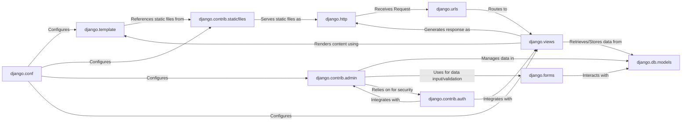

## Details

This subsystem is the user-facing layer of a Django application, responsible for rendering dynamic web content, serving static assets, and providing a robust administrative interface for data management. It acts as the bridge between user interactions and the application's business logic and data.

### django.template
The core of Django's dynamic content rendering. It provides the template engine responsible for parsing template files, processing template tags and filters, and rendering them into final HTML (or other formats). It allows for the separation of presentation logic from business logic.

**Related Classes/Methods**:

- <a href="https://github.com/django/django/django/template/__init__.py#L1-L1" target="_blank" rel="noopener noreferrer">`django/template/__init__.py` (1:1)</a>
- <a href="https://github.com/django/django/django/template/base.py#L1-L1" target="_blank" rel="noopener noreferrer">`django/template/base.py` (1:1)</a>
- <a href="https://github.com/django/django/django/template/engine.py#L1-L1" target="_blank" rel="noopener noreferrer">`django/template/engine.py` (1:1)</a>
- <a href="https://github.com/django/django/django/template/loader.py#L1-L1" target="_blank" rel="noopener noreferrer">`django/template/loader.py` (1:1)</a>
- <a href="https://github.com/django/django/django/template/context.py#L1-L1" target="_blank" rel="noopener noreferrer">`django/template/context.py` (1:1)</a>

### django.contrib.staticfiles
Dedicated to managing static files (CSS, JavaScript, images) required for the front-end presentation. It handles collecting, serving, and organizing these files efficiently during development and deployment.

**Related Classes/Methods**:

- <a href="https://github.com/django/django/django/contrib/staticfiles/__init__.py#L1-L1" target="_blank" rel="noopener noreferrer">`django/contrib/staticfiles/__init__.py` (1:1)</a>
- <a href="https://github.com/django/django/django/contrib/staticfiles/finders.py#L1-L1" target="_blank" rel="noopener noreferrer">`django/contrib/staticfiles/finders.py` (1:1)</a>
- <a href="https://github.com/django/django/django/contrib/staticfiles/storage.py#L1-L1" target="_blank" rel="noopener noreferrer">`django/contrib/staticfiles/storage.py` (1:1)</a>
- <a href="https://github.com/django/django/django/contrib/staticfiles/views.py#L1-L1" target="_blank" rel="noopener noreferrer">`django/contrib/staticfiles/views.py` (1:1)</a>

### django.contrib.admin
Django's built-in administrative interface, which automatically generates a powerful web-based UI for managing application data. It simplifies CRUD operations for registered models, significantly speeding up development and data management tasks.

**Related Classes/Methods**:

- <a href="https://github.com/django/django/django/contrib/admin/__init__.py#L1-L1" target="_blank" rel="noopener noreferrer">`django/contrib/admin/__init__.py` (1:1)</a>
- <a href="https://github.com/django/django/django/contrib/admin/sites.py#L1-L1" target="_blank" rel="noopener noreferrer">`django/contrib/admin/sites.py` (1:1)</a>
- <a href="https://github.com/django/django/django/contrib/admin/options.py#L1-L1" target="_blank" rel="noopener noreferrer">`django/contrib/admin/options.py` (1:1)</a>
- <a href="https://github.com/django/django/django/contrib/admin/views/main.py#L1-L1" target="_blank" rel="noopener noreferrer">`django/contrib/admin/views/main.py` (1:1)</a>

### django.forms
Provides a robust framework for creating, processing, and validating web forms. It handles data cleaning, validation, and rendering of form widgets, making it fundamental for user input and data manipulation, especially within the admin interface.

**Related Classes/Methods**:

- <a href="https://github.com/django/django/django/forms/__init__.py#L1-L1" target="_blank" rel="noopener noreferrer">`django/forms/__init__.py` (1:1)</a>
- <a href="https://github.com/django/django/django/forms/forms.py#L1-L1" target="_blank" rel="noopener noreferrer">`django/forms/forms.py` (1:1)</a>
- <a href="https://github.com/django/django/django/forms/models.py#L1-L1" target="_blank" rel="noopener noreferrer">`django/forms/models.py` (1:1)</a>
- <a href="https://github.com/django/django/django/forms/widgets.py#L1-L1" target="_blank" rel="noopener noreferrer">`django/forms/widgets.py` (1:1)</a>

### django.views
The core component for handling web requests and returning responses. Views encapsulate the logic for processing user input, interacting with models, and rendering templates to generate the final HTTP response.

**Related Classes/Methods**:

- <a href="https://github.com/django/django/django/views/__init__.py#L1-L1" target="_blank" rel="noopener noreferrer">`django/views/__init__.py` (1:1)</a>
- <a href="https://github.com/django/django/django/views/generic/base.py#L1-L1" target="_blank" rel="noopener noreferrer">`django/views/generic/base.py` (1:1)</a>
- <a href="https://github.com/django/django/django/views/generic/detail.py#L1-L1" target="_blank" rel="noopener noreferrer">`django/views/generic/detail.py` (1:1)</a>

### django.urls
Responsible for mapping incoming URLs to the appropriate view functions or class-based views. It provides the URL dispatcher, allowing for clean and organized URL routing within the application.

**Related Classes/Methods**:

- <a href="https://github.com/django/django/django/urls/__init__.py#L1-L1" target="_blank" rel="noopener noreferrer">`django/urls/__init__.py` (1:1)</a>
- <a href="https://github.com/django/django/django/urls/resolvers.py#L1-L1" target="_blank" rel="noopener noreferrer">`django/urls/resolvers.py` (1:1)</a>
- <a href="https://github.com/django/django/django/urls/conf.py#L1-L1" target="_blank" rel="noopener noreferrer">`django/urls/conf.py` (1:1)</a>

### django.http
Defines the fundamental HttpRequest and HttpResponse objects, which are the basis of all web communication in Django. It provides the interface for receiving incoming request data and constructing outgoing responses.

**Related Classes/Methods**:

- <a href="https://github.com/django/django/django/http/__init__.py#L1-L1" target="_blank" rel="noopener noreferrer">`django/http/__init__.py` (1:1)</a>
- <a href="https://github.com/django/django/django/http/request.py#L1-L1" target="_blank" rel="noopener noreferrer">`django/http/request.py` (1:1)</a>
- <a href="https://github.com/django/django/django/http/response.py#L1-L1" target="_blank" rel="noopener noreferrer">`django/http/response.py` (1:1)</a>

### django.conf
Manages project settings, which dictate how various Django components behave. It's crucial for configuring template loaders, static file directories, database connections, and enabling/disabling Django apps, including the admin.

**Related Classes/Methods**:

- <a href="https://github.com/django/django/django/conf/__init__.py#L1-L1" target="_blank" rel="noopener noreferrer">`django/conf/__init__.py` (1:1)</a>
- <a href="https://github.com/django/django/django/conf/global_settings.py#L1-L1" target="_blank" rel="noopener noreferrer">`django/conf/global_settings.py` (1:1)</a>

### django.db.models
Django's Object-Relational Mapper (ORM), providing a high-level Pythonic interface for interacting with the database. It defines models that map to database tables and allows for querying, creating, updating, and deleting data.

**Related Classes/Methods**:

- <a href="https://github.com/django/django/django/db/models/__init__.py#L1-L1" target="_blank" rel="noopener noreferrer">`django/db/models/__init__.py` (1:1)</a>
- <a href="https://github.com/django/django/django/db/models/base.py#L1-L1" target="_blank" rel="noopener noreferrer">`django/db/models/base.py` (1:1)</a>
- <a href="https://github.com/django/django/django/db/models/fields/__init__.py#L1-L1" target="_blank" rel="noopener noreferrer">`django/db/models/fields/__init__.py` (1:1)</a>
- <a href="https://github.com/django/django/django/db/models/query.py#L1-L1" target="_blank" rel="noopener noreferrer">`django/db/models/query.py` (1:1)</a>

### django.contrib.auth
Provides Django's authentication and authorization system. It manages users, groups, permissions, and password hashing, and is deeply integrated with the django.contrib.admin to secure access to the administrative interface.

**Related Classes/Methods**:

- <a href="https://github.com/django/django/django/contrib/auth/__init__.py#L1-L1" target="_blank" rel="noopener noreferrer">`django/contrib/auth/__init__.py` (1:1)</a>
- <a href="https://github.com/django/django/django/contrib/auth/models.py#L1-L1" target="_blank" rel="noopener noreferrer">`django/contrib/auth/models.py` (1:1)</a>
- <a href="https://github.com/django/django/django/contrib/auth/views.py#L1-L1" target="_blank" rel="noopener noreferrer">`django/contrib/auth/views.py` (1:1)</a>

### [FAQ](https://github.com/CodeBoarding/GeneratedOnBoardings/tree/main?tab=readme-ov-file#faq)