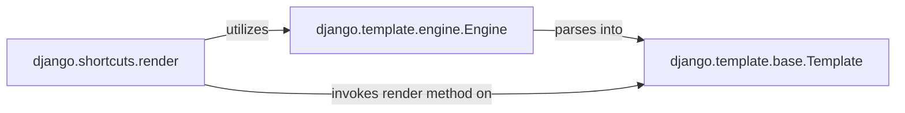

## Details

Analysis of Django's Presentation Layer, focusing on template processing, loading, parsing, and rendering to generate dynamic HTML output. Key components include Engine for managing templates, Template for compiled template representation, and render as a high-level interface for views.

### django.template.engine.Engine
The Engine is the core component for managing and loading templates. It provides the interface for configuring template directories, built-in tags, and filters. It acts as the central registry and factory for template instances.

**Related Classes/Methods**:

- <a href="https://github.com/django/django//blob/django/template/engine.py" target="_blank" rel="noopener noreferrer">`django.template.engine.Engine`</a>

### django.template.base.Template
Represents a compiled template. Once loaded and parsed by the Engine, this object holds the internal representation of the template. Its primary responsibility is to take a context (data) and render it into the final string output (e.g., HTML).

**Related Classes/Methods**:

- <a href="https://github.com/django/django//blob/django/template/base.py#L138-L288" target="_blank" rel="noopener noreferrer">`django.template.base.Template`:138-288</a>

### django.shortcuts.render
A convenience function that simplifies the common task of loading a template, rendering it with a given context, and returning an HttpResponse object. It acts as a high-level entry point for views to interact with the templating system, abstracting away the direct interaction with Engine and Template objects.

**Related Classes/Methods**:

- <a href="https://github.com/django/django//blob/django/shortcuts.py#L18-L26" target="_blank" rel="noopener noreferrer">`django.shortcuts.render`:18-26</a>

### [FAQ](https://github.com/CodeBoarding/GeneratedOnBoardings/tree/main?tab=readme-ov-file#faq)