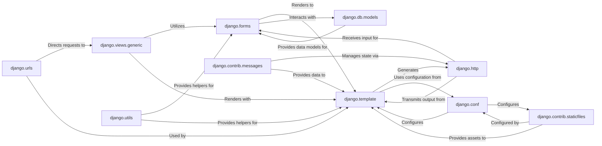

## Component Details

The Presentation Layer in Django is a critical subsystem responsible for all aspects of user interaction, from capturing input to rendering dynamic content. It acts as the interface between the user and the application's business logic and data.

### django.forms
This package provides a robust and flexible framework for handling user input through web forms. It simplifies the process of defining form fields, validating submitted data, and rendering forms into HTML.

**Related Classes/Methods**:

- <a href="https://github.com/django/django/blob/master/django/forms/forms.py#L1-L1" target="_blank" rel="noopener noreferrer">`django/forms/forms.py` (1:1)</a>
- <a href="https://github.com/django/django/blob/master/django/forms/fields.py#L1-L1" target="_blank" rel="noopener noreferrer">`django/forms/fields.py` (1:1)</a>
- <a href="https://github.com/django/django/blob/master/django/forms/widgets.py#L1-L1" target="_blank" rel="noopener noreferrer">`django/forms/widgets.py` (1:1)</a>
- <a href="https://github.com/django/django/blob/master/django/forms/models.py#L1-L1" target="_blank" rel="noopener noreferrer">`django/forms/models.py` (1:1)</a>

### django.template
This package implements Django's built-in template system, which allows for the separation of presentation logic from Python code. It provides a domain-specific language for defining the structure and dynamic content of web pages.

**Related Classes/Methods**:

- <a href="https://github.com/django/django/blob/master/django/template/engine.py#L1-L1" target="_blank" rel="noopener noreferrer">`django/template/engine.py` (1:1)</a>
- <a href="https://github.com/django/django/blob/master/django/template/base.py#L1-L1" target="_blank" rel="noopener noreferrer">`django/template/base.py` (1:1)</a>
- <a href="https://github.com/django/django/blob/master/django/template/loader.py#L1-L1" target="_blank" rel="noopener noreferrer">`django/template/loader.py` (1:1)</a>
- <a href="https://github.com/django/django/blob/master/django/template/defaulttags.py#L1-L1" target="_blank" rel="noopener noreferrer">`django/template/defaulttags.py` (1:1)</a>
- <a href="https://github.com/django/django/blob/master/django/template/defaultfilters.py#L1-L1" target="_blank" rel="noopener noreferrer">`django/template/defaultfilters.py` (1:1)</a>

### django.contrib.staticfiles
This contrib application is responsible for managing and serving static files (such as CSS stylesheets, JavaScript files, and images) that are essential for the visual and interactive aspects of a web application.

**Related Classes/Methods**:

- <a href="https://github.com/django/django/blob/master/django/contrib/staticfiles/finders.py#L1-L1" target="_blank" rel="noopener noreferrer">`django/contrib/staticfiles/finders.py` (1:1)</a>
- <a href="https://github.com/django/django/blob/master/django/contrib/staticfiles/views.py#L1-L1" target="_blank" rel="noopener noreferrer">`django/contrib/staticfiles/views.py` (1:1)</a>
- <a href="https://github.com/django/django/blob/master/django/contrib/staticfiles/storage.py#L1-L1" target="_blank" rel="noopener noreferrer">`django/contrib/staticfiles/storage.py` (1:1)</a>

### django.contrib.messages
This contrib application provides a "one-time notification" framework, allowing you to display temporary messages (e.g., success, warning, error) to users across HTTP requests.

**Related Classes/Methods**:

- <a href="https://github.com/django/django/blob/master/django/contrib/messages/api.py#L1-L1" target="_blank" rel="noopener noreferrer">`django/contrib/messages/api.py` (1:1)</a>
- <a href="https://github.com/django/django/blob/master/django/contrib/messages/middleware.py#L1-L1" target="_blank" rel="noopener noreferrer">`django/contrib/messages/middleware.py` (1:1)</a>
- <a href="https://github.com/django/django/blob/master/django/contrib/messages/storage/base.py#L1-L1" target="_blank" rel="noopener noreferrer">`django/contrib/messages/storage/base.py` (1:1)</a>

### django.http
Defines the core classes for handling HTTP requests (`HttpRequest`) and generating HTTP responses (`HttpResponse`), serving as the fundamental communication layer for web interactions.

**Related Classes/Methods**:

- <a href="https://github.com/django/django/blob/master/django/http/request.py#L1-L1" target="_blank" rel="noopener noreferrer">`django/http/request.py` (1:1)</a>
- <a href="https://github.com/django/django/blob/master/django/http/response.py#L1-L1" target="_blank" rel="noopener noreferrer">`django/http/response.py` (1:1)</a>

### django.db.models
Django's Object-Relational Mapper (ORM), which provides an abstraction layer for interacting with the database. It is crucial for `django.forms` when creating forms directly from database models.

**Related Classes/Methods**:

- <a href="https://github.com/django/django/blob/master/django/db/models/base.py#L1-L1" target="_blank" rel="noopener noreferrer">`django/db/models/base.py` (1:1)</a>
- `django/db/models/fields.py` (1:1)

### django.conf
Manages project-wide settings and configurations, influencing the behavior of various Django components, including template engines and static file handling.

**Related Classes/Methods**:

- <a href="https://github.com/django/django/blob/master/django/conf/__init__.py#L1-L1" target="_blank" rel="noopener noreferrer">`django/conf/__init__.py` (1:1)</a>

### django.views.generic
Provides a set of reusable class-based views that abstract common web development patterns, often integrating with forms and templates to render dynamic content.

**Related Classes/Methods**:

- <a href="https://github.com/django/django/blob/master/django/views/generic/base.py#L1-L1" target="_blank" rel="noopener noreferrer">`django/views/generic/base.py` (1:1)</a>
- <a href="https://github.com/django/django/blob/master/django/views/generic/edit.py#L1-L1" target="_blank" rel="noopener noreferrer">`django/views/generic/edit.py` (1:1)</a>

### django.urls
Responsible for URL routing, mapping incoming HTTP requests to the appropriate view functions or class-based views within the Django application.

**Related Classes/Methods**:

- <a href="https://github.com/django/django/blob/master/django/urls/base.py#L1-L1" target="_blank" rel="noopener noreferrer">`django/urls/base.py` (1:1)</a>
- <a href="https://github.com/django/django/blob/master/django/urls/resolvers.py#L1-L1" target="_blank" rel="noopener noreferrer">`django/urls/resolvers.py` (1:1)</a>

### django.utils
A collection of utility functions and classes used across various Django components, including helpers for HTML escaping, string manipulation, and functional programming, ensuring safe and efficient operations.

**Related Classes/Methods**:

- <a href="https://github.com/django/django/blob/master/django/utils/html.py#L1-L1" target="_blank" rel="noopener noreferrer">`django/utils/html.py` (1:1)</a>
- <a href="https://github.com/django/django/blob/master/django/utils/safestring.py#L1-L1" target="_blank" rel="noopener noreferrer">`django/utils/safestring.py` (1:1)</a>

### [FAQ](https://github.com/CodeBoarding/GeneratedOnBoardings/tree/main?tab=readme-ov-file#faq)