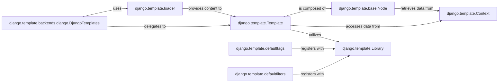

## Details

The Django template subsystem is orchestrated by `DjangoTemplates`, which acts as the primary interface for template rendering. It leverages `django.template.loader` to locate and load template files, which then provide content to `django.template.Template` instances. A `Template` parses this content into a tree of `django.template.base.Node` objects, the fundamental building blocks representing template logic. During rendering, `Template` and `Node` instances access data from a `django.template.Context` object, which holds all variables available to the template. The extensibility of the template language is managed by `django.template.Library`, a central registry where built-in components like `django.template.defaulttags` and `django.template.defaultfilters` register their functionalities, making them available for use within templates. This architecture ensures a clear separation of concerns, from template loading and parsing to data provision and extensibility.

### django.template.backends.django.DjangoTemplates
This component serves as the primary entry point and adapter for integrating and configuring Django's built-in template engine. It provides a consistent interface for template operations, abstracting the underlying template engine details.

**Related Classes/Methods**:

- <a href="https://github.com/django/django/blob/main/django/template/backends/django.py#L16-L90" target="_blank" rel="noopener noreferrer">`django.template.backends.django.DjangoTemplates`:16-90</a>

### django.template.loader
Responsible for locating and loading template files from various configured sources, such as the file system or installed application directories. It abstracts the physical storage and retrieval of templates.

**Related Classes/Methods**:

- <a href="https://github.com/django/django/blob/main/django/template/loader.py" target="_blank" rel="noopener noreferrer">`django.template.loader`</a>

### django.template.Template
Represents a compiled template. Its core responsibility is to parse the raw template content into an internal structure (a tree of nodes) and then, when rendered with a context, execute these nodes to produce the final output (e.g., HTML).

**Related Classes/Methods**:

- <a href="https://github.com/django/django/blob/main/django/template/base.py" target="_blank" rel="noopener noreferrer">`django.template.Template`</a>

### django.template.Context
A dictionary-like object that holds all the variables and data that are made available to the template during the rendering process. Views typically populate and pass a `Context` instance to the template.

**Related Classes/Methods**:

- <a href="https://github.com/django/django/blob/main/django/template/context.py" target="_blank" rel="noopener noreferrer">`django.template.Context`</a>

### django.template.base.Node
The fundamental building block of a parsed template. Each template tag (e.g., ``, ``) is internally represented by a specific subclass of `Node`, which defines its parsing and rendering behavior.

**Related Classes/Methods**:

- <a href="https://github.com/django/django/blob/main/django/template/base.py#L972-L1023" target="_blank" rel="noopener noreferrer">`django.template.base.Node`:972-1023</a>

### django.template.Library
Provides a mechanism for developers to extend the Django Template Language (DTL) by registering custom template tags and filters. This promotes reusability and modularity of template logic.

**Related Classes/Methods**:

- <a href="https://github.com/django/django/blob/main/django/template/library.py" target="_blank" rel="noopener noreferrer">`django.template.Library`</a>

### django.template.defaulttags
Contains the implementations of Django's extensive set of built-in template tags (e.g., `for`, `if`, `url`, `static`, `csrf_token`). These are essential for common templating tasks and are registered via `Library`.

**Related Classes/Methods**:

- <a href="https://github.com/django/django/blob/main/django/template/defaulttags.py" target="_blank" rel="noopener noreferrer">`django.template.defaulttags`</a>

### django.template.defaultfilters
Contains the implementations of Django's built-in template filters (e.g., `date`, `length`, `lower`, `truncatechars`). Filters are used to transform variable values within templates and are registered via `Library`.

**Related Classes/Methods**:

- <a href="https://github.com/django/django/blob/main/django/template/defaultfilters.py" target="_blank" rel="noopener noreferrer">`django.template.defaultfilters`</a>

### [FAQ](https://github.com/CodeBoarding/GeneratedOnBoardings/tree/main?tab=readme-ov-file#faq)