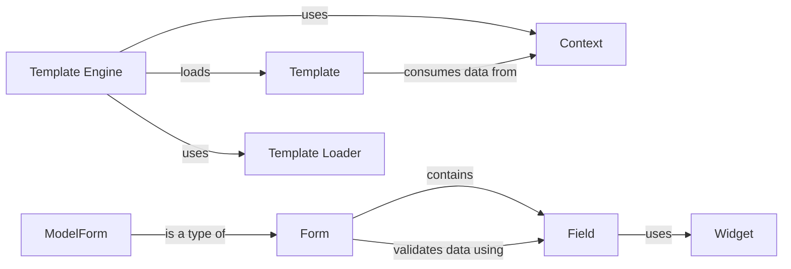

## Details

The Django templating and forms subsystem provides a robust framework for rendering dynamic web content and handling user input. The `Template Engine` serves as the central orchestrator for rendering, leveraging `Template Loaders` to locate and load `Templates`. During rendering, `Templates` consume data provided by `Context` objects. For user interaction, the `Form` component defines the structure and validation rules for web forms, composed of individual `Field` components. Each `Field` utilizes a `Widget` to control its HTML representation. The `ModelForm` extends the `Form` functionality, streamlining the creation of forms directly from database models. This architecture ensures a clear separation of concerns between data presentation, data handling, and user input validation.

### Template Engine
The primary interface for loading, parsing, and rendering templates. It orchestrates the template rendering process by interacting with loaders and contexts.

**Related Classes/Methods**:

- <a href="https://github.com/django/django/blob/main/django/template/backends/django.py#L16-L90" target="_blank" rel="noopener noreferrer">`django.template.backends.django.DjangoTemplates`:16-90</a>

### Template
Represents the parsed template structure, containing placeholders for dynamic data and control flow logic (e.g., loops, conditionals). It's the blueprint for the final HTML output.

**Related Classes/Methods**:

- <a href="https://github.com/django/django/blob/main/django/template/base.py" target="_blank" rel="noopener noreferrer">`django.template.Template`</a>

### Context
A dictionary-like object that holds all the data (variables, objects) that are made available to a template during its rendering process.

**Related Classes/Methods**:

- <a href="https://github.com/django/django/blob/main/django/template/context.py" target="_blank" rel="noopener noreferrer">`django.template.Context`</a>

### Form
The base class for defining web forms. It encapsulates the definition of form fields, handles data validation, and facilitates rendering the form as HTML.

**Related Classes/Methods**:

- <a href="https://github.com/django/django/blob/main/django/forms/forms.py" target="_blank" rel="noopener noreferrer">`django.forms.Form`</a>

### Field
Represents a single input field within a form. It defines the field's type (e.g., text, number), its validation rules, and how it interacts with user input.

**Related Classes/Methods**:

- <a href="https://github.com/django/django/blob/main/django/forms/fields.py" target="_blank" rel="noopener noreferrer">`django.forms.Field`</a>

### Widget
Controls how a form field is rendered as HTML. Widgets determine the HTML input type (e.g., <input type="text">, <textarea>) and can include custom rendering logic.

**Related Classes/Methods**:

- <a href="https://github.com/django/django/blob/main/django/forms/widgets.py" target="_blank" rel="noopener noreferrer">`django.forms.Widget`</a>

### ModelForm
A specialized type of Form that automatically generates form fields and validation rules directly from a Django model definition, simplifying CRUD operations.

**Related Classes/Methods**:

- <a href="https://github.com/django/django/blob/main/django/forms/models.py" target="_blank" rel="noopener noreferrer">`django.forms.ModelForm`</a>

### Template Loader
Responsible for locating and loading template files from various configured sources (e.g., file system paths, installed applications).

**Related Classes/Methods**:

- <a href="https://github.com/django/django/blob/main/django/template/loaders/base.py#L4-L51" target="_blank" rel="noopener noreferrer">`django.template.loaders.base.Loader`:4-51</a>

### [FAQ](https://github.com/CodeBoarding/GeneratedOnBoardings/tree/main?tab=readme-ov-file#faq)