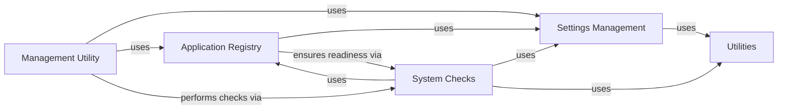

## Component Details

The `Project Core & Configuration` component serves as the foundational layer of a Django project, orchestrating its initialization, managing global settings, loading installed applications, and providing essential command-line utilities. It establishes the operational environment and parameters for all other components within the framework.

### Settings Management
This component is responsible for loading, managing, and providing access to Django's project settings. It handles the configuration values that dictate the behavior of the entire Django application, from database connections to installed applications and middleware. It ensures that all parts of the project operate under a unified and consistent set of parameters.

**Related Classes/Methods**:

- <a href="https://github.com/django/django/blob/master/django/template/backends/django.py#L0-L0" target="_blank" rel="noopener noreferrer">`django.conf` (0:0)</a>
- <a href="https://github.com/django/django/blob/master/django/conf/global_settings.py#L0-L0" target="_blank" rel="noopener noreferrer">`django.conf.global_settings` (0:0)</a>
- <a href="https://github.com/django/django/blob/master/django/template/backends/django.py#L0-L0" target="_blank" rel="noopener noreferrer">`django.conf.LazySettings` (0:0)</a>
- <a href="https://github.com/django/django/blob/master/django/template/backends/django.py#L0-L0" target="_blank" rel="noopener noreferrer">`django.conf.Settings` (0:0)</a>

### Application Registry
The Apps registry is a central component that manages the lifecycle of installed applications within a Django project. It handles app loading, ensures apps are ready before use, and provides methods to retrieve app configurations and models, enabling Django's modular architecture. This component is crucial for Django's "pluggable apps" philosophy.

**Related Classes/Methods**:

- <a href="https://github.com/django/django/blob/master/django/template/backends/django.py#L0-L0" target="_blank" rel="noopener noreferrer">`django.apps` (0:0)</a>
- <a href="https://github.com/django/django/blob/master/django/apps/config.py#L0-L0" target="_blank" rel="noopener noreferrer">`django.apps.config` (0:0)</a>
- <a href="https://github.com/django/django/blob/master/django/apps/registry.py#L0-L0" target="_blank" rel="noopener noreferrer">`django.apps.registry` (0:0)</a>
- <a href="https://github.com/django/django/blob/master/django/apps/registry.py#L12-L433" target="_blank" rel="noopener noreferrer">`django.apps.registry.Apps` (12:433)</a>
- <a href="https://github.com/django/django/blob/master/django/apps/config.py#L12-L273" target="_blank" rel="noopener noreferrer">`django.apps.config.AppConfig` (12:273)</a>

### Management Utility
This component serves as the command-line entry point for all Django administrative tasks (e.g., `runserver`, `migrate`, `makemigrations`). It parses command-line arguments and dispatches to the appropriate `BaseCommand` subclass, providing a consistent interface for project administration and development. It's the primary interface for developers to interact with their Django projects.

**Related Classes/Methods**:

- <a href="https://github.com/django/django/blob/master/django/template/backends/django.py#L0-L0" target="_blank" rel="noopener noreferrer">`django.core.management` (0:0)</a>
- <a href="https://github.com/django/django/blob/master/django/core/management/base.py#L0-L0" target="_blank" rel="noopener noreferrer">`django.core.management.base` (0:0)</a>
- `django.core.management.ManagementUtility` (0:0)
- <a href="https://github.com/django/django/blob/master/django/core/management/base.py#L0-L0" target="_blank" rel="noopener noreferrer">`django.core.management.base.BaseCommand` (0:0)</a>

### System Checks
This component provides a robust framework for performing system-wide checks across different parts of a Django project (e.g., settings, models, databases, URLs) to identify common problems, misconfigurations, and potential issues. It helps improve the overall stability and correctness of the application by providing early warnings.

**Related Classes/Methods**:

- <a href="https://github.com/django/django/blob/master/django/template/backends/django.py#L0-L0" target="_blank" rel="noopener noreferrer">`django.core.checks` (0:0)</a>
- <a href="https://github.com/django/django/blob/master/django/core/checks/registry.py#L0-L0" target="_blank" rel="noopener noreferrer">`django.core.checks.registry` (0:0)</a>
- <a href="https://github.com/django/django/blob/master/django/core/checks/model_checks.py#L0-L0" target="_blank" rel="noopener noreferrer">`django.core.checks.model_checks` (0:0)</a>
- <a href="https://github.com/django/django/blob/master/django/core/checks/caches.py#L0-L0" target="_blank" rel="noopener noreferrer">`django.core.checks.caches` (0:0)</a>
- <a href="https://github.com/django/django/blob/master/django/core/checks/database.py#L0-L0" target="_blank" rel="noopener noreferrer">`django.core.checks.database` (0:0)</a>
- <a href="https://github.com/django/django/blob/master/django/core/checks/urls.py#L0-L0" target="_blank" rel="noopener noreferrer">`django.core.checks.urls` (0:0)</a>
- <a href="https://github.com/django/django/blob/master/django/core/checks/registry.py#L28-L111" target="_blank" rel="noopener noreferrer">`django.core.checks.registry.CheckRegistry` (28:111)</a>

### Utilities
This broad component encompasses a collection of general-purpose helper functions and classes that are widely used throughout the Django framework. These utilities provide foundational functionalities such as dynamic module loading, functional programming constructs, and various data manipulation and formatting tools, supporting various other components.

**Related Classes/Methods**:

- <a href="https://github.com/django/django/blob/master/django/utils/module_loading.py#L0-L0" target="_blank" rel="noopener noreferrer">`django.utils.module_loading` (0:0)</a>
- <a href="https://github.com/django/django/blob/master/django/utils/functional.py#L0-L0" target="_blank" rel="noopener noreferrer">`django.utils.functional` (0:0)</a>
- <a href="https://github.com/django/django/blob/master/django/utils/autoreload.py#L0-L0" target="_blank" rel="noopener noreferrer">`django.utils.autoreload` (0:0)</a>
- <a href="https://github.com/django/django/blob/master/django/utils/cache.py#L0-L0" target="_blank" rel="noopener noreferrer">`django.utils.cache` (0:0)</a>
- <a href="https://github.com/django/django/blob/master/django/utils/crypto.py#L0-L0" target="_blank" rel="noopener noreferrer">`django.utils.crypto` (0:0)</a>
- <a href="https://github.com/django/django/blob/master/django/utils/encoding.py#L0-L0" target="_blank" rel="noopener noreferrer">`django.utils.encoding` (0:0)</a>
- <a href="https://github.com/django/django/blob/master/django/utils/html.py#L0-L0" target="_blank" rel="noopener noreferrer">`django.utils.html` (0:0)</a>
- <a href="https://github.com/django/django/blob/master/django/utils/text.py#L0-L0" target="_blank" rel="noopener noreferrer">`django.utils.text` (0:0)</a>
- <a href="https://github.com/django/django/blob/master/django/utils/timezone.py#L0-L0" target="_blank" rel="noopener noreferrer">`django.utils.timezone` (0:0)</a>
- <a href="https://github.com/django/django/blob/master/django/utils/module_loading.py#L18-L34" target="_blank" rel="noopener noreferrer">`django.utils.module_loading.import_string` (18:34)</a>
- <a href="https://github.com/django/django/blob/master/django/utils/functional.py#L258-L371" target="_blank" rel="noopener noreferrer">`django.utils.functional.LazyObject` (258:371)</a>

### [FAQ](https://github.com/CodeBoarding/GeneratedOnBoardings/tree/main?tab=readme-ov-file#faq)