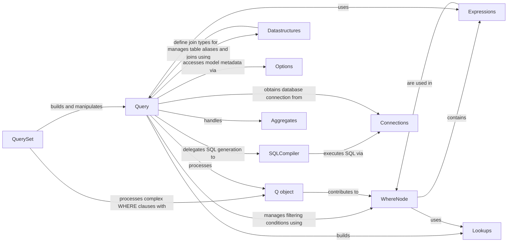

## Component Details

Here's the final component overview for `Query`, focusing on its structure, flow, and purpose, along with its fundamental relationships with other key components in the Django ORM.

### Query
The core internal object that represents an abstract SQL query being constructed. It's a stateful object that accumulates all the conditions, selections, orderings, and other SQL clauses. It manages table aliases, joins, WHERE clauses, annotations, and extra SQL parts.

**Related Classes/Methods**:

- <a href="https://github.com/django/django/blob/master/django/db/models/sql/query.py#L0-L0" target="_blank" rel="noopener noreferrer">`django.db.models.sql.query.Query` (0:0)</a>

### QuerySet
The primary user-facing interface for interacting with the database. It provides methods like `filter()`, `annotate()`, `order_by()`, `values()`, `create()`, `update()`, and `delete()`. These methods build and modify the underlying `Query` object.

**Related Classes/Methods**:

- <a href="https://github.com/django/django/blob/master/django/db/models/query.py#L0-L0" target="_blank" rel="noopener noreferrer">`django.db.models.query.QuerySet:filter` (0:0)</a>
- <a href="https://github.com/django/django/blob/master/django/db/models/query.py#L0-L0" target="_blank" rel="noopener noreferrer">`django.db.models.query.QuerySet:annotate` (0:0)</a>
- <a href="https://github.com/django/django/blob/master/django/db/models/query.py#L0-L0" target="_blank" rel="noopener noreferrer">`django.db.models.query.QuerySet:order_by` (0:0)</a>
- <a href="https://github.com/django/django/blob/master/django/db/models/query.py#L0-L0" target="_blank" rel="noopener noreferrer">`django.db.models.query.QuerySet:values` (0:0)</a>
- <a href="https://github.com/django/django/blob/master/django/db/models/query.py#L0-L0" target="_blank" rel="noopener noreferrer">`django.db.models.query.QuerySet:create` (0:0)</a>
- <a href="https://github.com/django/django/blob/master/django/db/models/query.py#L0-L0" target="_blank" rel="noopener noreferrer">`django.db.models.query.QuerySet:update` (0:0)</a>
- <a href="https://github.com/django/django/blob/master/django/db/models/query.py#L0-L0" target="_blank" rel="noopener noreferrer">`django.db.models.query.QuerySet:delete` (0:0)</a>

### WhereNode
A specialized tree-like structure responsible for managing the WHERE and HAVING clauses of the SQL query. It handles complex logical operations (AND, OR, NOT) and can split conditions into appropriate SQL clauses based on the presence of aggregates or window functions. `Query` holds an instance of `WhereNode`.

**Related Classes/Methods**:

- <a href="https://github.com/django/django/blob/master/django/db/models/sql/where.py#L0-L0" target="_blank" rel="noopener noreferrer">`django.db.models.sql.where.WhereNode` (0:0)</a>

### SQLCompiler
An abstract base class (with database-specific subclasses like `SQLInsertCompiler`, `SQLDeleteCompiler`, `SQLUpdateCompiler`) responsible for translating a `Query` object into a concrete SQL string and its corresponding parameters. It also handles the execution of the generated SQL against the database. `Query` delegates SQL generation and execution to `SQLCompiler`.

**Related Classes/Methods**:

- <a href="https://github.com/django/django/blob/master/django/db/models/sql/compiler.py#L39-L1674" target="_blank" rel="noopener noreferrer">`django.db.models.sql.compiler.SQLCompiler` (39:1674)</a>
- <a href="https://github.com/django/django/blob/master/django/db/models/sql/compiler.py#L1677-L1961" target="_blank" rel="noopener noreferrer">`django.db.models.sql.compiler.SQLInsertCompiler` (1677:1961)</a>
- <a href="https://github.com/django/django/blob/master/django/db/models/sql/compiler.py#L1964-L2021" target="_blank" rel="noopener noreferrer">`django.db.models.sql.compiler.SQLDeleteCompiler` (1964:2021)</a>
- <a href="https://github.com/django/django/blob/master/django/db/models/sql/compiler.py#L2024-L2178" target="_blank" rel="noopener noreferrer">`django.db.models.sql.compiler.SQLUpdateCompiler` (2024:2178)</a>

### Expressions
A collection of classes (e.g., `F`, `Value`, `Col`, `Case`, `When`) that represent various elements within SQL expressions. They are the building blocks for constructing SELECT, WHERE, GROUP BY, and ORDER BY clauses, allowing for dynamic and database-agnostic SQL generation. `Query` resolves and manipulates these expressions.

**Related Classes/Methods**:

- <a href="https://github.com/django/django/blob/master/django/db/models/expressions.py#L875-L936" target="_blank" rel="noopener noreferrer">`django.db.models.expressions.F` (875:936)</a>
- <a href="https://github.com/django/django/blob/master/django/db/models/expressions.py#L1141-L1218" target="_blank" rel="noopener noreferrer">`django.db.models.expressions.Value` (1141:1218)</a>
- <a href="https://github.com/django/django/blob/master/django/db/models/expressions.py#L1303-L1339" target="_blank" rel="noopener noreferrer">`django.db.models.expressions.Col` (1303:1339)</a>
- <a href="https://github.com/django/django/blob/master/django/db/models/expressions.py#L1654-L1750" target="_blank" rel="noopener noreferrer">`django.db.models.expressions.Case` (1654:1750)</a>
- <a href="https://github.com/django/django/blob/master/django/db/models/expressions.py#L1588-L1650" target="_blank" rel="noopener noreferrer">`django.db.models.expressions.When` (1588:1650)</a>

### Datastructures
Contains classes like `BaseTable` and `Join` that are used by the `Query` object to manage table references, aliasing, and different types of join operations (INNER, LEFT OUTER). `Query` uses these to build its `alias_map`.

**Related Classes/Methods**:

- <a href="https://github.com/django/django/blob/master/django/db/models/sql/datastructures.py#L0-L0" target="_blank" rel="noopener noreferrer">`django.db.models.sql.datastructures.BaseTable` (0:0)</a>
- <a href="https://github.com/django/django/blob/master/django/db/models/sql/datastructures.py#L0-L0" target="_blank" rel="noopener noreferrer">`django.db.models.sql.datastructures.Join` (0:0)</a>

### Options
An internal class (accessed via `model._meta`) that provides metadata about a Django model, including its fields, primary keys, relationships, and default ordering. The `Query` object uses this metadata to resolve field lookups and construct queries.

**Related Classes/Methods**:

- <a href="https://github.com/django/django/blob/master/django/db/models/options.py#L89-L1042" target="_blank" rel="noopener noreferrer">`django.db.models.options.Options` (89:1042)</a>

### Connections
Manages the database connections configured in Django's settings. It provides access to the appropriate database backend's operations (`connection.ops`) and allows for the creation of `SQLCompiler` instances specific to that backend. `Query` uses `Connections` to obtain a database connection for the `SQLCompiler`.

**Related Classes/Methods**:

- <a href="https://github.com/django/django/blob/master/django/db/utils.py#L0-L0" target="_blank" rel="noopener noreferrer">`django.db.utils.Connections` (0:0)</a>

### Q object
A Python object used to encapsulate complex WHERE clause logic, allowing for the combination of conditions using AND, OR, and NOT operators. `Query` processes `Q` objects to build its `WhereNode`.

**Related Classes/Methods**:

- <a href="https://github.com/django/django/blob/master/django/db/models/query_utils.py#L0-L0" target="_blank" rel="noopener noreferrer">`django.db.models.query_utils.Q` (0:0)</a>

### Aggregates
A set of classes (e.g., `Count`, `Sum`, `Avg`, `Max`, `Min`) that represent SQL aggregate functions. These are used with `annotate()` and `aggregate()` methods on `QuerySet` and are processed by the `Query` object.

**Related Classes/Methods**:

- <a href="https://github.com/django/django/blob/master/django/db/models/aggregates.py#L0-L0" target="_blank" rel="noopener noreferrer">`django.db.models.aggregates.Count` (0:0)</a>
- <a href="https://github.com/django/django/blob/master/django/db/models/aggregates.py#L0-L0" target="_blank" rel="noopener noreferrer">`django.db.models.aggregates.Sum` (0:0)</a>
- <a href="https://github.com/django/django/blob/master/django/db/models/aggregates.py#L0-L0" target="_blank" rel="noopener noreferrer">`django.db.models.aggregates.Avg` (0:0)</a>
- <a href="https://github.com/django/django/blob/master/django/db/models/aggregates.py#L0-L0" target="_blank" rel="noopener noreferrer">`django.db.models.aggregates.Max` (0:0)</a>
- <a href="https://github.com/django/django/blob/master/django/db/models/aggregates.py#L0-L0" target="_blank" rel="noopener noreferrer">`django.db.models.aggregates.Min` (0:0)</a>

### Lookups
Defines the various lookup types (e.g., `exact`, `iexact`, `contains`, `gt`, `lt`) that can be used in `filter()` and `exclude()` clauses to specify comparison operations in SQL.

**Related Classes/Methods**:

- <a href="https://github.com/django/django/blob/master/django/db/models/lookups.py#L0-L0" target="_blank" rel="noopener noreferrer">`django.db.models.lookups.exact` (0:0)</a>
- <a href="https://github.com/django/django/blob/master/django/db/models/lookups.py#L0-L0" target="_blank" rel="noopener noreferrer">`django.db.models.lookups.iexact` (0:0)</a>
- <a href="https://github.com/django/django/blob/master/django/db/models/lookups.py#L0-L0" target="_blank" rel="noopener noreferrer">`django.db.models.lookups.contains` (0:0)</a>
- <a href="https://github.com/django/django/blob/master/django/db/models/lookups.py#L0-L0" target="_blank" rel="noopener noreferrer">`django.db.models.lookups.gt` (0:0)</a>
- <a href="https://github.com/django/django/blob/master/django/db/models/lookups.py#L0-L0" target="_blank" rel="noopener noreferrer">`django.db.models.lookups.lt` (0:0)</a>

### [FAQ](https://github.com/CodeBoarding/GeneratedOnBoardings/tree/main?tab=readme-ov-file#faq)