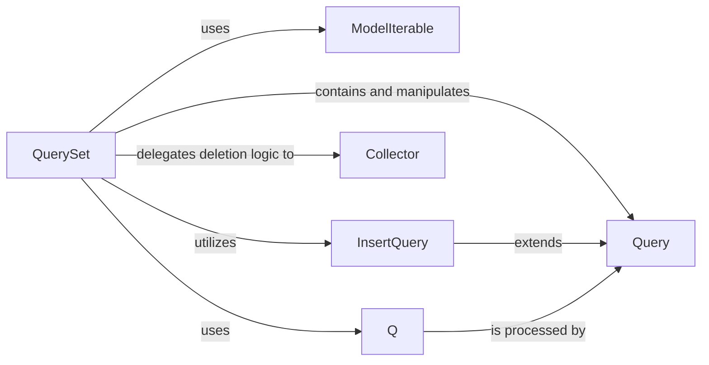

## Component Details

Analysis of Django's QuerySet component and its fundamental building blocks for database interactions, including Query, ModelIterable, Q, Collector, and InsertQuery, and their interrelationships within the Django ORM framework. The QuerySet provides a high-level, Pythonic API for constructing and executing database queries, representing a collection of database objects and enabling efficient data retrieval and manipulation through a lazy evaluation model. The analysis highlights how these components collectively contribute to the QuerySet's functionality, from SQL construction and data retrieval to complex query expressions and object deletion management, ensuring data integrity and efficient database operations within Django's ORM.

### QuerySet
The primary interface for interacting with the database in an object-oriented manner. It represents a collection of database queries and offers a rich, lazy API for filtering, ordering, slicing, and retrieving data. `QuerySet` objects are not evaluated until explicitly needed, promoting efficiency by delaying database hits.

**Related Classes/Methods**:

- <a href="https://github.com/django/django/blob/master/django/db/models/query.py#L1-L9999" target="_blank" rel="noopener noreferrer">`django.db.models.query.QuerySet` (1:9999)</a>

### Query
This component represents the low-level, underlying SQL query being constructed by the `QuerySet`. It holds all the details of the SQL statement, including `SELECT` columns, `WHERE` conditions, `ORDER BY` clauses, `LIMIT` and `OFFSET` values, and `JOIN` information. It's the direct representation of the database interaction before it's compiled into a raw SQL string.

**Related Classes/Methods**:

- <a href="https://github.com/django/django/blob/master/django/db/models/sql/query.py#L1-L9999" target="_blank" rel="noopener noreferrer">`django.db.models.sql.query.Query` (1:9999)</a>

### ModelIterable
An internal iterable class that acts as an adapter between the raw results returned by the database and Django model instances. It's responsible for iterating over the database rows and converting each row into a fully populated Django model object, including handling related object population.

**Related Classes/Methods**:

- <a href="https://github.com/django/django/blob/master/django/db/models/query.py#L1-L9999" target="_blank" rel="noopener noreferrer">`django.db.models.query.ModelIterable` (1:9999)</a>

### Q
An object that encapsulates a SQL `WHERE` clause or a part of it. `Q` objects allow developers to build complex query expressions using Python's logical operators (`&` for AND, `|` for OR, `~` for NOT), which are then translated into appropriate SQL by the `Query` component. This provides a more readable and programmatic way to define query conditions.

**Related Classes/Methods**:

- <a href="https://github.com/django/django/blob/master/django/db/models/query_utils.py#L1-L9999" target="_blank" rel="noopener noreferrer">`django.db.models.query_utils.Q` (1:9999)</a>

### Collector
This utility class is specifically designed to manage the complexities of object deletion, particularly when dealing with related objects and cascade rules. It identifies all objects that need to be deleted or have their foreign keys nullified when a primary object is deleted, ensuring data integrity.

**Related Classes/Methods**:

- <a href="https://github.com/django/django/blob/master/django/db/models/deletion.py#L93-L516" target="_blank" rel="noopener noreferrer">`django.db.models.deletion.Collector` (93:516)</a>

### InsertQuery
A specialized subclass of `Query` that is specifically tailored for constructing SQL `INSERT` statements. It manages the fields and values that are to be inserted into the database, including handling `on_conflict` and `update_fields` for `INSERT ... ON CONFLICT` statements.

**Related Classes/Methods**:

- <a href="https://github.com/django/django/blob/master/django/db/models/sql/subqueries.py#L1-L9999" target="_blank" rel="noopener noreferrer">`django.db.models.sql.subqueries.InsertQuery` (1:9999)</a>

### [FAQ](https://github.com/CodeBoarding/GeneratedOnBoardings/tree/main?tab=readme-ov-file#faq)