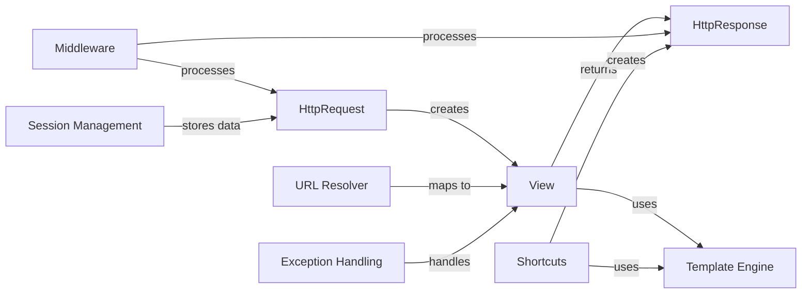

## Component Details

### HttpRequest
Represents an incoming HTTP request. It encapsulates all the information about the request, such as headers, GET and POST parameters, and the request body. Django uses this object to pass request data to view functions.
- **Related Classes/Methods**: `django.http.request.HttpRequest`

### HttpResponse
Represents the HTTP response that a Django view returns. It contains the content, headers, and status code of the response. Django handles the creation and sending of HttpResponse objects to the client.
- **Related Classes/Methods**: `django.http.response.HttpResponse`

### Middleware
Middleware provides a way to process requests and responses globally. Each middleware component performs a specific function, such as adding headers, handling sessions, or logging requests. Middleware components are chained together to form a processing pipeline.
- **Related Classes/Methods**: `django.core.handlers.base.BaseHandler`, `django.middleware.common.CommonMiddleware`, `django.middleware.csrf.CsrfViewMiddleware`, `django.contrib.sessions.middleware.SessionMiddleware`

### URL Resolver
The URL resolver maps incoming URLs to specific view functions. It uses a URL configuration (urlpatterns) to define the mapping rules. When a request comes in, the URL resolver finds the matching view and passes the HttpRequest object to it.
- **Related Classes/Methods**: `django.urls.resolvers.URLResolver`, `django.urls.resolvers.URLPattern`

### View
A view is a callable that takes an HttpRequest object as input and returns an HttpResponse object. It contains the application logic for processing a request and generating a response. Views can be functions or classes.
- **Related Classes/Methods**: `django.views.generic.base.View`

### Template Engine
The template engine renders dynamic content into HTML or other formats. It uses templates that contain placeholders for data, which are filled in by the view. The rendered template is then included in the HttpResponse.
- **Related Classes/Methods**: `django.template.engine.Engine`, `django.template.loader`

### Session Management
Django's session management allows you to store and retrieve data associated with individual users across multiple requests. The SessionMiddleware enables session functionality, and the session data is stored in a database or other storage backend.
- **Related Classes/Methods**: `django.contrib.sessions.middleware.SessionMiddleware`, `django.contrib.sessions.backends.db.SessionStore`

### Exception Handling
Django provides a mechanism for handling exceptions that occur during request processing. When an exception is raised, Django's exception handling middleware intercepts it and generates an appropriate error response, such as a 404 or 500 error page.
- **Related Classes/Methods**: `django.core.handlers.exception.handle_uncaught_exception`

### Shortcuts
Django provides shortcut functions like render, redirect, and get_object_or_404 to simplify common tasks in views. These functions abstract away some of the boilerplate code required to generate responses and handle common scenarios.
- **Related Classes/Methods**: `django.shortcuts`
