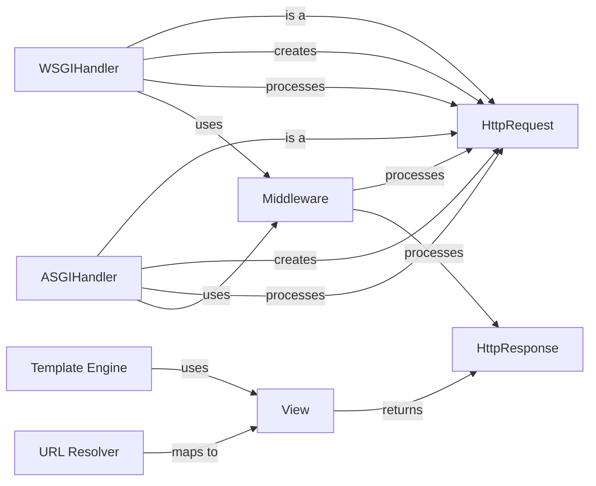

## Component Details

The Request Handling and Middleware component is the entry point for all HTTP requests to a Django application. It receives requests, processes them through a chain of middleware components, and generates HTTP responses. The middleware components perform tasks such as session management, authentication, CSRF protection, and request logging. The URL resolver maps URLs to views, which then interact with the template engine to generate the response content.

### HttpRequest
Represents an incoming HTTP request. It encapsulates all the information about the request, including headers, query parameters, POST data, and uploaded files. It provides methods for accessing this data and other request-related information.
- **Related Classes/Methods**: `django.django.http.request.HttpRequest`

### HttpResponse
Represents an outgoing HTTP response. It allows setting the content, status code, and headers of the response. It also provides methods for setting and deleting cookies.
- **Related Classes/Methods**: `django.django.http.response.HttpResponse`, `django.django.http.response.HttpResponseBase`

### WSGIHandler
The WSGI handler that processes requests. It receives a WSGI environment and returns a WSGI response. It is the entry point for WSGI-based Django applications.
- **Related Classes/Methods**: `django.django.core.handlers.wsgi.WSGIHandler`

### ASGIHandler
The ASGI handler that processes requests. It receives an ASGI scope and sends events to the ASGI channel. It is the entry point for ASGI-based Django applications.
- **Related Classes/Methods**: `django.django.core.handlers.asgi.ASGIHandler`

### Middleware
Middleware components are a chain of functions that process the request and response at different stages of the request-response cycle. They perform tasks such as authentication, session management, CSRF protection, and request logging.
- **Related Classes/Methods**: `django.django.middleware.common`, `django.django.middleware.csrf`, `django.django.middleware.security`, `django.django.contrib.sessions.middleware`, `django.django.contrib.auth.middleware`, `django.django.contrib.messages.middleware`

### URL Resolver
The URL resolver maps incoming URLs to specific views. It uses the URL patterns defined in the project's URL configuration to determine which view should handle the request.
- **Related Classes/Methods**: `django.django.urls.resolvers`

### View
A view is a callable that takes an HttpRequest object and returns an HttpResponse object. It is responsible for processing the request and generating the response.
- **Related Classes/Methods**: `django.django.views.generic.base`, `django.django.views`

### Template Engine
The template engine renders templates with a given context and returns a string. This string is then used as the content of the HttpResponse.
- **Related Classes/Methods**: `django.django.template.engine`
