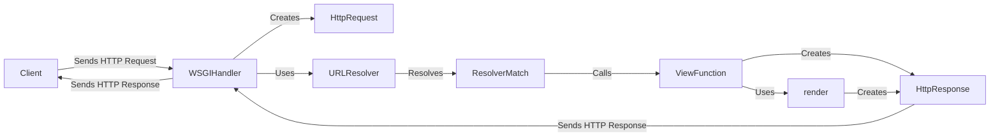

## Request Handling in Django: An Overview

This document provides a high-level overview of the request handling process in Django, focusing on the key components involved in receiving, processing, and responding to HTTP requests.

### Data Flow Diagram

### Component Descriptions

*   **Client:** The user or system that initiates the HTTP request. It sends a request to the Django application and receives a response.

*   **WSGIHandler:** (django.core.handlers.wsgi.WSGIHandler) The entry point for Django applications in a WSGI environment. It receives the HTTP request from the web server, creates an `HttpRequest` object, and processes the request through Django's middleware and URL routing. Finally, it sends the `HttpResponse` back to the web server, which then relays it to the client.

*   **HttpRequest:** (django.http.request.HttpRequest) Represents an incoming HTTP request. It encapsulates all the request data, including headers, GET and POST parameters, and other metadata. The `WSGIHandler` creates this object and passes it to the URL resolver and view function.

*   **URLResolver:** (django.urls.resolvers.URLResolver) Responsible for resolving the URL path to a specific view function. It iterates through the URL patterns defined in the project's `urls.py` files and attempts to find a match for the requested URL. It uses `resolve` function.

*   **ResolverMatch:** (django.urls.resolvers.ResolverMatch) Represents the result of a successful URL resolution. It contains the view function to be executed, any arguments captured from the URL, and metadata about the matched URL pattern. The `URLResolver` returns this object when a match is found.

*   **ViewFunction:** A callable that processes the `HttpRequest` and returns an `HttpResponse`. It contains the application logic for handling the request and generating the response. It can use `render` to generate the `HttpResponse`.

*   **render:** (django.shortcuts.render) A shortcut function that renders a template with a given context and returns an `HttpResponse` object. It simplifies the process of generating HTML responses by combining template loading, context processing, and response creation.

*   **HttpResponse:** (django.http.response.HttpResponse) Represents an outgoing HTTP response. It encapsulates the response data, headers, and status code. The view function creates this object and returns it to the `WSGIHandler`, which then sends it back to the client.
