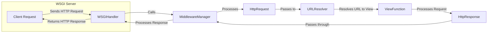

## Request Handling in Django: A Component Flow Diagram

This diagram illustrates the flow of an HTTP request through the Django framework, from the initial WSGI handling to the generation of an HTTP response.

## Component Descriptions

**1. WSGIClient (Client Request)**
   - *Description*: Represents the client (e.g., a web browser) initiating an HTTP request to the Django application.
   - *Functionality*: Sends the initial HTTP request to the WSGI server.
   - *Interaction*: Initiates the entire request processing flow by sending the request to the WSGIHandler.

**2. WSGIHandler**
   - *Description*: Entry point for handling WSGI requests in Django. It receives the request from the WSGI server, processes it, and returns a response.
   - *Functionality*: Initializes request and response objects, calls middleware, resolves the URL, and invokes the appropriate view.
   - *Interaction*: Receives the request from the WSGI server, interacts with the MiddlewareManager, and sends the final response back to the WSGI server.
   - *Relevant Source Files*: `django.core.handlers.wsgi.WSGIHandler`

**3. MiddlewareManager**
   - *Description*: Manages the execution of middleware components during both request and response processing.
   - *Functionality*: Executes middleware in a defined order to modify the request before it reaches the view and to process the response before it's sent to the client.
   - *Interaction*: Intercepts the request and response, applying middleware logic. Interacts with HttpRequest and HttpResponse objects.

**4. HttpRequest**
   - *Description*: Represents an incoming HTTP request.
   - *Functionality*: Encapsulates all request data, including headers, parameters, and body.
   - *Interaction*: Created by WSGIHandler, modified by middleware, and passed to the URLResolver and ViewFunction.
   - *Relevant Source Files*: `django.http.request.HttpRequest`

**5. URLResolver**
   - *Description*: Resolves the URL to the corresponding view function.
   - *Functionality*: Matches the requested URL against the URL patterns defined in the project's URL configuration.
   - *Interaction*: Receives the HttpRequest, uses URL patterns to find the appropriate ViewFunction, and passes control to it.
   - *Relevant Source Files*: `django.urls.resolvers.URLResolver`

**6. ViewFunction**
   - *Description*: Processes the request and generates an HTTP response.
   - *Functionality*: Contains the application logic to handle the request and create the appropriate response data.
   - *Interaction*: Receives the HttpRequest from the URLResolver, processes it, and returns an HttpResponse.

**7. HttpResponse**
   - *Description*: Represents an outgoing HTTP response.
   - *Functionality*: Encapsulates the response data, including status code, headers, and body.
   - *Interaction*: Created by the ViewFunction, modified by middleware, and sent back to the WSGIHandler.
   - *Relevant Source Files*: `django.http.response.HttpResponse`
