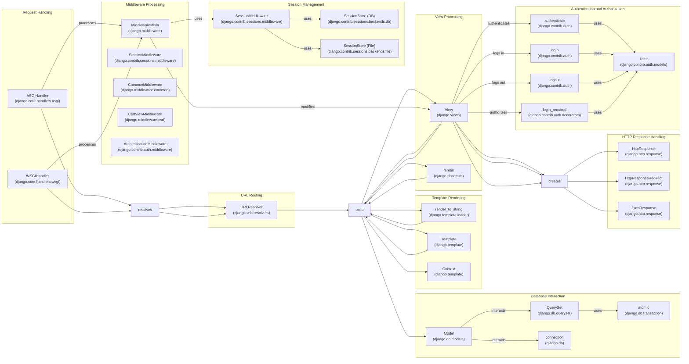

```mermaid
graph LR
    subgraph "Request Handling"
      ASGIHandler["ASGIHandler\n(django.core.handlers.asgi)"]
      WSGIHandler["WSGIHandler\n(django.core.handlers.wsgi)"]
    end
    subgraph "URL Routing"
      URLResolver["URLResolver\n(django.urls.resolvers)"]
    end
    subgraph "Middleware Processing"
      MiddlewareMixin["MiddlewareMixin\n(django.middleware)"]
      SessionMiddleware["SessionMiddleware\n(django.contrib.sessions.middleware)"]
      CommonMiddleware["CommonMiddleware\n(django.middleware.common)"]
      CsrfViewMiddleware["CsrfViewMiddleware\n(django.middleware.csrf)"]
      AuthenticationMiddleware["AuthenticationMiddleware\n(django.contrib.auth.middleware)"]
    end
    subgraph "View Processing"
      View["View\n(django.views)"]
      render["render\n(django.shortcuts)"]
    end
    subgraph "Template Rendering"
      render_to_string["render_to_string\n(django.template.loader)"]
      Template["Template\n(django.template)"]
      Context["Context\n(django.template)"]
    end
    subgraph "HTTP Response Handling"
      HttpResponse["HttpResponse\n(django.http.response)"]
      HttpResponseRedirect["HttpResponseRedirect\n(django.http.response)"]
      JsonResponse["JsonResponse\n(django.http.response)"]
    end
    subgraph "Database Interaction"
      Model["Model\n(django.db.models)"]
      QuerySet["QuerySet\n(django.db.queryset)"]
      connection["connection\n(django.db)"]
      atomic["atomic\n(django.db.transaction)"]
    end
    subgraph "Authentication and Authorization"
      authenticate["authenticate\n(django.contrib.auth)"]
      login["login\n(django.contrib.auth)"]
      logout["logout\n(django.contrib.auth)"]
      login_required["login_required\n(django.contrib.auth.decorators)"]
      User["User\n(django.contrib.auth.models)"]
    end
    subgraph "Session Management"
      SessionMiddleware2["SessionMiddleware\n(django.contrib.sessions.middleware)"]
      SessionStoreDB["SessionStore (DB)\n(django.contrib.sessions.backends.db)"]
      SessionStoreFile["SessionStore (File)\n(django.contrib.sessions.backends.file)"]
    end
    ASGIHandler --> resolves --> URLResolver
    WSGIHandler --> resolves --> URLResolver
    URLResolver --> uses --> View
    View --> uses --> Model
    View --> uses --> render
    render --> uses --> render_to_string
    render_to_string --> uses --> Template
    Template --> uses --> Context
    View --> creates --> HttpResponse
    View --> creates --> HttpResponseRedirect
    View --> creates --> JsonResponse
    ASGIHandler -- processes --> MiddlewareMixin
    WSGIHandler -- processes --> MiddlewareMixin
    MiddlewareMixin -- modifies --> View
    MiddlewareMixin -- uses --> SessionMiddleware2
    SessionMiddleware2 -- uses --> SessionStoreDB
    SessionMiddleware2 -- uses --> SessionStoreFile
    View -- authenticates --> authenticate
    View -- logs in --> login
    View -- logs out --> logout
    View -- authorizes --> login_required
    authenticate -- uses --> User
    login -- uses --> User
    logout -- uses --> User
    login_required -- uses --> User
    Model -- interacts --> connection
    Model -- interacts --> QuerySet
    QuerySet -- uses --> atomic
```
