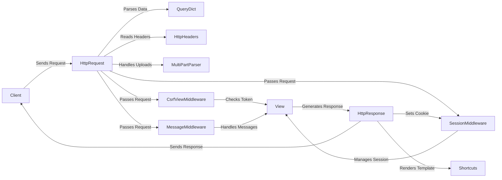

## Request Handling Component Overview

This component is responsible for receiving, parsing, and processing HTTP requests in a Django application. It manages request metadata, data, and files, providing a unified interface for accessing request information. The component also includes middleware for CSRF protection, session management, and message handling.

Here's a data flow diagram illustrating the request handling process:

## Component Descriptions:

- **Client:** The user or system that initiates the HTTP request.
    - *Interaction:* Sends the initial request to the Django application and receives the final response.
    - *Relevant Files:* N/A

- **HttpRequest:** Represents an incoming HTTP request. It encapsulates request data like headers, body, method, and path, providing a unified interface for accessing this information.
    - *Interaction:* Receives the request from the client, parses data using `QueryDict`, reads headers using `HttpHeaders`, and handles file uploads using `MultiPartParser`. It then passes the request to middleware components.
    - *Relevant Files:* `django.http.request.HttpRequest`

- **QueryDict:** A dictionary-like class specifically designed for handling query string parameters and form data. It supports multiple values for the same key.
    - *Interaction:* Parses data from the request and provides an interface for accessing request parameters.
    - *Relevant Files:* `django.http.request.QueryDict`

- **HttpHeaders:** Manages HTTP headers within a request or response. It provides methods for accessing, setting, and parsing header values.
    - *Interaction:* Reads and provides access to HTTP headers from the request.
    - *Relevant Files:* `django.http.request.HttpHeaders`

- **MultiPartParser:** Parses multipart/form-data content, which is commonly used for file uploads. It extracts the data and files from the request body.
    - *Interaction:* Handles file uploads and extracts data from multipart requests.
    - *Relevant Files:* `django.http.multipartparser.MultiPartParser`

- **CsrfViewMiddleware:** Provides Cross-Site Request Forgery (CSRF) protection by verifying a token in the request. It protects against malicious attacks that attempt to execute unwanted actions on behalf of an authenticated user.
    - *Interaction:* Checks for a CSRF token in the request and validates it before passing the request to the view.
    - *Relevant Files:* `django.middleware.csrf.CsrfViewMiddleware`

- **SessionMiddleware:** Enables session management, allowing the server to store and retrieve data associated with a specific user across multiple requests. It uses cookies to maintain session state.
    - *Interaction:* Manages user sessions by storing and retrieving data associated with a user across multiple requests.
    - *Relevant Files:* `django.contrib.sessions.middleware.SessionMiddleware`

- **MessageMiddleware:** Provides a way to display temporary messages to the user, such as success, error, or warning messages. These messages are typically stored in the session and displayed on the next page load.
    - *Interaction:* Handles temporary messages to be displayed to the user.
    - *Relevant Files:* `django.contrib.messages.middleware.MessageMiddleware`

- **View:** The view function or class that processes the request and generates a response.
    - *Interaction:* Receives the processed request from the middleware components and generates an `HttpResponse`.
    - *Relevant Files:* User-defined view functions

- **HttpResponse:** Represents an outgoing HTTP response. It allows setting the response status code, headers, and content, which are then sent back to the client.
    - *Interaction:* Generates the HTTP response to be sent back to the client. It can use `Shortcuts` to render templates.
    - *Relevant Files:* `django.http.response.HttpResponse`

- **Shortcuts:** Provides shortcut functions like render and redirect to simplify common tasks in view functions. `render` combines a template with a context to produce an HTML response, while `redirect` creates a redirect response to another URL.
    - *Interaction:* Simplifies common tasks in view functions, such as rendering templates and redirecting to other URLs.
    - *Relevant Files:* `django.shortcuts`
