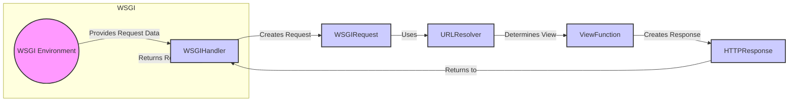

### Components:

-   **WSGI Environment**
    -   *Description*: The WSGI environment provides data about the request to the Django application.
    -   *Functionality*: It contains all the information about the incoming request, such as headers, method, and body.
    -   *Interaction*: Provides request data to the `WSGIHandler`.
    -   *Relevant source files*: `django.core.handlers.wsgi`

-   **WSGIHandler**
    -   *Description*: The entry point for handling WSGI requests.
    -   *Functionality*: It receives the WSGI environment, creates an `HttpRequest` object, gets the response from Django, and returns it to the WSGI server.
    -   *Interaction*: Receives the WSGI environment, creates a `WSGIRequest`, and processes the response.
    -   *Relevant source files*: `django.core.handlers.wsgi.WSGIHandler`

-   **WSGIRequest**
    -   *Description*: Represents an HTTP request.
    -   *Functionality*: It encapsulates the data from the WSGI environment into a more convenient object for Django to use.
    -   *Interaction*: Created by `WSGIHandler` from the WSGI environment. Used by `URLResolver`.
    -   *Relevant source files*: `django.core.handlers.wsgi.WSGIRequest`

-   **URLResolver**
    -   *Description*: Resolves the URL to a specific view.
    -   *Functionality*: It matches the requested URL against the URL patterns defined in `urls.py` and determines which view function should handle the request.
    -   *Interaction*: Receives the `WSGIRequest` and determines the appropriate `ViewFunction`.
    -   *Relevant source files*: `django.urls`

-   **ViewFunction**
    -   *Description*: A function that handles a specific request.
    -   *Functionality*: It processes the request, interacts with models, and creates an `HttpResponse` object.
    -   *Interaction*: Receives data from `URLResolver` and creates an `HTTPResponse`.
    -   *Relevant source files*: User-defined views in `views.py`

-   **HTTPResponse**
    -   *Description*: Represents an HTTP response.
    -   *Functionality*: It contains the data that will be sent back to the client, such as the content, status code, and headers.
    -   *Interaction*: Created by `ViewFunction` and returned to `WSGIHandler`.
    -   *Relevant source files*: `django.http.HttpResponse`