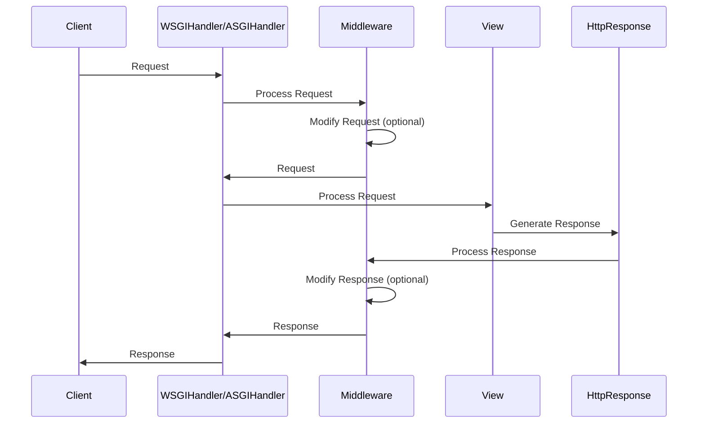
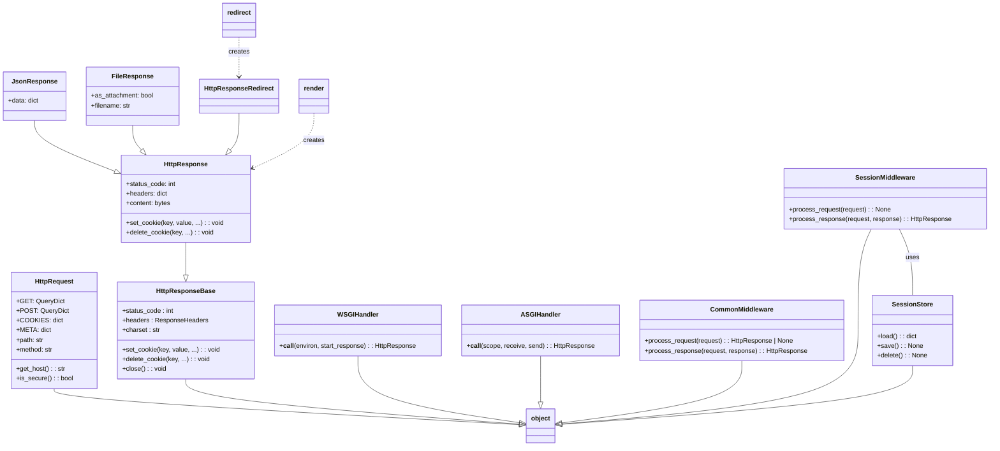

Okay, I have reviewed the source code for the key modules involved in request handling in Django. Based on the information gathered, here's a component overview:

**Component Description: Request-Response Cycle**

This component encapsulates the core functionality of handling HTTP requests and generating HTTP responses in a Django application. It begins with the receipt of an HttpRequest, processes it through middleware, and ultimately produces an HttpResponse that is sent back to the client. Key aspects include request parsing, session management, security checks, and response rendering.

**Main Classes and Their Purposes:**

*   **HttpRequest:** Represents an incoming HTTP request. It contains information such as request method, headers, query parameters, POST data, cookies, and metadata.
*   **HttpResponse:** Represents an HTTP response. It includes the response status code, headers, and content (body). Subclasses like `JsonResponse`, `FileResponse`, `HttpResponseRedirect` provide specialized response types.
*   **WSGIHandler/ASGIHandler:** Entry points for handling requests in WSGI/ASGI environments, respectively. They manage the request lifecycle, including middleware processing and view execution.
*   **CommonMiddleware:** Performs several common tasks, such as setting the content encoding and handling conditional GET requests.
*   **SessionMiddleware:** Enables session management by attaching a session object to the request.
*   **SessionStore:** Abstract base class for session storage implementations.
*   **render:** A shortcut function that renders a template with a given context and returns an HttpResponse.
*   **redirect:** A shortcut function that returns an HttpResponseRedirect to a specified URL.

**Visualization:**

I'll use a sequence diagram to illustrate the request-response flow and a class diagram to show the relationships between the main classes.

**Sequence Diagram (Mermaid Format):**

**Class Diagram (Mermaid Format):**

