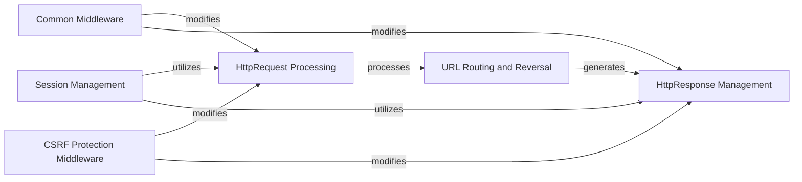

## Component Details

The Request-Response Cycle in Django encapsulates the entire process of handling an incoming HTTP request and generating an appropriate HTTP response. It involves parsing request data, routing the URL to the correct view, applying various middleware for common functionalities like session management and CSRF protection, and finally constructing and sending the response back to the client. This cycle ensures that Django applications can effectively receive, process, and respond to web interactions.

### HttpRequest Processing
This component is responsible for handling all aspects of an incoming HTTP request. It parses request headers, content types, host information, URL paths, and manages file uploads and cookie handling. It provides methods to access various parts of the request data.

**Related Classes/Methods**:

- <a href="https://github.com/django/django/blob/master/django/http/request.py#L52-L469" target="_blank" rel="noopener noreferrer">`django.http.request.HttpRequest` (52:469)</a>

### HttpResponse Management
This component is responsible for creating, manipulating, and serializing HTTP responses that are sent back to the client. It handles setting content, headers, and provides methods for writing data to the response body.

**Related Classes/Methods**:

- <a href="https://github.com/django/django/blob/master/django/http/response.py#L364-L434" target="_blank" rel="noopener noreferrer">`django.http.response.HttpResponse` (364:434)</a>

### URL Routing and Reversal
This component is central to Django's URL dispatching system. It manages the resolution of incoming URLs to their corresponding view functions and also provides functionality for reversing URL patterns to generate URLs dynamically. It handles namespaces and application-specific URL configurations.

**Related Classes/Methods**:

- <a href="https://github.com/django/django/blob/master/django/urls/resolvers.py#L501-L839" target="_blank" rel="noopener noreferrer">`django.urls.resolvers.URLResolver` (501:839)</a>

### Common Middleware
This middleware handles common operations such as forbidding access to disallowed user agents, and URL rewriting based on settings like APPEND_SLASH and PREPEND_WWW. It can redirect URLs to append missing slashes or prepend 'www.' if configured.

**Related Classes/Methods**:

- <a href="https://github.com/django/django/blob/master/django/middleware/common.py#L12-L114" target="_blank" rel="noopener noreferrer">`django.middleware.common.CommonMiddleware` (12:114)</a>

### Session Management
This component provides the base functionality for managing user sessions. It handles session key generation, loading and saving session data, setting and retrieving session variables, and managing session expiry.

**Related Classes/Methods**:

- <a href="https://github.com/django/django/blob/master/django/contrib/sessions/backends/base.py#L34-L522" target="_blank" rel="noopener noreferrer">`django.contrib.sessions.backends.base.SessionBase` (34:522)</a>

### CSRF Protection Middleware
This middleware is responsible for protecting against Cross-Site Request Forgery (CSRF) attacks. It ensures that POST requests have a valid CSRF token, manages CSRF cookies, and verifies the origin and referer headers to prevent unauthorized requests.

**Related Classes/Methods**:

- <a href="https://github.com/django/django/blob/master/django/middleware/csrf.py#L165-L483" target="_blank" rel="noopener noreferrer">`django.middleware.csrf.CsrfViewMiddleware` (165:483)</a>

### [FAQ](https://github.com/CodeBoarding/GeneratedOnBoardings/tree/main?tab=readme-ov-file#faq)