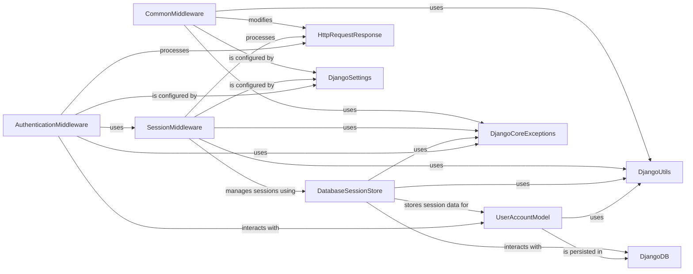

## Component Details

A pluggable framework of hooks that process requests and responses globally, allowing for cross-cutting concerns like session management, CSRF protection, and URL rewriting, along with managing user authentication, authorization, and session persistence.

### CommonMiddleware
This middleware component is responsible for enforcing common HTTP conventions and security policies. It handles URL normalization (e.g., appending/removing slashes, 'www' redirection) and checks for disallowed user agents, potentially issuing redirects or raising exceptions.

**Related Classes/Methods**:

- <a href="https://github.com/django/django/blob/master/django/middleware/common.py#L12-L114" target="_blank" rel="noopener noreferrer">`django.middleware.common.CommonMiddleware` (12:114)</a>
- <a href="https://github.com/django/django/blob/master/django/middleware/common.py#L33-L59" target="_blank" rel="noopener noreferrer">`django.middleware.common.CommonMiddleware.process_request` (33:59)</a>
- <a href="https://github.com/django/django/blob/master/django/middleware/common.py#L99-L114" target="_blank" rel="noopener noreferrer">`django.middleware.common.CommonMiddleware.process_response` (99:114)</a>
- <a href="https://github.com/django/django/blob/master/django/template/backends/django.py#L400-L401" target="_blank" rel="noopener noreferrer">`django.http.HttpResponsePermanentRedirect` (400:401)</a>
- <a href="https://github.com/django/django/blob/master/django/template/backends/django.py#L100-L103" target="_blank" rel="noopener noreferrer">`django.urls.is_valid_path` (100:103)</a>
- <a href="https://github.com/django/django/blob/master/django/utils/html.py#L100-L103" target="_blank" rel="noopener noreferrer">`django.utils.html.escape_leading_slashes` (100:103)</a>

### SessionMiddleware
This middleware component manages the lifecycle of user sessions. It loads session data from the configured session store at the beginning of a request and saves any modifications back to the store before the response is sent, also handling session cookie creation and deletion.

**Related Classes/Methods**:

- <a href="https://github.com/django/django/blob/master/django/contrib/sessions/middleware.py#L11-L76" target="_blank" rel="noopener noreferrer">`django.contrib.sessions.middleware.SessionMiddleware` (11:76)</a>
- <a href="https://github.com/django/django/blob/master/django/contrib/sessions/middleware.py#L17-L19" target="_blank" rel="noopener noreferrer">`django.contrib.sessions.middleware.SessionMiddleware.process_request` (17:19)</a>
- <a href="https://github.com/django/django/blob/master/django/contrib/sessions/middleware.py#L21-L76" target="_blank" rel="noopener noreferrer">`django.contrib.sessions.middleware.SessionMiddleware.process_response` (21:76)</a>
- <a href="https://github.com/django/django/blob/master/django/template/backends/django.py#L49-L50" target="_blank" rel="noopener noreferrer">`django.conf.settings` (49:50)</a>
- <a href="https://github.com/django/django/blob/master/django/utils/cache.py#L130-L133" target="_blank" rel="noopener noreferrer">`django.utils.cache.patch_vary_headers` (130:133)</a>
- <a href="https://github.com/django/django/blob/master/django/utils/http.py#L85-L96" target="_blank" rel="noopener noreferrer">`django.utils.http.http_date` (85:96)</a>
- <a href="https://github.com/django/django/blob/master/django/contrib/sessions/exceptions.py#L15-L18" target="_blank" rel="noopener noreferrer">`django.contrib.sessions.exceptions.SessionInterrupted` (15:18)</a>

### DatabaseSessionStore
This component provides the concrete implementation for storing and retrieving session data using a database backend. It interacts directly with the Session model to perform CRUD operations on session records.

**Related Classes/Methods**:

- <a href="https://github.com/django/django/blob/master/django/contrib/sessions/backends/db.py#L11-L197" target="_blank" rel="noopener noreferrer">`django.contrib.sessions.backends.db.SessionStore` (11:197)</a>
- <a href="https://github.com/django/django/blob/master/django/contrib/sessions/models.py#L7-L34" target="_blank" rel="noopener noreferrer">`django.contrib.sessions.models.Session` (7:34)</a>
- <a href="https://github.com/django/django/blob/master/django/db/transaction.py#L315-L322" target="_blank" rel="noopener noreferrer">`django.db.transaction.atomic` (315:322)</a>

### AuthenticationMiddleware
This middleware component is responsible for authenticating the user associated with the current request. It populates the request.user attribute, allowing subsequent application logic to access authenticated user information.

**Related Classes/Methods**:

- <a href="https://github.com/django/django/blob/master/django/contrib/auth/middleware.py#L29-L40" target="_blank" rel="noopener noreferrer">`django.contrib.auth.middleware.AuthenticationMiddleware` (29:40)</a>
- <a href="https://github.com/django/django/blob/master/django/contrib/auth/models.py#L516-L525" target="_blank" rel="noopener noreferrer">`django.contrib.auth.models.User` (516:525)</a>
- <a href="https://github.com/django/django/blob/master/django/contrib/auth/backends.py#L53-L241" target="_blank" rel="noopener noreferrer">`django.contrib.auth.backends.ModelBackend` (53:241)</a>

### UserAccountModel
This component represents the core user model in Django's authentication system. It defines the structure and behavior of user accounts, including fields for username, password, and permissions.

**Related Classes/Methods**:

- <a href="https://github.com/django/django/blob/master/django/contrib/auth/models.py#L516-L525" target="_blank" rel="noopener noreferrer">`django.contrib.auth.models.User` (516:525)</a>
- <a href="https://github.com/django/django/blob/master/django/contrib/auth/base_user.py#L10-L100" target="_blank" rel="noopener noreferrer">`django.contrib.auth.base_user.AbstractBaseUser` (10:100)</a>
- <a href="https://github.com/django/django/blob/master/django/db/models/base.py#L480-L2406" target="_blank" rel="noopener noreferrer">`django.db.models.base.Model` (480:2406)</a>

### HttpRequestResponse
This component encapsulates the fundamental HTTP request and response objects used throughout the Django framework. It provides methods and attributes for accessing request data (headers, body, cookies) and constructing HTTP responses.

**Related Classes/Methods**:

- <a href="https://github.com/django/django/blob/master/django/template/backends/django.py#L10-L100" target="_blank" rel="noopener noreferrer">`django.http.HttpRequest` (10:100)</a>
- <a href="https://github.com/django/django/blob/master/django/template/backends/django.py#L10-L100" target="_blank" rel="noopener noreferrer">`django.http.HttpResponse` (10:100)</a>

### DjangoSettings
This component represents the central configuration system for a Django project. It provides access to various settings that influence the behavior of middleware, session management, and other Django components.

**Related Classes/Methods**:

- <a href="https://github.com/django/django/blob/master/django/template/backends/django.py#L49-L50" target="_blank" rel="noopener noreferrer">`django.conf.settings` (49:50)</a>

### DjangoDB
This component represents Django's database abstraction layer, providing functionalities for interacting with the underlying database system. It handles database connections, queries, and transactions.

**Related Classes/Methods**:

- <a href="https://github.com/django/django/blob/master/django/template/backends/django.py#L1-L100" target="_blank" rel="noopener noreferrer">`django.db` (1:100)</a>

### DjangoCoreExceptions
This component provides a set of standard exception classes used throughout the Django framework to signal various error conditions, including those related to suspicious operations or interrupted processes.

**Related Classes/Methods**:

- <a href="https://github.com/django/django/blob/master/django/core/exceptions.py#L1-L100" target="_blank" rel="noopener noreferrer">`django.core.exceptions` (1:100)</a>

### DjangoUtils
This component encompasses a collection of utility functions and classes used across Django for common tasks such as caching, HTTP date formatting, and general functional programming helpers.

**Related Classes/Methods**:

- <a href="https://github.com/django/django/blob/master/django/template/backends/django.py#L1-L100" target="_blank" rel="noopener noreferrer">`django.utils` (1:100)</a>

### [FAQ](https://github.com/CodeBoarding/GeneratedOnBoardings/tree/main?tab=readme-ov-file#faq)