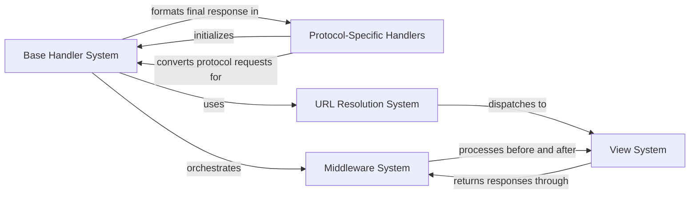

## Details

Django's Request Handling Pipeline is the core mechanism that processes HTTP requests from initial receipt to final response delivery. The pipeline begins when a protocol-specific handler (WSGI or ASGI) receives an HTTP request and initializes the base handler. The base handler orchestrates the request lifecycle, first passing the request through the middleware chain for pre-processing. Then, the URL resolution system maps the request URL to the appropriate view. The selected view processes the request and generates a response, which flows back through the middleware chain for post-processing before being formatted by the base handler and returned through the protocol-specific handler. This structured pipeline embodies Django's principles of separation of concerns, extensibility, and adaptability while providing a predictable path for all HTTP interactions.

### Base Handler System
Provides the foundation for all request handling, defining the core processing logic and request lifecycle management. It manages the request processing workflow, coordinates middleware execution, and handles exceptions.

**Related Classes/Methods**:

- <a href="https://github.com/django/django/blob/main/django/core/handlers/base.py#L19-L364" target="_blank" rel="noopener noreferrer">`django.core.handlers.base.BaseHandler` (19:364)</a>

### Protocol-Specific Handlers
Specialized handlers that adapt Django to different server protocols (WSGI and ASGI). They convert protocol-specific request formats to Django's internal request representation and translate responses back.

**Related Classes/Methods**:

- <a href="https://github.com/django/django/blob/main/django/core/handlers/wsgi.py#L112-L143" target="_blank" rel="noopener noreferrer">`django.core.handlers.wsgi.WSGIHandler` (112:143)</a>
- <a href="https://github.com/django/django/blob/main/django/core/handlers/asgi.py#L138-L378" target="_blank" rel="noopener noreferrer">`django.core.handlers.asgi.ASGIHandler` (138:378)</a>

### Middleware System
Pluggable processing units that intercept requests and responses at various stages of the pipeline. They provide hooks for cross-cutting concerns like authentication, security, and session management.

**Related Classes/Methods**:

- <a href="https://github.com/django/django/blob/main/django/utils/deprecation.py#L265-L321" target="_blank" rel="noopener noreferrer">`django.utils.deprecation.MiddlewareMixin` (265:321)</a>

### URL Resolution System
Maps incoming request URLs to the appropriate view functions or classes. It parses URLs, matches patterns, and dispatches requests to the correct view handlers.

**Related Classes/Methods**:

- `django.urls.resolvers.URLResolver`
- `django.urls.resolvers.URLPattern`

### View System [[Expand]](./View_System.md)
Processes requests and generates responses after URL resolution. Views contain the business logic for handling specific requests and returning appropriate responses.

**Related Classes/Methods**:

- <a href="https://github.com/django/django/blob/main/django/views/generic/base.py#L36-L180" target="_blank" rel="noopener noreferrer">`django.views.generic.base.View` (36:180)</a>

### [FAQ](https://github.com/CodeBoarding/GeneratedOnBoardings/tree/main?tab=readme-ov-file#faq)