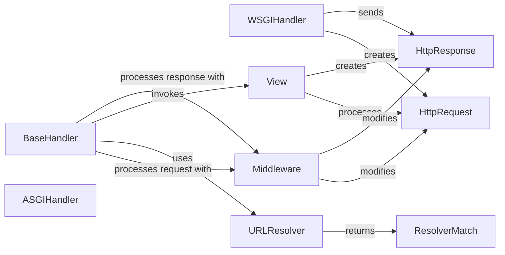

## Details

`Request Handling & Routing` is the heart of the Django framework, acting as the central nervous system that processes incoming HTTP requests and directs them to the appropriate logic. This analysis breaks down the key components of this subsystem, their responsibilities, and their interactions.

### BaseHandler
The abstract core of the request/response system. It loads middleware and orchestrates the main processing flow: applying middleware to the request, resolving the URL, calling the view, applying middleware to the response, and handling exceptions.

**Related Classes/Methods**:

- `django.core.handlers.base`

### WSGIHandler
The primary entry point for synchronous requests from WSGI-compatible web servers. It inherits from `BaseHandler` and adapts the request/response cycle to the WSGI specification by creating an `HttpRequest` object from the WSGI environment.

**Related Classes/Methods**:

- `django.core.handlers.wsgi`

### ASGIHandler
The primary entry point for asynchronous requests from ASGI-compatible web servers. It also inherits from `BaseHandler` but provides the necessary asynchronous logic to handle modern, high-concurrency applications.

**Related Classes/Methods**:

- `django.core.handlers.asgi`

### URLResolver
Responsible for mapping the request's URL path to the corresponding view function. It iterates through the project's URL patterns (`urlpatterns`) to find a match. Its `resolve()` method is the core of the routing mechanism.

**Related Classes/Methods**:

- `django.urls.resolvers`

### ResolverMatch
A data structure returned by `URLResolver` upon a successful URL match. It contains the resolved view function, along with any arguments (`args`) and keyword arguments (`kwargs`) captured from the URL, which are then passed to the view.

**Related Classes/Methods**:

- `django.urls.resolvers`

### HttpRequest
A data structure that encapsulates all details of an incoming HTTP request, including metadata (headers, method) and content (GET/POST parameters, body). It is created by the handler and passed through middleware to the view.

**Related Classes/Methods**:

- `django.http.request`

### HttpResponse
Represents the outgoing HTTP response. It is typically instantiated and returned by a view. Middleware can modify it before the handler sends it back to the client. It holds the content and headers of the response.

**Related Classes/Methods**:

- `django.http.response`

### Middleware
A framework of hooks into Django's request/response processing. `BaseHandler` manages a chain of middleware that can inspect and modify `HttpRequest` and `HttpResponse` objects, enabling cross-cutting concerns like authentication and session management.

**Related Classes/Methods**:

- `django.utils.deprecation`

### View
The application logic that processes a request and returns a response. This is not a single class but a conceptual component representing the function or class-based view that `BaseHandler` invokes after the URL is resolved.

**Related Classes/Methods**:

- `Project-specific`

### [FAQ](https://github.com/CodeBoarding/GeneratedOnBoardings/tree/main?tab=readme-ov-file#faq)