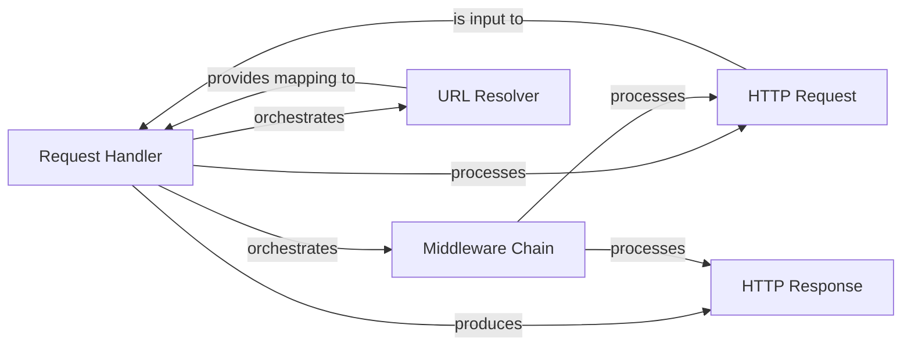

## Details

The Request Processing Pipeline in Django encompasses the core mechanisms for handling incoming HTTP requests and generating outgoing HTTP responses. This includes the initial reception of a request, its passage through various middleware, URL routing to the appropriate view, and the final construction and sending of the response.

### Request Handler
The orchestrator of the entire pipeline. It loads and chains middleware, resolves URLs, invokes the appropriate view, and manages the response flow, including exception handling. This component is the entry point for a web request into the Django application.

**Related Classes/Methods**:

- <a href="https://github.com/django/django/blob/main/django/core/handlers/base.py#L20-L366" target="_blank" rel="noopener noreferrer">`django.core.handlers.base.BaseHandler`:20-366</a>

### HTTP Request
Represents an incoming HTTP request, encapsulating all request-related information (headers, body, GET/POST parameters, user session, etc.). It's passed through the middleware chain and ultimately to the view function or class.

**Related Classes/Methods**:

- <a href="https://github.com/django/django/blob/main/django/http/request.py#L53-L488" target="_blank" rel="noopener noreferrer">`django.http.request.HttpRequest`:53-488</a>

### HTTP Response
Represents an outgoing HTTP response, built by the view or middleware. It encapsulates the response status, headers, and body content that will be sent back to the client.

**Related Classes/Methods**:

- <a href="https://github.com/django/django/blob/main/django/http/response.py#L366-L436" target="_blank" rel="noopener noreferrer">`django.http.response.HttpResponse`:366-436</a>

### Middleware Chain
A series of callable components that intercept and process requests before they reach the view and responses before they are sent back to the client. Middleware can modify requests, responses, or handle exceptions, providing a powerful extension mechanism.

**Related Classes/Methods**:

- <a href="https://github.com/django/django/blob/main/django/middleware/__init__.py" target="_blank" rel="noopener noreferrer">`django.middleware`</a>

### URL Resolver
Responsible for mapping the incoming URL path to a specific view function or class, along with any arguments extracted from the URL. This component is crucial for directing the request to the correct application logic.

**Related Classes/Methods**:

- <a href="https://github.com/django/django/blob/main/django/urls/__init__.py" target="_blank" rel="noopener noreferrer">`django.urls`</a>

### [FAQ](https://github.com/CodeBoarding/GeneratedOnBoardings/tree/main?tab=readme-ov-file#faq)